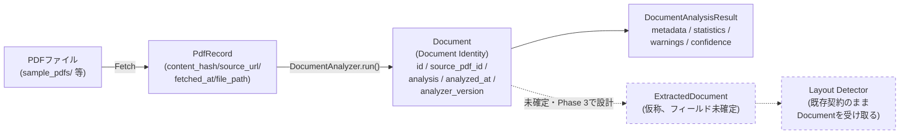
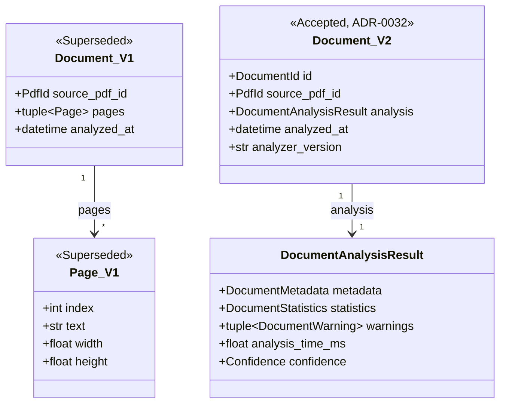

# 0032. Redefine Document Analyzer Responsibility

## ステータス
Accepted

## コンテキスト（Context）

[ADR-0011](0011-fixed-core-pipeline.md)は中核パイプラインの6段階（Document Analyzer → Layout Detector → Section Parser → Field Extractor → Normalizer → Validator）の**段階の数・順序・名称**を固定したが、各段階の詳細な責務は[`docs/architecture.md`](../architecture.md)に委ねていた（ADR-0011本文「各段階の詳細な責務はdocs/architecture.mdを参照」）。

設計フェーズ（Task 8）で[`docs/api/interfaces.md`](../api/interfaces.md)・[`docs/api/models.md`](../api/models.md)に落とし込まれたDocument Analyzerの責務は、以下のとおりだった（以下「Version 1設計」と呼ぶ）。

- `DocumentAnalyzer.run(context, source: PdfRecord) -> Document`
- `Document`は`pages: tuple[Page, ...]`を保持し、`Page`は`index` / `text`（**ページ単位の抽出済みテキスト**） / `width` / `height`を持つ。
- [`docs/architecture.md`](../architecture.md)は「Document Analyzer: 取得したPDFを解析可能な内部表現（ページ・テキスト・座標等）に変換する」と明記していた。

Phase2 Task4（Document Analyzer Implementation）の実装指示は、これと異なる責務を明示的に要求した（以下「Version 2.0設計」と呼ぶ）。

- Document Analyzerは **PDF解析・OCR・文字抽出・Layout解析・Section解析・Field解析を行わない**。
- 責務は**PDFの存在確認・PDFメタデータ取得・PDF健全性確認・PDF基本統計・警告生成のみ**。
- 出力は`DocumentAnalysisResult`（`metadata` / `statistics` / `warnings` / `analysis_time_ms` / `confidence`）であり、ページ単位の抽出済みテキストを含まない。

## 問題（Problem）

Version 1設計とVersion 2.0設計は、`Document Analyzer`という同一の名称・同一のパイプライン段階1でありながら、**根本的に異なる入出力契約**を要求しており、両立しない。

1. Version 1の`Document`（`pages: tuple[Page, ...]`、`Page.text`保持）とVersion 2.0の`DocumentAnalysisResult`（メタデータ・統計・警告のみ）は、データとして非互換である。
2. Version 1の[`docs/api/interfaces.md`](../api/interfaces.md)は`LayoutDetector.run(context, document: Document) -> LayoutDetectionResult`・`SectionParser.run(context, document: Document, ...)`という、Document Analyzerが抽出したページテキストをLayout Detector・Section Parserがそのまま消費する契約を前提にしている。Document Analyzerが文字列を生成しなくなると、この前提が崩れる。
3. [`docs/api/models.md`](../api/models.md)の`PersonnelSection.page_range`の不変条件（「`Document.pages`の範囲内」）も同様にVersion 1の`Document`構造に依存している。
4. 既存の実装（`src/mod_personnel_db/models/document.py`、Phase2 Task2で実装済み）は、Version 1の`Document`/`Page`をそのまま実装している。

この不整合を解消せずにPhase2 Task4（Document Analyzer実装）に着手すると、実装がどちらの設計にも部分的にしか従わない状態が生じ、[`docs/constitution.md`](../constitution.md)・[CLAUDE.md](../../CLAUDE.md)が求めるSingle Source of Truthに反する。

## 決定（Decision）

**Version 2.0 Architectureを正式仕様として採用する。** Document Analyzerの責務を以下のとおり再定義する。

### Document Analyzerが行わないこと
- PDF解析（構造的な内部表現への変換）
- OCR
- 文字抽出（ページ本文テキストの取得・保持・返却）
- Layout解析（様式判定）
- Section解析（対象セクションの切り出し）
- Field解析（個別フィールドの抽出）

### Document Analyzerの責務（これのみ）
- PDFの存在確認
- PDFメタデータ取得（SHA256・ファイル名・作成日時・更新日時・PDFバージョン・暗号化有無）
- PDF健全性確認（破損有無）
- PDF基本統計（ページ数・ファイルサイズ・画像数・回転数、および後述の軽量プローブによる`text_length`）
- 警告生成（`DocumentWarning`）

### 新しい型定義

`Document`は**Pipelineを流れる「Document Identity」**として再定義する。ページ単位の抽出済みテキストは保持しない。

```python
from datetime import datetime
from enum import StrEnum
from typing import NewType

DocumentId = NewType("DocumentId", int)


class DocumentWarning(StrEnum):
    ENCRYPTED = "encrypted"
    IMAGE_ONLY = "image_only"
    BROKEN_PDF = "broken_pdf"
    UNSUPPORTED_VERSION = "unsupported_version"
    LARGE_PDF = "large_pdf"
    UNKNOWN_ENCODING = "unknown_encoding"


@dataclass(frozen=True, slots=True)
class DocumentMetadata:
    sha256: str
    filename: str
    created_at: datetime | None
    modified_at: datetime | None
    pdf_version: str
    encrypted: bool


@dataclass(frozen=True, slots=True)
class DocumentStatistics:
    page_count: int
    file_size: int
    text_length: int | None
    image_count: int
    rotation_count: int


@dataclass(frozen=True, slots=True)
class DocumentAnalysisResult:
    metadata: DocumentMetadata
    statistics: DocumentStatistics
    warnings: tuple[DocumentWarning, ...]
    analysis_time_ms: float
    confidence: Confidence


@dataclass(frozen=True, slots=True)
class Document:
    id: DocumentId
    source_pdf_id: PdfId
    analysis: DocumentAnalysisResult
    analyzed_at: datetime
    analyzer_version: str
```

- `DocumentStatistics.text_length`についての注記: Document Analyzerは文字列（抽出結果）を生成・保持・返却しないが、画像PDF判定（`DocumentWarning.IMAGE_ONLY`）等の警告生成のために、ページ内文字数を軽量プローブ（抽出結果を破棄する一時的な計測）として内部的に計測してよい。`text_length`はこの計測値（スカラー）のみであり、抽出したテキスト本文そのものではない。これにより「文字抽出をしない」という責務境界と、警告生成に必要な統計値の両方を矛盾なく満たす。
- `Document.id`（`DocumentId`）は、同一`PdfRecord`に対して将来再解析（Parser Version更新後の再実行等、[ADR-0023](0023-parser-versioning-policy.md)）が行われた場合に、解析実行ごとに区別するための識別子である。`source_pdf_id`（`PdfId`）とは別の識別子空間を持つ。
- `Document.analyzer_version`は、どのDocument Analyzer実装バージョンによる解析結果かを追跡する（[ADR-0006](0006-pipeline-provenance.md)の来歴要件）。

### `Page`の扱い

Version 1の`Page`（ページ単位の抽出済みテキスト）は`Document`から分離する。文字列保持は**後続Stageの責務**とする。当該Stage（Layout DetectorまたはSection Parser、あるいは新設の中間表現）が何を保持すべきかは、**本ADRの時点では未確定**であり、以下のいずれかの方向性を、当該Stageの実装着手前に別ADRとして確定する。

1. Layout Detectorが`Document`（`source_pdf_id`経由でPDFへの参照を持つ）を受け取り、自身の責務としてページテキストを抽出し、`ExtractedDocument`（仮称）として保持しながらレイアウト判定を行う。
2. Document AnalyzerとLayout Detectorの間に、抽出専用の中間Stageを新設する（ただしこれは[ADR-0011](0011-fixed-core-pipeline.md)が禁じる「新規ステージの挿入」に抵触するため、プロジェクトオーナーの明示的承認が必要）。

本ADRでは`ExtractedDocument` / `ExtractedPage`という名称の**概念の存在のみ**を記録し、フィールド定義は行わない（Task 3.1-4の指示どおり、設計は行うが確定させない）。

### Document Lifecycle（Version 2.0）



破線（`ExtractedDocument`, `Layout Detector`の抽出責務）は本ADR時点で未確定の将来設計であることを示す。実線部分（PdfRecord→Document→DocumentAnalysisResult）が本ADRで確定する範囲である。

### Documentモデルの変化（Version 1 → Version 2.0）



## 検討した代替案

- **Version 1設計（`Document`がページテキストを保持する）を維持し、Task4のDocument Analyzer実装指示を「文字列抽出もしない」という要求を字面どおりには実装しない**: Phase2 Task4の実装指示（`DocumentAnalysisResult`, `DocumentMetadata`, `DocumentStatistics`, `DocumentWarning`という具体的な型名まで指定）と正面から矛盾するため採用しなかった。
- **`Document`を2種類に分裂させたまま（Version 1の`Document`とVersion 2.0の`DocumentAnalysisResult`を別名で共存）**: `interfaces.md`の`DocumentAnalyzer.run()`戻り値型が曖昧になり、Single Source of Truthに反するため採用しなかった。
- **Page/文字列抽出の後続Stageでの扱いまで本ADRで確定する**: Task 3.1-4の指示（「現時点では実装しない。設計のみ」）と、Task4-2以降の指示（「Layout Detector以降の実装は禁止する」）に反するため、意図的に未確定のまま残した（上記「Migration Plan」で扱う）。

## 結果（トレードオフ, Consequences）

- Document Analyzerの実装（Phase2 Task4）は、PDFメタデータ・健全性・統計・警告の生成という、明確で狭い責務に限定される。テスト容易性が高く、外部PDFライブラリへの依存も読み取り専用の軽量な操作（存在確認・メタデータ取得・健全性チェック）に限定できる。
- Layout Detector以降が「どうやってページテキストを得るか」という設計上の空白を一時的に抱える。これは意図的な先送りであり、[`docs/design-freeze.md`](../design-freeze.md)の「設計完了とは変更しないことではない」という原則どおり、Layout Detectorの設計時に新規ADRで確定する。
- 既存実装（`src/mod_personnel_db/models/document.py`、Phase2 Task2）はVersion 1の`Document`/`Page`のままであり、本ADR時点では**変更しない**（Task 3.1-9「コード修正は最小限とする」）。Phase2 Task4（Document Analyzer実装）で、新しい`Document`/`DocumentAnalysisResult`等を実装する際に、この既存コードとの整合を取る（詳細はMigration Planを参照）。

## Migration Plan

3段階で移行する。

1. **Phase 1（本ADR、Task 3.1）**: 設計文書のみを同期する。コード変更は行わない。既存の`src/mod_personnel_db/models/document.py`（Version 1の`Document`/`Page`）はそのまま残る。
2. **Phase 2（Task 4、Document Analyzer実装）**: `src/mod_personnel_db/document/`に、本ADRが定めるVersion 2.0の型（`DocumentAnalyzer`, `DocumentAnalysisResult`, `DocumentMetadata`, `DocumentStatistics`, `DocumentWarning`, `DocumentAnalyzerError`）を新規実装する。既存の`src/mod_personnel_db/models/document.py`（Version 1の`Document`/`Page`）は、Task4の時点では**削除しない**（Layout Detector以降が引き続きVersion 1の`Document`を参照する可能性があるため、Layout Detector未着手の段階で削除すると参照切れを起こす）。Task4完了時点で、新旧`Document`の共存状態と、どちらが最終的にパイプラインの正式な型になるかを明示的にTODOとして記録する。
3. **Phase 3（将来タスク、Layout Detector設計時）**: `ExtractedDocument` / `ExtractedPage`（または代替の設計）を新規ADRとして確定し、`LayoutDetector.run()`の入力型を確定させる。この時点で、`src/mod_personnel_db/models/document.py`のVersion 1`Document`/`Page`を、本ADRが定める新しい`Document`（`models/document.py`のリネーム・再実装）と`ExtractedDocument`/`ExtractedPage`（新規ファイル）に分割し、Version 1の`Page`を廃止する。

## Migration Guide

Version 1設計からVersion 2.0設計への対応表。少なくとも`Document` / `Page` / `Pipeline` / `DocumentAnalyzer`の4項目について、Before/After/Migration理由/影響範囲を整理する。

| 項目 | Before（Version 1） | After（Version 2.0） | Migration理由 | 影響範囲 |
|---|---|---|---|---|
| `Document` | `source_pdf_id` / `pages: tuple[Page, ...]` / `analyzed_at`を保持する、ページ単位の抽出済みテキストを含む構造体 | `id`（`DocumentId`） / `source_pdf_id` / `analysis: DocumentAnalysisResult` / `analyzed_at` / `analyzer_version`を保持する「Document Identity」。ページテキストは保持しない | Phase2 Task4の実装指示（Document Analyzerは文字列抽出を行わない）と、旧`Document`のデータ構造が非互換だったため | `docs/api/models.md`, `docs/api/interfaces.md`（`LayoutDetector`/`SectionParser`の入力契約）, `src/mod_personnel_db/models/document.py`（Phase2 Task4以降で対応、本ADR時点では未変更） |
| `Page` | `Document`直下のフィールドとして`index` / `text` / `width` / `height`を保持 | `Document`から分離。`text`（抽出済みテキスト）の保持責務は後続Stage（`ExtractedDocument`/`ExtractedPage`、名称のみ確定・フィールド未確定）に移管 | Document Analyzerが文字列を生成・保持しないというVersion 2.0の責務境界に合わせるため | `docs/api/models.md`。Layout Detector・Section Parserの入力契約は本ADRでは未確定のまま残る（Phase 3で確定） |
| `Pipeline`（6段階の構成） | Document Analyzer → Layout Detector → Section Parser → Field Extractor → Normalizer → Validator | **変更なし**。段階の数・順序・名称は維持（[ADR-0011](0011-fixed-core-pipeline.md)の固定対象） | 本ADRはDocument Analyzer**単体**の詳細責務のみを再定義する。段階構成自体の変更はADR-0011がプロジェクトオーナー承認を要求する範囲であり、本ADRの対象外 | なし |
| `DocumentAnalyzer` | `run(context, source: PdfRecord) -> Document`。PDF解析（構造化）・文字抽出を行い、ページ単位テキストを含む`Document`を返す | `run(context, source: PdfRecord) -> Document`（**シグネチャ自体は変更なし**）。ただし戻り値`Document`の中身がVersion 2.0の定義に変わり、実際に行う処理はPDFメタデータ取得・健全性確認・基本統計・警告生成に限定される | Phase2 Task4の実装指示に合わせ、責務を「解析」から「メタデータ・健全性・統計の取得」に縮小 | `docs/api/interfaces.md`, `src/mod_personnel_db/document/`（Phase2 Task4で新規実装） |

## Affected Documents

| ドキュメント | 変更内容 |
|---|---|
| [`docs/api/interfaces.md`](../api/interfaces.md) | `DocumentAnalyzer.run()`の戻り値型の意味を再定義。`LayoutDetector`/`SectionParser`のdocstringに、入力`Document`がテキストを保持しない旨の注記を追加 |
| [`docs/api/models.md`](../api/models.md) | `Document`/`Page`セクションを全面改訂。`DocumentId`・`DocumentWarning`等を追加。`PersonnelSection`の不変条件を調整 |
| [`docs/architecture.md`](../architecture.md) | Document Analyzerの責務説明を更新 |
| [`docs/architecture/architecture-contract.md`](../architecture/architecture-contract.md) | 保証1「Document Analyzerはlayoutを知らない」に、文字列非生成の保証を追加 |
| [`docs/architecture-review-package.md`](../architecture-review-package.md) | Architecture Contractの要約説明を更新 |
| [`docs/design-freeze.md`](../design-freeze.md) | 凍結後の変更履歴として本ADRを記録 |
| [`docs/constitution.md`](../constitution.md) | 変更なし（Document Analyzerの内部責務に関する記述がないため） |
| [`docs/README.md`](../README.md) | 変更なし（該当記述がないため確認のみ） |
| [`README.md`](../../README.md) | 変更なし（パイプライン段階名・順序のみの言及であり、内部責務の記述がないため確認のみ） |
| [`CLAUDE.md`](../../CLAUDE.md) | 変更なし（同上） |
| [`AGENTS.md`](../../AGENTS.md) | 変更なし（同上） |

## Backward Compatibility

- **ADR-0011（中核パイプラインの固定化）との関係**: 本ADRは6段階の**数・順序・名称**を変更しない。ADR-0011が定める固定対象そのものには抵触しない。変更するのは各段階の詳細な責務（`docs/architecture.md`委任部分）のみである。
- **既存コードとの関係**: `src/mod_personnel_db/models/document.py`（Version 1の`Document`/`Page`）は本ADR時点では後方互換のまま維持され、削除・変更しない（Migration PlanのPhase 1参照）。既存のユニットテスト（`tests/unit/models/test_document.py`）は本ADRの影響を受けない。
- **`PersonnelSection`との関係**: `PersonnelSection.page_range`の不変条件（「`Document.pages`の範囲内」）は、`ExtractedDocument`が確定するまで**未確定（open）**として`docs/api/models.md`に明記する。Section Parserの実装着手前に解決が必須である。

## Superseded Design

以下の設計内容を、本ADRにより不採用（Superseded）とする。既存ドキュメントの当該記述は削除せず、本ADRへの参照を付記した上で「Version 1設計」として保持する（[`docs/adr/README.md`](README.md#更新ルール)の削除せず追記する原則）。

- [`docs/architecture.md`](../architecture.md)の「Document Analyzer: 取得したPDFを解析可能な内部表現（ページ・テキスト・座標等）に変換する」という記述。
- [`docs/api/interfaces.md`](../api/interfaces.md)の`DocumentAnalyzer`が「様式に関する情報を一切含まない（ページ・テキスト・座標のみ）」`Document`を返す、という設計（[`docs/architecture/architecture-contract.md`](../architecture/architecture-contract.md)保証1の実現方法節）。
- [`docs/api/models.md`](../api/models.md)の`Document`/`Page`（`pages: tuple[Page, ...]`、`Page.text`）というVersion 1のデータ構造。

## 関連ADR
- [ADR-0006](0006-pipeline-provenance.md) — パイプライン段階分割と来歴管理。`Document.id`/`analyzer_version`による来歴追跡の前提。
- [ADR-0011](0011-fixed-core-pipeline.md) — 中核パイプラインの固定化。本ADRが変更しない範囲（段階の数・順序・名称）を定める上位決定。
- [ADR-0012](0012-error-handling-priority-order.md) — 未知パターンへの対応優先順位。`DocumentWarning`による警告生成の位置づけ。
- [ADR-0023](0023-parser-versioning-policy.md) — Parserバージョニング方針。`Document.id`による再解析の識別、`analyzer_version`の関連。
- [ADR-0030](0030-strenum-adoption.md) — Enum実装方針をenum.StrEnumに統一する。`DocumentWarning`の実装方針の根拠。
