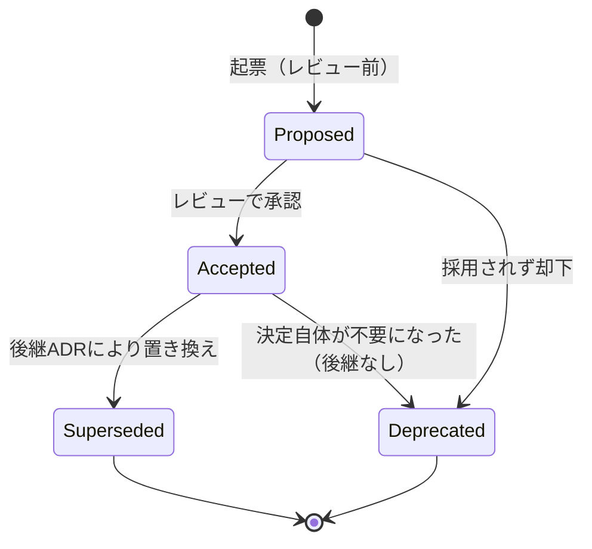

# Architecture Decision Records（ADR）

> ADR体系全体は[`docs/constitution.md`](../constitution.md)（Project Constitution）に従属する。Constitutionはこのディレクトリの一覧・依存関係図には含めない — ADRより上位の統治文書であり、ADRを覆す通常のSupersede手続きの対象ではないため。ADRとConstitutionが矛盾する場合は常にConstitutionが優先される。

## ADRとは何か

後から「なぜこの設計にしたのか」を問われたときに答えられるようにするための記録。10年以上保守するプロジェクトでは、コードやコミット履歴だけでは「なぜ」が失われる。ADRはそれを防ぐ。

本ディレクトリの構成:

| ファイル | 役割 |
|---|---|
| `README.md`（本ファイル） | ADRの書き方・運用ルール |
| [`index.md`](index.md) | 全ADRのメタデータ台帳（ステータス・作成日・関連ADR・関連ドキュメント） |
| [`dependency-map.md`](dependency-map.md) | ADR間の依存関係のMermaid可視化 |
| [`gap-analysis.md`](gap-analysis.md) | 不足しているADRトピックの分析記録 |
| [`quality-check.md`](quality-check.md) | 重複・矛盾・孤立・参照切れ・Supersede候補の点検結果 |
| `NNNN-短い説明.md` | 個々のADR本体 |

## いつADRを書くか（作成ルール）

以下に該当する変更は、実装に着手する前にADRを起票する。

- データモデルの決定・変更
- 技術選定（言語・ライブラリ・データストア・ビルドツール等）
- パイプラインの構造（ステージ分割、責務分担）
- 運用・公開ポリシー、データ倫理に関わる方針
- 既存ADRを覆す決定

小さなバグ修正や、既存方針の範囲内の実装詳細にはADRは不要。判断に迷う場合は、`CLAUDE.md` / `AGENTS.md` の規定に従いユーザーに確認する。

## 命名規則

- ファイル名: `NNNN-短い説明.md`
- `NNNN`: 4桁の連番。**既存ADRの最大値+1を用いる。欠番・番号の再利用・並べ替えは行わない**（既存ADRのリネーム・番号変更は禁止）。
- 短い説明: 英語のkebab-case（例: `fixed-core-pipeline`）。日本語ファイル名は使わない。
- タイトル（ファイル1行目の見出し）は `# NNNN. 日本語タイトル` とする。

## フォーマット（テンプレート）

```markdown
# NNNN. タイトル

## ステータス
Proposed / Accepted / Superseded by ADR-XXXX / Deprecated

## コンテキスト
なぜこの決定が必要になったか。前提・制約。

## 決定
何を決定したか。

## 検討した代替案
他にどんな選択肢を検討し、なぜ採用しなかったか。

## 結果（トレードオフ）
この決定によって得られるもの・失うもの・将来への影響。
```

`関連ADR`セクションは任意（既存の決定を参照・補強する場合に追加する）。

## ステータス遷移



- **Proposed**: 起票されたがまだレビューを経ていない状態。本リポジトリでは現時点で全ADRが `Accepted` から開始しているが、今後は議論を要する提案について `Proposed` として起票してよい。
- **Accepted**: 正式決定。以後の実装・他ADR・他ドキュメントはこの決定を前提にしてよい。
- **Superseded**: 別のADR（後継）によって決定内容が置き換えられた状態。ステータス行に `Superseded by ADR-XXXX` の形式で後継ADRを明記する。
- **Deprecated**: 決定自体が不要になった（後継ADRなしに無効化された）状態。理由をステータス行に付記する。

一部のADR（例: [ADR-0011](0011-fixed-core-pipeline.md)）は、通常の`Accepted`より変更のハードルを意図的に高く設定している（Supersedeにプロジェクトオーナーの明示的承認を要する等）。該当ADRのステータス行にその旨が明記されている。

## 更新ルール

- **ADRは基本的に不変（immutable）として扱う。** 決定を覆す場合は、既存ADRの内容を書き換えるのではなく、既存ADRのステータスを `Superseded by ADR-XXXX` に更新した上で、新しいADRを追加する。
- 既存ADRへの追記が許容されるのは、以下のような**決定内容を変えない**変更に限る。
  - `## 関連ADR` セクションの追加・更新（後から追加されたADRへの参照を補うため）
  - 誤字脱字の修正
  - リンク切れの修正
- 上記以外（コンテキスト・決定・代替案・結果の実質的な書き換え）は禁止。決定を変えたい場合は必ず新規ADR＋Supersedeで対応する。

## 廃止ルール

- ADRを廃止する場合も、ファイルの削除は行わない（削除すると「なぜかつてそう決めたか」という履歴が失われるため、`CLAUDE.md` の「削除せず追記する」思想と整合させる）。
- ステータスを `Deprecated`（後継なし）または `Superseded by ADR-XXXX`（後継あり）に変更し、廃止理由を追記する。
- 廃止されたADRへの既存の参照（他ドキュメントからのリンク）は、後継ADRがあれば張り替える。後継がない場合はリンクを残しつつ「廃止済み」である旨が読み手に伝わるよう文脈を調整する。

## レビュー手順

1. ADR本体を作成し、[命名規則](#命名規則)・[フォーマット](#フォーマットテンプレート)に従う。
2. 既存ADRとの矛盾がないか確認する。矛盾する場合は、対象の既存ADRをSupersedeする（[更新ルール](#更新ルール)）。
3. 新規ADR・変更したADRについて、[`index.md`](index.md)（メタデータ台帳）・[`dependency-map.md`](dependency-map.md)（依存関係図）を更新する。新規ADRが既存ADRを参照する場合は依存関係図にエッジを追加する。
4. `CODEOWNERS` の `/docs/adr/` 指定に基づくレビュー担当者の承認を得る（`CONTRIBUTING.md`のPRプロセス）。
5. マージ後、`README.md`（本ファイル）自体の更新が必要な場合（プロセス変更等）は別PRとする（[ADR-0014](0014-development-discipline.md)の1PR1責務）。

新規ADRの追加が既存の複数ドキュメント（`docs/architecture.md`, `docs/database/schema.md`等）に影響する場合、それらのドキュメント側の更新も同一PRに含めてよい（ADR自体の追加と、それを反映したドキュメント更新は不可分な一つの責務とみなす）。

## 全ADRの一覧

詳細なメタデータ（ステータス・作成日・最終更新日・関連ADR・関連ドキュメント）は [`index.md`](index.md) を参照。依存関係の全体像は [`dependency-map.md`](dependency-map.md) を参照。

現在のADR数: 45（0001〜0045）。うち0001〜0017は初期設計時に、0018〜0026は [Gap Analysis](gap-analysis.md) に基づき、0027はReview Domainの中核化に伴い、0028はConfiguration Architecture（[`docs/configuration.md`](../configuration.md)）設計時のPydantic Settings採用に伴い、0029はSecurity Architecture（[`docs/security.md`](../security.md)）設計時の署名・GitHub Actionsハードニング・監査ログ方針の決定に伴い、0030はPhase2 Task2の実装で判明した`str, Enum`多重継承の機械的な摩擦（ruff/mypy）を解消するための`enum.StrEnum`採用に伴い、0031はPhase2 Task4-0（Design Synchronization）で判明した`PipelineMetrics`の設計ドラフト（`docs/api/pipeline.md`初版）と実装（Phase2 Task3）の乖離を解消し正式仕様を一つに統一するために、0032はPhase2 Task4着手前のArchitecture Synchronization（Task 3.1）で判明したDocument Analyzerの責務（Version 1設計＝文字抽出まで行う／Version 2.0設計＝メタデータ・健全性・統計のみ）の不整合を解消するために、0033はPhase2 Task4-0（Design Verification）で判明した`DocumentMetadata`/`DocumentStatistics`/`DocumentAnalysisResult`のフィールド配置（`file_size`・`analysis_time_ms`の所属先）の差異を解消するために、0034はPhase2 Task4（Document Analyzer Implementation）でPDFパースライブラリ（`pypdf`）を新規依存として採用するために、0035はPhase2 Task5（Layout Detector Implementation）着手前のArchitecture Verificationで判明した「Layout DetectorがPDF本文へアクセスする手段を`Document`が持たない」という欠落を解消し、Layout DetectorをPDF本文アクセスの唯一の担い手として明文化するために、0036はLayoutDefinitionのYAMLロードにYAMLパーサー（`PyYAML`）を新規依存として採用するために、0037はPhase2 Task6（Section Parser Implementation）着手前のArchitecture Verificationで判明した「Section ParserがPDF本文を得る手段がない」という欠落を解消し、Layout Detectorの戻り値`LayoutArtifact`をSection ParserがPDF本文を得る唯一の経路として明文化するために、0038はPhase2 Task7-0（Architecture Verification）で判明した「`RawRecord`のフィールド集合検証が前提とする様式定義スキーマが存在しない」という欠落を解消し、Field Extractorが列位置ベースの汎用フィールド名（`column_N`）で`FieldExtractionResult`を生成する設計をVersion 2.0の暫定解として確定するために、0039はPhase2 Task8-0（Architecture Verification）でADR-0038が委譲した「`column_N`から意味的フィールド名への対応付け」を解決し、`knowledge/layout`カテゴリのスコープをNormalizerの列位置マッピングにまで拡張し、`RawRecord`に`layout_id`（era_id）を追加する決定をユーザー確認の上で確定するために、0040はPhase2 Task8（Normalizer Implementation）で判明した「`Normalizer.run()`の2引数契約が`PipelineStage[TIn, TOut]`の単一入力規約に違反する」「既存`NormalizedRecord`を要求どおり再定義するとGold/Export/Repositoryへ破壊的影響が及ぶ」という2件の欠落を解消し、`KnowledgeSnapshot`のコンストラクタ注入・既存`NormalizedRecord`を維持したままの`NormalizationResult`集約パターン・`RawRecord.layout_id`の実装確定・Knowledge検索規約をユーザー確認の上で確定するために、0041はPhase2 Task9-0（Architecture Verification）でADR-0040が委譲した「`Validator.run()`の2引数契約が`PipelineStage[TIn, TOut]`の単一入力規約に違反する」という同型の欠落を解消し、`ValidationRuleSet`のコンストラクタ注入（`RuleEngine`等の追加抽象は導入しない）・既存`ValidationResult`の形状維持を確定するために、0042はGitHub Actions CIの継続的な失敗（`requires-python >=3.14`とCIが実際にインストールする3.12の不一致）を調査した結果判明した、Phase2 Task1でADRを経ずに3.14へ引き上げられ実地検証もされていなかったPython対象バージョンを、実際に検証されてきた3.13へ統一するために、0043はPhase2 Task9（Validator Implementation）の実装要求がADR-0041の副次判断（`ValidationResult`は変更不要・`RuleEngine`は不要）と矛盾することが判明したため、影響範囲（`repositories/sqlite/candidate.py`の`update_validation`と既存テスト2件のみ）を確認したうえで`ValidationResult`を集約結果パターンに再定義し、`KnowledgeSnapshot`によるフィールド名解決・`RuleEngine`によるルール評価の分離を導入するために追加され（ADR-0041の核心決定である単一入力化・コンストラクタ注入パターン自体は変更しない）、0044はPhase3 Task10-0（Architecture Review）で判明した「実装済み`PipelineRunner`はRepository・Knowledge・Learning・Review・Exportのいずれにも依存しないようコード上既にクリーンだが、この責務境界がどの設計文書にも明示的に記述されておらず、`docs/api/dependency-rule.md`が`pipeline/`パッケージを単一ノードとして扱うため未実装の`JobRunner`が必要とする依存と区別できない」という欠落を解消し、`PipelineRunner`（純粋なStage実行機）と`JobRunner`（`PipelineContext`生成・Stage生成・永続化・Knowledge取得・Learning記録を担う呼び出し元）の責務分離を、パッケージ分割を伴わずに（`architecture-contract.md`保証13・各設計文書への注記により）確定するために追加され、0045はPhase3 Task10-2（Architecture Review）で判明した「Section Parser→Field Extractor、Field Extractor→Normalizer、Normalizer→Validatorの3境界で、単一`PipelineRunner`への6段階直列登録では集約結果（`SectionParseResult`/`FieldExtractionResult`/`NormalizationResult`）と単一Artifactの型が一致せず実行時に破綻する」という欠落と、それに起因する「ADR-0044が定める中間Stage出力の永続化責務が構造的に実装不可能である」という欠落を解消し、`PipelineRunner`を変更せず`JobRunner`が集約Artifactを反復処理するCoordinatorとなるという実行モデル（`architecture-contract.md`保証14）を確定するために追加された。
