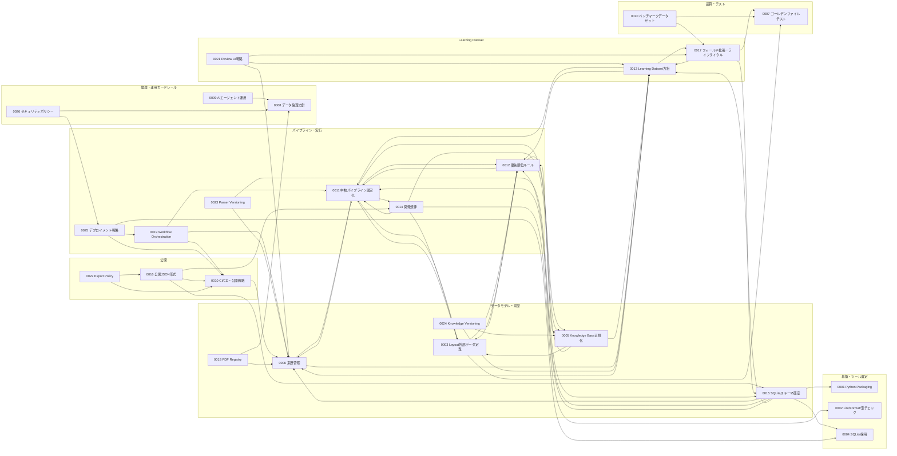

# ADR Dependency Map

> `A --> B` は「AはBを参照・前提としている（Aを理解するにはBの決定を先に理解する必要がある）」ことを表す。矢印の向きは各ADR本文中の「関連ADR」節・コンテキスト中の参照から機械的に抽出したもの（抽出方法は[品質チェックレポート](quality-check.md#依存関係の抽出方法)を参照）。新規ADR（0018〜0026）の依存関係は、[`gap-analysis.md`](gap-analysis.md)での検討過程に基づき設計時点で付与したもの。

## 全体図（テーマ別クラスタ）

## 読み方の例

- `ADR-0002 --> ADR-0007` は課題文の記法例であり、本リポジトリの実際の依存関係には存在しない。実例として `ADR-0011 --> ADR-0006` は「中核パイプラインの固定化（0011）は、来歴管理方針（0006）が定めたステージ分割を前提にしている」ことを示す。
- `0001`, `0002`, `0004`, `0007`, `0008`, `0009` は他ADRを参照しない、または参照が少ない「基盤側」の決定であり、他の多くのADRから参照される。
- 新規追加ADR（`0018`〜`0026`）は、既存ADRを参照する側（out-degree）としてのみ現時点でグラフに現れる。まだどのADRからも参照されていない（in-degree 0）のは、追加されたばかりで他ADRからの参照が発生していないためであり、設計上の欠陥ではない。今後これらのトピックに依存する新しいADRが追加されれば自然に解消される。

## 被参照数（in-degree）ランキング（上位、実測値）

以下は本ファイルの全60エッジを実際に集計した値である（[品質チェックレポート](quality-check.md#依存関係の抽出方法)で検証済み）。

| ADR | 被参照数 | 参照数 | 備考 |
|---|---|---|---|
| 0006 | 8 | 2 | 来歴管理方針。データモデル全体の前提。プロジェクト内で最も広く参照される |
| 0011 | 7 | 5 | 中核パイプライン固定化 |
| 0012 | 6 | 3 | 未知パターンへの対応優先順位 |
| 0013 | 6 | 4 | Learning Dataset方針 |
| 0003 | 4 | 3 | Layout外部データ定義 |
| 0005 | 4 | 3 | Knowledge Base正規化 |
| 0010 | 4 | 1 | CI/CD・公開戦略 |
| 0007 | 3 | 0 | ゴールデンファイルテスト戦略 |
| 0008 | 3 | 0 | データ倫理方針 |
| 0015 | 3 | 6 | SQLiteスキーマの確定 |
| 0017 | 3 | 3 | Learning Dataset拡張 |

被参照数0のADR（`0018`, `0020`, `0021`, `0022`, `0023`, `0024`, `0026`、および既存の`0009`）については [`quality-check.md`](quality-check.md#孤立したadr) で個別に評価している。いずれも参照数（out-degree）は1以上あり、グラフ上完全に孤立したノード（in=0 かつ out=0）は存在しない。
