# ADR Dependency Map

> `A --> B` は「AはBを参照・前提としている（Aを理解するにはBの決定を先に理解する必要がある）」ことを表す。矢印の向きは各ADR本文中の「関連ADR」節・コンテキスト中の参照から機械的に抽出したもの（抽出方法は[品質チェックレポート](quality-check.md#依存関係の抽出方法)を参照）。新規ADR（0018〜0026）の依存関係は、[`gap-analysis.md`](gap-analysis.md)での検討過程に基づき設計時点で付与したもの。ADR-0027（Review Domainの中核化）・ADR-0028（設定管理へのPydantic Settings採用）・ADR-0029（公開成果物の完全性保証と監査ログ方針）・ADR-0030（Enum実装方針をenum.StrEnumに統一する）・ADR-0031（PipelineMetricsのフィールド構成を確定する）・ADR-0032（Redefine Document Analyzer Responsibility）・ADR-0033（Document Analyzer出力型のフィールド構成を確定する）・ADR-0034（Document Analyzerの実装にpypdfを採用する）・ADR-0035（Layout Detector Owns PDF Content Access）・ADR-0036（LayoutDefinitionの実装にPyYAMLを採用する）・ADR-0037（Layout Detector Produces Layout Artifact）・ADR-0038（Field Extractor Produces FieldExtractionResult）・ADR-0039（Normalizer Field Mapping via Extended Layout Knowledge）・ADR-0040（Normalizer Produces NormalizationResult）・ADR-0041（Validator Constructor-Injects ValidationRuleSet）・ADR-0042（Python Version Target Realignment）の依存関係は、当該ADR本文の「コンテキスト」節・「関連ADR」節に基づき付与した。

## 全体図（テーマ別クラスタ）

```mermaid
flowchart LR
    subgraph FOUNDATION["基盤・ツール選定"]
        ADR0001["0001 Python Packaging"]
        ADR0002["0002 Lint/Format/型チェック"]
        ADR0004["0004 SQLite採用"]
        ADR0028["0028 Pydantic Settings採用"]
        ADR0030["0030 StrEnum採用"]
        ADR0036["0036 PyYAML採用"]
        ADR0042["0042 Python Version Target Realignment"]
    end

    subgraph GUARDRAIL["倫理・運用ガードレール"]
        ADR0008["0008 データ倫理方針"]
        ADR0009["0009 AIエージェント運用"]
        ADR0026["0026 セキュリティポリシー"]
        ADR0029["0029 完全性保証・監査ログ"]
    end

    subgraph DATAMODEL["データモデル・来歴"]
        ADR0003["0003 Layout外部データ定義"]
        ADR0005["0005 Knowledge Base正規化"]
        ADR0006["0006 来歴管理"]
        ADR0015["0015 SQLiteスキーマ確定"]
        ADR0018["0018 PDF Registry"]
        ADR0024["0024 Knowledge Versioning"]
    end

    subgraph PIPELINE["パイプライン・実行"]
        ADR0011["0011 中核パイプライン固定化"]
        ADR0012["0012 優先順位ルール"]
        ADR0014["0014 開発規律"]
        ADR0019["0019 Workflow Orchestration"]
        ADR0023["0023 Parser Versioning"]
        ADR0025["0025 デプロイメント戦略"]
        ADR0031["0031 PipelineMetrics確定"]
        ADR0032["0032 Document Analyzer責務再定義"]
        ADR0033["0033 Document Analyzerフィールド確定"]
        ADR0034["0034 pypdf採用"]
        ADR0035["0035 Layout Detector PDF独占"]
        ADR0037["0037 Layout Detector Produces Layout Artifact"]
        ADR0038["0038 Field Extractor Produces FieldExtractionResult"]
        ADR0039["0039 Normalizer Field Mapping via Extended Layout Knowledge"]
        ADR0040["0040 Normalizer Produces NormalizationResult"]
        ADR0041["0041 Validator Constructor-Injects ValidationRuleSet"]
    end

    subgraph QUALITY["品質・テスト"]
        ADR0007["0007 ゴールデンファイルテスト"]
        ADR0020["0020 ベンチマークデータセット"]
    end

    subgraph LEARNING["Learning Dataset / Review"]
        ADR0013["0013 Learning Dataset方針"]
        ADR0017["0017 フィールド拡張・ライフサイクル"]
        ADR0021["0021 Review UI戦略"]
        ADR0027["0027 Review Domainの中核化"]
    end

    subgraph PUBLISH["公開"]
        ADR0010["0010 CI/CD・公開戦略"]
        ADR0016["0016 公開JSON形式"]
        ADR0022["0022 Export Policy"]
    end

    ADR0003 --> ADR0007
    ADR0003 --> ADR0011
    ADR0003 --> ADR0012
    ADR0005 --> ADR0003
    ADR0005 --> ADR0012
    ADR0005 --> ADR0013
    ADR0006 --> ADR0011
    ADR0006 --> ADR0013
    ADR0009 --> ADR0008
    ADR0010 --> ADR0006
    ADR0011 --> ADR0003
    ADR0011 --> ADR0005
    ADR0011 --> ADR0006
    ADR0011 --> ADR0012
    ADR0011 --> ADR0014
    ADR0012 --> ADR0003
    ADR0012 --> ADR0005
    ADR0012 --> ADR0011
    ADR0013 --> ADR0006
    ADR0013 --> ADR0011
    ADR0013 --> ADR0012
    ADR0013 --> ADR0017
    ADR0014 --> ADR0002
    ADR0014 --> ADR0003
    ADR0014 --> ADR0005
    ADR0014 --> ADR0011
    ADR0015 --> ADR0001
    ADR0015 --> ADR0004
    ADR0015 --> ADR0006
    ADR0015 --> ADR0011
    ADR0015 --> ADR0012
    ADR0015 --> ADR0013
    ADR0016 --> ADR0010
    ADR0016 --> ADR0014
    ADR0016 --> ADR0015
    ADR0017 --> ADR0007
    ADR0017 --> ADR0013
    ADR0017 --> ADR0015

    ADR0018 --> ADR0006
    ADR0018 --> ADR0008
    ADR0019 --> ADR0006
    ADR0019 --> ADR0010
    ADR0019 --> ADR0011
    ADR0020 --> ADR0007
    ADR0020 --> ADR0017
    ADR0021 --> ADR0006
    ADR0021 --> ADR0013
    ADR0021 --> ADR0017
    ADR0022 --> ADR0010
    ADR0022 --> ADR0016
    ADR0023 --> ADR0006
    ADR0023 --> ADR0015
    ADR0024 --> ADR0005
    ADR0024 --> ADR0012
    ADR0024 --> ADR0013
    ADR0025 --> ADR0004
    ADR0025 --> ADR0010
    ADR0025 --> ADR0019
    ADR0026 --> ADR0008
    ADR0026 --> ADR0025

    ADR0027 --> ADR0010
    ADR0027 --> ADR0021

    ADR0028 --> ADR0001
    ADR0028 --> ADR0002
    ADR0028 --> ADR0026

    ADR0029 --> ADR0006
    ADR0029 --> ADR0014
    ADR0029 --> ADR0019
    ADR0029 --> ADR0022
    ADR0029 --> ADR0026

    ADR0030 --> ADR0002
    ADR0030 --> ADR0014
    ADR0030 --> ADR0028

    ADR0031 --> ADR0006
    ADR0031 --> ADR0011
    ADR0031 --> ADR0014
    ADR0031 --> ADR0019

    ADR0032 --> ADR0006
    ADR0032 --> ADR0011
    ADR0032 --> ADR0012
    ADR0032 --> ADR0023
    ADR0032 --> ADR0030

    ADR0033 --> ADR0031
    ADR0033 --> ADR0032

    ADR0034 --> ADR0001
    ADR0034 --> ADR0026
    ADR0034 --> ADR0032

    ADR0035 --> ADR0006
    ADR0035 --> ADR0011
    ADR0035 --> ADR0032
    ADR0035 --> ADR0033

    ADR0036 --> ADR0001
    ADR0036 --> ADR0005
    ADR0036 --> ADR0026
    ADR0036 --> ADR0034
    ADR0036 --> ADR0035

    ADR0037 --> ADR0011
    ADR0037 --> ADR0032
    ADR0037 --> ADR0035

    ADR0038 --> ADR0011
    ADR0038 --> ADR0035
    ADR0038 --> ADR0037

    ADR0039 --> ADR0003
    ADR0039 --> ADR0005
    ADR0039 --> ADR0011
    ADR0039 --> ADR0012
    ADR0039 --> ADR0037
    ADR0039 --> ADR0038

    ADR0040 --> ADR0005
    ADR0040 --> ADR0011
    ADR0040 --> ADR0037
    ADR0040 --> ADR0038
    ADR0040 --> ADR0039

    ADR0041 --> ADR0005
    ADR0041 --> ADR0006
    ADR0041 --> ADR0011
    ADR0041 --> ADR0014
    ADR0041 --> ADR0037
    ADR0041 --> ADR0040

    ADR0042 --> ADR0001
    ADR0042 --> ADR0002
    ADR0042 --> ADR0009
    ADR0042 --> ADR0010
    ADR0042 --> ADR0030
```

## 読み方の例

- `ADR-0002 --> ADR-0007` は課題文の記法例であり、本リポジトリの実際の依存関係には存在しない。実例として `ADR-0011 --> ADR-0006` は「中核パイプラインの固定化（0011）は、来歴管理方針（0006）が定めたステージ分割を前提にしている」ことを示す。
- `0001`, `0002`, `0004`, `0007`, `0008`, `0009` は他ADRを参照しない、または参照が少ない「基盤側」の決定であり、他の多くのADRから参照される。
- 新規追加ADR（`0018`〜`0026`）は、既存ADRを参照する側（out-degree）としてのみ現時点でグラフに現れる。まだどのADRからも参照されていない（in-degree 0）のは、追加されたばかりで他ADRからの参照が発生していないためであり、設計上の欠陥ではない。今後これらのトピックに依存する新しいADRが追加されれば自然に解消される。

## 被参照数（in-degree）ランキング（上位、実測値）

以下は本ファイルの全124エッジ（ADR-0042追加後）を実際に集計した値である（[品質チェックレポート](quality-check.md#依存関係の抽出方法)で検証済み。0034追加時点からの増分はADR-0035の新規4エッジ・ADR-0036の新規5エッジ・ADR-0037の新規3エッジ・ADR-0038の新規3エッジ・ADR-0039の新規6エッジ・ADR-0040の新規5エッジ・ADR-0041の新規6エッジ・ADR-0042の新規5エッジ）。

| ADR | 被参照数 | 参照数 | 備考 |
|---|---|---|---|
| 0011 | 15 | 5 | 中核パイプライン固定化（ADR-0035追加により+1、ADR-0037追加により+1、ADR-0038追加により+1、ADR-0039追加により+1、ADR-0040追加により+1、ADR-0041追加により+1） |
| 0006 | 13 | 2 | 来歴管理方針。データモデル全体の前提（ADR-0035追加により+1、ADR-0041追加により+1） |
| 0012 | 8 | 3 | 未知パターンへの対応優先順位（ADR-0039追加により被参照数が7→8に） |
| 0005 | 8 | 3 | Knowledge Base正規化（ADR-0036追加により被参照数が4→5に、ADR-0039追加により5→6に、ADR-0040追加により6→7に、ADR-0041追加により7→8に） |
| 0010 | 6 | 1 | CI/CD・公開戦略（ADR-0042追加により被参照数が5→6に） |
| 0013 | 6 | 4 | Learning Dataset方針 |
| 0014 | 6 | 4 | 開発規律（ADR-0041追加により被参照数が5→6に） |
| 0001 | 5 | 0 | Pythonパッケージング（ADR-0036追加により被参照数が3→4に、ADR-0042追加により4→5に） |
| 0003 | 5 | 3 | Layout外部データ定義（ADR-0039追加により被参照数が4→5に） |
| 0002 | 4 | 0 | Lint/Format/型チェックツールの選定（ADR-0042追加により被参照数が3→4に） |
| 0026 | 4 | 2 | セキュリティポリシー（ADR-0036追加により被参照数が3→4に） |
| 0032 | 4 | 5 | Document Analyzer責務再定義（ADR-0037追加により被参照数が3→4に） |
| 0037 | 4 | 3 | Layout Detector Produces Layout Artifact（ADR-0039追加により被参照数が1→2に、ADR-0040追加により2→3に、ADR-0041追加により3→4に） |
| 0015 | 3 | 6 | SQLiteスキーマの確定 |
| 0019 | 3 | 3 | Workflow Orchestration |
| 0008 | 3 | 0 | データ倫理方針 |
| 0007 | 3 | 0 | ゴールデンファイルテスト戦略 |
| 0017 | 3 | 3 | Learning Dataset拡張 |
| 0035 | 3 | 4 | Layout Detector PDF独占（ADR-0038追加により被参照数が2→3に、本表に初めて登場） |

被参照数0のADR（`0018`, `0020`, `0024`, `0027`, `0029`, `0036`, `0041`, `0042`）については [`quality-check.md`](quality-check.md#孤立したadr) で個別に評価している。いずれも参照数（out-degree）は1以上あり、グラフ上完全に孤立したノード（in=0 かつ out=0）は存在しない（42ノード・124エッジで再検証済み）。`0021`は`0027`（Review Domainの中核化）から、`0026`は`0028`（Pydantic Settings採用）から、`0022`は`0029`（公開成果物の完全性保証と監査ログ方針）から、`0028`は`0030`（Enum実装方針をenum.StrEnumに統一する）から新たに参照されたため、この一覧から外れた。`0023`（Parser Versioning）・`0030`（StrEnum採用）は、いずれもADR-0032（Document Analyzer責務再定義）から、`0031`・`0032`はADR-0033（Document Analyzer出力型のフィールド構成を確定する）から、`0033`・`0034`はADR-0035（Layout Detector Owns PDF Content Access）から、`0037`はADR-0038（Field Extractor Produces FieldExtractionResult）から、`0038`はADR-0039（Normalizer Field Mapping via Extended Layout Knowledge）から、`0039`はADR-0040（Normalizer Produces NormalizationResult）から、`0040`はADR-0041（Validator Constructor-Injects ValidationRuleSet）から新たに参照されたため、それぞれの一覧から外れた。従来「既存の`0009`」として被参照数0の一覧に含めていたが、ADR-0042がAIエージェント運用方針（ADR-0009）を初めて参照したため、`0009`は被参照数1となりこの一覧から外れた。`0041`・`0042`は追加されたばかりで、まだどのADRからも参照されていない（被参照数0、Task9-0・本対応完了時点で自然な状態）。

**注記（発見した既知の問題、本Task5の範囲外）**: 上記の非巡回性の実測検証において、`ADR-0003`・`ADR-0005`・`ADR-0006`・`ADR-0011`の間に相互参照（例: `ADR-0003 --> ADR-0011`と`ADR-0011 --> ADR-0003`が同時に存在）による循環が複数存在することを確認した（Phase2 Task5でのDFSベースの機械検証により発見）。`git log`で確認したところ、これらの循環はADR統治基盤の最初のコミット（`dependency-map.md`初版）から存在しており、Phase2 Task5で新規に導入されたものではない。[`docs/design-freeze.md`](../design-freeze.md)が「DFS彩色法・Kahnのアルゴリズムの双方でグラフ全体が非巡回であることを検証済み」と述べているが、本Task5時点の機械検証では非巡回性が成立していないことが判明した。本ADR体系全体の再検証・整理は本Task5の責務範囲外（無関係なADRの実質的な書き換えを伴うため）であり、別タスクとして起票することを推奨する（詳細はPhase2 Task5 Review ReportのTODO参照）。Task6・Task7・Task8-0・Task8・Task9-0・本対応（Python Version Target Realignment）完了時点でも同じ既知の循環が残存しており（ADR-0037・ADR-0038・ADR-0039・ADR-0040・ADR-0041・ADR-0042の追加による新規循環はない、上記の機械検証で確認済み）、引き続き別タスクでの対応を推奨する。

**検証スクリプトの再現性修正**: 本対応時に、DFS彩色法の起点ノードをPythonの`set`反復順（非決定的）で選んでいたため、検出される循環の列挙件数が実行のたびに12〜15件とばらつくバグを発見した。起点ノードをソート済みリストから選ぶよう修正した結果、**一意な循環は13件**であり、いずれも既知のクラスタ（`0003`/`0005`/`0006`/`0011`/`0012`/`0013`/`0014`/`0015`/`0017`）内に閉じていることを再現可能な形で確認した（`0037`〜`0042`を含む新しいノードは1件も循環に関与しない）。過去のTask5〜Task9-0のレビューで報告した「12件」という件数はこの非決定性の影響を受けた可能性があるが、循環が既知クラスタの外に広がっていないという結論自体に変わりはない。
