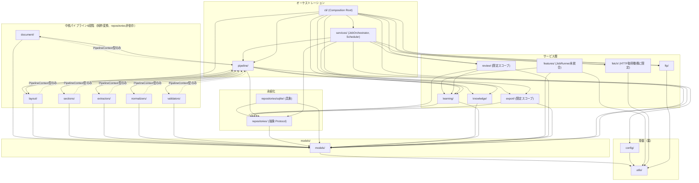
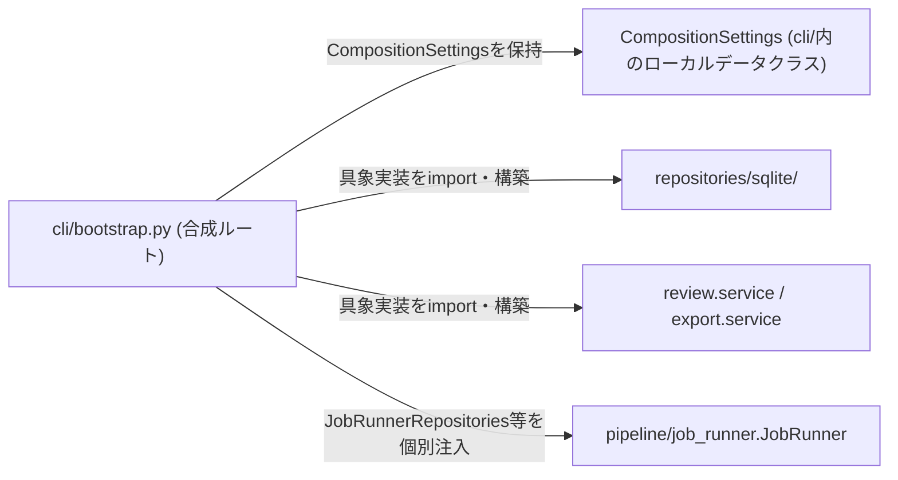

# Dependency Rule

> パッケージ間の依存方向を固定する。[`package-design.md`](package-design.md)の個別パッケージ節が定める依存先・依存禁止の**一覧化・可視化**が本ドキュメントの役割であり、内容はそちらと矛盾しない。

## 一般原則（ユーザー提示の例に基づく）

**禁止**: 具体的なDB技術への直接依存。

```
extractor
  ↓
sqlite
```

**許可**: Repositoryという抽象を経由した依存。

```
extractor
  ↓
repository
  ↓
sqlite
```

この一般原則は、`repositories/`（抽象）を経由する限り、どのパッケージも永続化にアクセスしてよい、というのが**Dependency Ruleの一般形**である。

## 本プロジェクト固有の追加制約

上記の一般原則に対し、本プロジェクトは中核パイプライン6段階（`document/`, `layout/`, `sections/`, `extractors/`, `normalizers/`, `validators/`）についてのみ、**一般原則よりも厳格な制約**を追加する。

```
extractor
  ↓
repository        ← 一般原則では許可されるが、本プロジェクトの6段階には適用しない
  ↓
sqlite
```

**理由**: [`pipeline.md`](pipeline.md)が定めるように、中核6段階は`run()`のみを公開する純粋な変換ステージとして設計する。Repositoryへのアクセス（読み込み・書き込みいずれも）は、常に呼び出し元の`pipeline/`（`JobRunner`）が担う。これにより[`architecture-contract.md`](../architecture/architecture-contract.md)が要求する「Field ExtractorはDBを知らない」等の分離を、単なる運用上の申し合わせではなく**パッケージの依存関係グラフ上の構造的事実**として保証できる。

したがって本プロジェクトでは、6段階について以下も禁止とする。

```
extractor
  ↓
repository（抽象であっても）
```

`learning/`, `features/`, `review/`, `export/`, `fetch/`, `pipeline/`等、6段階に含まれないパッケージは、一般原則どおり`repositories/`（抽象）への依存を許可する。ただし`knowledge/`は例外である。`KnowledgeService`の具象実装（`FileKnowledgeService`）はYAML読込のみを責務とし、`models/`・`utils/`以外に依存しない設計を採用したため、`repositories/`（抽象含む）への依存を持たない。

---

## `PipelineContext`型依存

上記の「6段階は`repositories/`・`knowledge/`・`learning/`・`review/`・`export/`に依存しない」という制約とは別に、`document/`, `layout/`, `sections/`, `extractors/`, `normalizers/`, `validators/`の6パッケージは、いずれも`from mod_personnel_db.pipeline import PipelineContext`をimportする。これは[`pipeline.md`](pipeline.md)が定める`PipelineStage.run(self, context: PipelineContext, input: TIn) -> TOut`というProtocol実装のために、各Stage実装のメソッドシグネチャが`PipelineContext`型を参照する必要があるという、**型シグネチャ上避けられない構造的帰結**である。

- **この依存は許可する**: `PipelineContext`（`pipeline/context.py`）は不変（immutable）の値オブジェクトであり、Repository・Knowledge・Learning・Review・Exportのいずれへのアクセス手段も提供しない。6段階が参照するのは型定義のみであり、`pipeline/`の実行ロジック（`PipelineRunner.run()`・`JobRunner`）を呼び出すことはない。
- **循環参照は発生しない**: `pipeline/__init__.py`は6段階パッケージ（`document/`〜`validators/`）・`pipeline/job_runner.py`のいずれもimportしない（`job_runner.py`が6段階に依存するため、ここでimportすると循環参照になる。`pipeline/__init__.py`のコメント参照）。したがって「6段階 → `pipeline/`（型のみ）」と「`pipeline/` → 6段階（`JobRunner`経由の実行）」は、実行時には同一方向（`pipeline/`が6段階を呼び出す）を保ったまま共存する。
- **`package-design.md`との対応**: [`package-design.md`](package-design.md)の`document/`〜`validators/`各節・パッケージ横断の依存先サマリ表には、この依存を`pipeline/`（`PipelineContext`型のみ）と明記している。

---

## 全体依存グラフ



**読み方**: 矢印`A --> B`は「AはBに依存してよい（Aのコードから`import`してよい）」。逆方向（`B --> A`）は許可しない限り禁止。図に存在しない実線エッジ（例: `extractors --> repositories`）はすべて暗黙的に禁止である。破線エッジ（`-.->`）は「型シグネチャ上の型のみの依存」（[`PipelineContext`型依存](#pipelinecontext型依存)参照）を表す。`config["config/"]`はPhase6 Task14-5で実装済みとなった（[ADR-0028](../adr/0028-pydantic-settings-for-configuration.md)）。`features/`・`ftp/`・`fetch/`・`services/`はPhase7 Task16-1〜16-4で実装済みとなり、上図のエッジは実装時点のimportを反映している（`fetch/`は`utils/`のみに依存し、Task16-0計画時点の`repositories/`・`ftp/`への依存は実装されなかった。`services/`は計画通り`repositories/`（抽象、`PDFRepository`のみ）へ依存する一方、計画にあった`utils/`への依存は実装上不要であった。詳細は[`package-design.md`](package-design.md)の各節参照）。`pipeline --> features`（`JobRunner`が`FeatureVector`を計算しNormalizer/Validatorへ注入する統合）は設計方針のみ確定しており未実装のため、上図にエッジとして描かない（`features/`は現時点でどのコンポーネントからも呼び出されない独立パッケージ、[`package-design.md`](package-design.md)の`features/`節参照）。`cli --> fetch`・`cli --> ftp`・`cli --> services`は、Phase7 Task17-1（`build_fetch_client()`/`build_ftp_client()`/`build_job_orchestrator()`）・Task17-4（`build_scheduler()`）で`cli/bootstrap.py`に実装され、上図に反映済みである（旧「統合後の依存グラフ（計画中）」節は本節へ統合済み、下記参照）。`repositories_sqlite → config`エッジは、`config/`が実装済みの現在も存在しない。`repositories/sqlite/`のDB接続先（`db_path`）は合成ルート（`cli/`）から単純な文字列として渡される設計であり、`repositories/sqlite/`自身が`config/`の型付き設定オブジェクトを参照することはないため（構造上の設計判断であり、`config/`の実装状況とは無関係）。`cli/`の実際の依存は`review/`・`export/`・`pipeline/`・`knowledge/`・`learning/`・`layout/`・`config/`・`fetch/`・`ftp/`・`services/`・`repositories/sqlite/`（合成ルートとしての例外）であり、`features/`のみ実装済みだが`cli/`から一切参照されていないため、依存エッジを描かない。

> **注記（`pipeline`ノードの粒度について、[ADR-0044](../adr/0044-pipelinerunner-jobrunner-boundary.md)）**: 上図の`pipeline`ノードはパッケージ単位であり、`pipeline --> repositories`・`pipeline --> knowledge`・`pipeline --> learning`の3エッジは、`pipeline/`パッケージ内の`JobRunner`（`pipeline/job_runner.py`、実装済み）が必要とする依存を表す。パッケージ内の`PipelineRunner`（`pipeline/runner.py`、実装済み）自身は、これら3エッジのいずれにも該当するimportを持たない（[architecture-contract.md 保証13](../architecture/architecture-contract.md#13-pipelinerunnerはrepositoryknowledgelearningreviewexportを知らない)）。この区別はモジュール単位の規律であり、他パッケージと粒度を揃えるため、本図ではノードを分割しない（[ADR-0044](../adr/0044-pipelinerunner-jobrunner-boundary.md)の「検討した代替案」）。

---

## Phase7統合（Task17-0設計・Task17-1/17-4実装、完了）

> **本節は実装済みの状態を記録する。** 本節はもともと「統合後の依存グラフ（計画中）」として[`docs/phase7-integration-design.md`](../phase7-integration-design.md)（Task17-0）が確定したComposition Root統合の設計案を示していたが、Task17-1（`cli --> fetch`・`cli --> ftp`・`cli --> services`の新設）・Task17-4（`Scheduler`の`cli`統合）で実装が完了し、上記「全体依存グラフ」に反映済みである。本節は実装完了後の記録として残す（設計時点の検討経緯は[`phase7-integration-design.md`](../phase7-integration-design.md)を参照）。

Phase7統合が`cli/`に追加したエッジは、`cli --> fetch`・`cli --> ftp`・`cli --> services`の3本のみである（`cli --> features`は追加していない、`FeatureStore`は`JobRunner`への統合が未実装のため未接続のまま、[`phase7-integration-design.md`](../phase7-integration-design.md#7-featurestore生成位置)参照）。`services/`側は`JobOrchestrator`（Task17-1）に加え`Scheduler`（Task17-4、`services/scheduler.py`の`DefaultScheduler`）も`cli/bootstrap.py`の`build_scheduler()`経由で生成される。`DefaultScheduler`自体は`JobOrchestrator`のみに依存し（`fetch/`・`ftp/`・`pipeline/`・`review/`・`export/`・Repositoryのいずれにも直接依存しない）、`services/`パッケージ内で完結する。

**循環依存が発生しない理由**: [`package-design.md`](package-design.md)のパッケージ横断の依存先サマリ表が定めるとおり、`fetch/`・`ftp/`・`services/`はいずれも依存禁止に`cli/`を含む（`fetch/`・`ftp/`は`utils/`以外への依存を持たず、`services/`の依存禁止表に`cli/`が明記されている）。したがって`cli --> fetch`・`cli --> ftp`・`cli --> services`のいずれのエッジも逆方向（`fetch --> cli`等）を伴わず、既存の依存グラフに循環を生じさせない（実装後の再検証結果は[`docs/reports/phase7-final-audit.md`](../reports/phase7-final-audit.md)を参照）。

---

## 明示的な禁止例・許可例（追加）

| # | 禁止 | 許可（代替） | 理由 |
|---|---|---|---|
| 1 | `extractors/` → `repositories/sqlite/` | `pipeline/` → `repositories/`（抽象）→ `repositories/sqlite/` | 一般原則。具体DB技術への直接依存を避ける |
| 2 | `extractors/` → `repositories/`（抽象） | `pipeline/`が`extractors/`の出力を受け取り、`pipeline/`自身が`repositories/`へ渡す | 本プロジェクト固有の追加制約（6段階はrepositories非依存） |
| 3 | `document/` → `layout/` | `pipeline/`が両者を順に呼び出す | 「Document Analyzerはlayoutを知らない」（[`architecture-contract.md`](../architecture/architecture-contract.md)） |
| 4 | `layout/` → `extractors/` | 同上、`pipeline/`が調停する | 「Layout Detectorはfieldを知らない」 |
| 5 | `sections/` → `knowledge/` | 同上 | 「Section Parserはknowledgeを知らない」 |
| 6 | `normalizers/` → `knowledge/` | `pipeline/`が`knowledge/`から`KnowledgeSnapshot`を取得し、`Normalizer`のコンストラクタに注入する（ADR-0040） | Normalizerはknowledgeサービスそのものを知らず、値オブジェクトのみを受け取る |
| 7 | `repositories/` → `repositories/sqlite/` | （逆方向、常に許可） `repositories/sqlite/` → `repositories/` | 抽象は具象を知らない（依存性逆転の原則） |
| 8 | `knowledge/` / `learning/` 等サービス層 → `repositories/sqlite/`（具象を直接import） | サービス層 → `repositories/`（抽象）。具象の選択は`cli/`（合成ルート）が行う | PostgreSQL移行時にサービス層のコード変更を不要にするため（[`repositories.md`](repositories.md)） |
| 9 | `pipeline/` → `review/` または `pipeline/` → `export/` | `services/`が`pipeline/`・`review/`・`export/`を束ねる | 中核パイプラインの実行と、レビュー・公開は独立した関心事（[`package-design.md`](package-design.md)） |
| 10 | 任意のパッケージ → `utils/`以外への依存を`utils/`自身が持つ | `utils/`は常に依存グラフの葉 | `utils/`はドメイン知識を持たない汎用ヘルパーの集合であるため |
| 11 | `validators/` → `knowledge/` | `pipeline/`が`knowledge/`から`ValidationRuleSet`を取得し、`Validator`のコンストラクタに注入する（ADR-0041、行6と対称） | Validatorはknowledgeサービスそのものを知らず、値オブジェクトのみを受け取る |
| 12 | `pipeline/runner.py`（`PipelineRunner`） → `repositories/` / `knowledge/` / `learning/` / `review/` / `export/` | `pipeline/job_runner.py`（`JobRunner`）がこれらに依存し、`PipelineRunner`へは登録済み`PipelineStage`列と`PipelineContext`のみを渡す | `PipelineRunner`は純粋なStage実行機であり、これらへの依存はJobRunnerの責務（ADR-0044、[architecture-contract.md 保証13](../architecture/architecture-contract.md#13-pipelinerunnerはrepositoryknowledgelearningreviewexportを知らない)） |
| 13 | `knowledge/`（`KnowledgeService`）・`learning/`（`LearningService`） → `pipeline/`、`repositories/sqlite/` | `pipeline/`（`JobRunner`）が`knowledge/`・`learning/`に依存する片方向のみ許可 | データ・Learning記録は常に「注入される」側であり、パイプラインを呼び出さない。`KnowledgeService`/`LearningService`のProtocol定義自体は`models/`の型のみを参照し、`pipeline/`・`repositories/sqlite/`のいずれにも依存しない |
| 14 | `config/` / `services/` / `pipeline/` / `repositories/`（抽象）が`repositories/sqlite/`の各具象クラス・`KnowledgeService`具象実装・`LearningService`具象実装を生成する | `cli/`（合成ルート）のみがこれらを生成し、生成済みのインスタンスを個別注入で渡す | 依存生成責務はComposition Root（`cli/`）に一本化される（ADR-0046、[architecture-contract.md 保証15](../architecture/architecture-contract.md#15-依存生成責務はcomposition-rootcliに一本化される)） |
| 15 | `knowledge/` → `repositories/`（抽象含む） | `knowledge/`の具象実装（`FileKnowledgeService`）は`models/`・`utils/`のみに依存し、`knowledge/`配下のYAMLを直接読み込む | `KnowledgeService`はDBインデックス（`KnowledgeRepository`）を経由せず、YAML読込・`KnowledgeSnapshot`/`ValidationRuleSet`生成のみを責務とする設計を採用したため（[interfaces.md#knowledgeservice](interfaces.md#knowledgeservice)の具象実装）。`learning/`（`LearningService`）は本行の対象外であり、`repositories/`（抽象、`LearningRepository`）への依存を引き続き許可する |
| 16 | `normalizers/` → `features/`、`validators/` → `features/`（`features/`は実装済み、Phase7 Task16-2） | `pipeline/`（`JobRunner`）が`features/`を呼び出して`FeatureVector`を計算し、`Normalizer`/`Validator`のコンストラクタに注入する設計（行6・行11と対称のパターン、Phase7 Task16-0で設計方針のみ確定）だが、この統合自体は未実装であり、`features/`は現時点でどのコンポーネントからも呼び出されない | `features/`は「6段階から直接参照されないユーティリティ」のままとし、`FeatureVector`は値オブジェクトとしてのみStage実装へ届く設計とする（[`package-design.md`](package-design.md)の`features/`節） |
| 17 | `fetch/` → `document/`〜`validators/`（PDF本文の解析） | `fetch/`はPDFバイト列の取得のみを行い、本文解析は行わない（実装確認済み、`pypdf`等のPDF専用ライブラリを一切importしない）。パイプライン実行時に`layout/`（Layout Detector）が改めてPDF本文へアクセスする | 「Layout DetectorだけがPDF本文にアクセスできる」（[architecture-contract.md 保証11](../architecture/architecture-contract.md#11-layout-detectorだけがpdf本文にアクセスできる)）を`fetch/`にも適用するため |

---

## 合成ルート（Composition Root）

「誰も`repositories/sqlite/`を直接importしない」という原則には、唯一の例外として**合成ルート**が必要である。実行時にどの`Repository`実装（SQLite/将来のPostgreSQL）を使うかを決定し、`repositories/sqlite/`・`KnowledgeService`・`LearningService`・`ReviewService`・`ExportService`の具象実装を構築して`JobRunner`に渡す箇所は、**`cli/bootstrap.py`**が担う（[ADR-0046](../adr/0046-composition-root-dependency-injection-contract.md)）。`config/`・`services/`・`pipeline/`・`repositories/`のいずれも、これらの具象実装を自ら生成しない（`config/`は値の提供に責務を限定し合成を行わない設計、`services/`はPhase7 Task16-4で実装済みだが同様に構築済みインスタンスの注入のみを行い自ら具象実装を生成しない設計、[`package-design.md`](package-design.md)参照）。Phase7 Task17-1/17-4で、`ftp/`・`fetch/`・`services/`の具象実装（`StandardFTPClient`・`HTTPFetchClient`・`DefaultJobOrchestrator`・`DefaultScheduler`）の生成も同じ合成ルート（`cli/bootstrap.py`）に一本化された。`services/`自身は依然`cli/bootstrap.py`から一切参照されない（`services/`パッケージのコードは`cli/`をimportしない、一方向の依存のまま）が、`cli/bootstrap.py`は`services/`が公開するProtocol・具象クラスを参照し、合成ルートの一部として`services/`の具象実装を組み立てる。

> **設計変更の経緯**: 当初`config/`を合成ルートとする案を検討したが、[`import-graph.md`](import-graph.md)の循環参照検証により、`repositories/sqlite/ → config/`（接続情報取得のため）と`config/ → repositories/sqlite/`（合成のため）が同時に成立し**循環参照になる**ことが判明した。`config/`は「設定値を提供するだけの末端パッケージ」のままとし、合成（具象実装のimportと組み立て）は依存グラフの最上位に位置する`cli/`に一本化することで循環を解消した。詳細な検証手順は[`import-graph.md`](import-graph.md#循環参照がないことの検証)を参照。**現状（Phase6 Task14-5で`config/`実装済み）**: `config/settings.py`の`AppSettings`（`pydantic_settings.BaseSettings`、`db_path`/`knowledge_root`/`layouts_root`/`parser_code_version`）が、本節が想定する設定値提供を実現する。`cli/bootstrap.py`の`CompositionSettings`は`AppSettings`の別名（`CompositionSettings = AppSettings`）であり、`AppSettings`の生成（`AppSettings(...)`の呼び出し）は`cli/bootstrap.py`の`build_settings()`一箇所に限定される。上記の循環参照回避策（合成は`cli/`に一本化）自体は変更していない。

> **`pipeline/`（`JobRunner`）への注入契約（ADR-0046）**: `JobRunner`（`pipeline/job_runner.py`）は`UnitOfWork`を受け取らない。`cli/`は`JobRunnerRepositories`（`pdfs`/`jobs`/`candidates`の3種のみを束ねる）・`KnowledgeService`・`LearningService`・`ParserVersionId`・`layout_definitions`を個別にコンストラクタ注入する。`UnitOfWork`は未実装であり（[`repositories.md#unitofwork`](repositories.md#unitofwork)参照）、`JobRunner`はそのような複数Repository原子性操作を行わないため使用しない。



この例外は、`cli/`が「どの具象実装を選ぶか」という配線の責務を持つことの直接の帰結であり、`cli/`以外のいかなるパッケージにもこの例外を拡大しない。実装済みの`cli/bootstrap.py`は、`repositories/sqlite/`の8具象クラス・`FileKnowledgeService`・`RepositoryLearningService`・`RepositoryReviewService`・`RepositoryExportService`・`HTTPFetchClient`・`StandardFTPClient`・`DefaultJobOrchestrator`・`DefaultScheduler`の生成をすべて一箇所に集約しており、他のいかなるパッケージにもこれらの生成は存在しない（`tests/unit/cli/test_bootstrap.py`のAST検証が機械的に保証する）。

> **Phase7統合（Task17-0設計・Task17-1/17-4実装、完了）**: `ftp/`・`fetch/`・`services/`の具象実装（`StandardFTPClient`・`HTTPFetchClient`・`DefaultJobOrchestrator`・`DefaultScheduler`）の生成位置は、この例外を拡大することなく`cli/bootstrap.py`に一本化された（[`docs/phase7-integration-design.md`](../phase7-integration-design.md)が確定した設計どおり）。詳細は「[Phase7統合](#phase7統合task17-0設計task17-117-4実装完了)」を参照。

---

## 機械的な検証（将来の推奨事項）

本ドキュメントのルールはドキュメント上の合意であり、実装が進むにつれて違反が紛れ込むリスクがある（[CLAUDE.md](../../CLAUDE.md)の「正しさより先に、間違いに気づける設計」の精神）。実装着手時には、`import-linter`等の静的解析ツールをCI（[ADR-0010](../adr/0010-ci-cd-and-publish-strategy.md)）に組み込み、本ドキュメントの依存グラフを機械的に強制することを推奨する。設定ファイル（`.importlinter`相当）は、本ドキュメントの「全体依存グラフ」を1対1で契約（`Contract`）として書き下せる。
