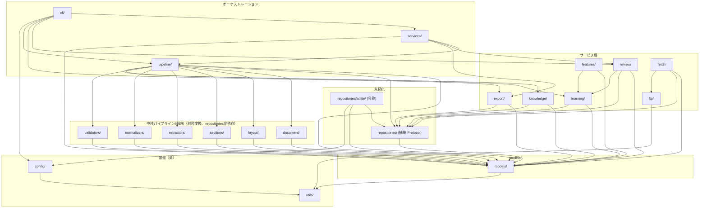
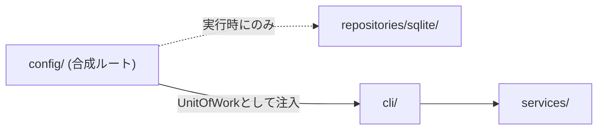

# Dependency Rule

> パッケージ間の依存方向を固定する。[`package-design.md`](package-design.md)の個別パッケージ節が定める依存先・依存禁止の**一覧化・可視化**が本ドキュメントの役割であり、内容はそちらと矛盾しない。

## 一般原則（ユーザー提示の例に基づく）

**禁止**: 具体的なDB技術への直接依存。

```
extractor
  ↓
sqlite
```

**許可**: Repositoryという抽象を経由した依存。

```
extractor
  ↓
repository
  ↓
sqlite
```

この一般原則は、`repositories/`（抽象）を経由する限り、どのパッケージも永続化にアクセスしてよい、というのが**Dependency Ruleの一般形**である。

## 本プロジェクト固有の追加制約

上記の一般原則に対し、本プロジェクトは中核パイプライン6段階（`document/`, `layout/`, `sections/`, `extractors/`, `normalizers/`, `validators/`）についてのみ、**一般原則よりも厳格な制約**を追加する。

```
extractor
  ↓
repository        ← 一般原則では許可されるが、本プロジェクトの6段階には適用しない
  ↓
sqlite
```

**理由**: [`pipeline.md`](pipeline.md)が定めるように、中核6段階は`run()`のみを公開する純粋な変換ステージとして設計する。Repositoryへのアクセス（読み込み・書き込みいずれも）は、常に呼び出し元の`pipeline/`（`JobRunner`）が担う。これにより[`architecture-contract.md`](../architecture/architecture-contract.md)が要求する「Field ExtractorはDBを知らない」等の分離を、単なる運用上の申し合わせではなく**パッケージの依存関係グラフ上の構造的事実**として保証できる。

したがって本プロジェクトでは、6段階について以下も禁止とする。

```
extractor
  ↓
repository（抽象であっても）
```

`knowledge/`, `learning/`, `features/`, `review/`, `export/`, `fetch/`, `pipeline/`等、6段階に含まれないパッケージは、一般原則どおり`repositories/`（抽象）への依存を許可する。

---

## 全体依存グラフ



**読み方**: 矢印`A --> B`は「AはBに依存してよい（Aのコードから`import`してよい）」。逆方向（`B --> A`）は許可しない限り禁止。図に存在しないエッジ（例: `extractors --> repositories`）はすべて暗黙的に禁止である。

---

## 明示的な禁止例・許可例（追加）

| # | 禁止 | 許可（代替） | 理由 |
|---|---|---|---|
| 1 | `extractors/` → `repositories/sqlite/` | `pipeline/` → `repositories/`（抽象）→ `repositories/sqlite/` | 一般原則。具体DB技術への直接依存を避ける |
| 2 | `extractors/` → `repositories/`（抽象） | `pipeline/`が`extractors/`の出力を受け取り、`pipeline/`自身が`repositories/`へ渡す | 本プロジェクト固有の追加制約（6段階はrepositories非依存） |
| 3 | `document/` → `layout/` | `pipeline/`が両者を順に呼び出す | 「Document Analyzerはlayoutを知らない」（[`architecture-contract.md`](../architecture/architecture-contract.md)） |
| 4 | `layout/` → `extractors/` | 同上、`pipeline/`が調停する | 「Layout Detectorはfieldを知らない」 |
| 5 | `sections/` → `knowledge/` | 同上 | 「Section Parserはknowledgeを知らない」 |
| 6 | `normalizers/` → `knowledge/` | `pipeline/`が`knowledge/`から`KnowledgeSnapshot`を取得し、`Normalizer.run()`の引数として渡す | Normalizerはknowledgeサービスそのものを知らず、値オブジェクトのみを受け取る |
| 7 | `repositories/` → `repositories/sqlite/` | （逆方向、常に許可） `repositories/sqlite/` → `repositories/` | 抽象は具象を知らない（依存性逆転の原則） |
| 8 | `knowledge/` / `learning/` 等サービス層 → `repositories/sqlite/`（具象を直接import） | サービス層 → `repositories/`（抽象）。具象の選択は`config/`（合成ルート）が行う | PostgreSQL移行時にサービス層のコード変更を不要にするため（[`repositories.md`](repositories.md)） |
| 9 | `pipeline/` → `review/` または `pipeline/` → `export/` | `services/`が`pipeline/`・`review/`・`export/`を束ねる | 中核パイプラインの実行と、レビュー・公開は独立した関心事（[`package-design.md`](package-design.md)） |
| 10 | 任意のパッケージ → `utils/`以外への依存を`utils/`自身が持つ | `utils/`は常に依存グラフの葉 | `utils/`はドメイン知識を持たない汎用ヘルパーの集合であるため |

---

## 合成ルート（Composition Root）

「誰も`repositories/sqlite/`を直接importしない」という原則には、唯一の例外として**合成ルート**が必要である。実行時にどの`Repository`実装（SQLite/将来のPostgreSQL）を使うかを決定し、`UnitOfWork`を組み立てて`pipeline/`・`services/`・`cli/`に渡す箇所は、`config/`が担う。



この例外は、`config/`が「どの具象実装を選ぶか」という配線の責務を持つことの直接の帰結であり、`config/`以外のいかなるパッケージにもこの例外を拡大しない。

---

## 機械的な検証（将来の推奨事項）

本ドキュメントのルールはドキュメント上の合意であり、実装が進むにつれて違反が紛れ込むリスクがある（[CLAUDE.md](../../CLAUDE.md)の「正しさより先に、間違いに気づける設計」の精神）。実装着手時には、`import-linter`等の静的解析ツールをCI（[ADR-0010](../adr/0010-ci-cd-and-publish-strategy.md)）に組み込み、本ドキュメントの依存グラフを機械的に強制することを推奨する。設定ファイル（`.importlinter`相当）は、本ドキュメントの「全体依存グラフ」を1対1で契約（`Contract`）として書き下せる。
