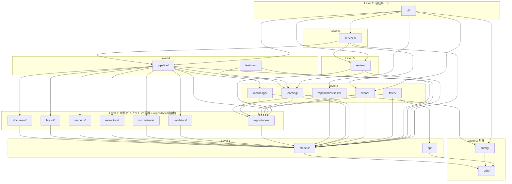

# Import Graph

> [`package-design.md`](package-design.md)・[`dependency-rule.md`](dependency-rule.md)が定めるパッケージ間の依存を、**実際にimportされる方向**として可視化し、循環参照が存在しないことを機械的に検証する。本ドキュメントに実装はない。

## グラフの意味

`A --> B`は「パッケージ`A`のコードが`from mod_personnel_db.B import ...`を含む（`A`は`B`をimportする）」ことを表す。これは[`dependency-rule.md`](dependency-rule.md)の「依存する」と同じ関係であり、本ドキュメントはそれを**import文の存在**という、より具体的な事実として言い換えたものである。

## Import Graph（全体、Mermaid）



`Level N`は依存の深さ（後述のトポロジカル順序）に基づく目安の階層であり、Mermaidの`subgraph`は視覚的な整理のためのグルーピングであって、それ自体が追加の制約を意味するものではない。正式な依存ルールは[`dependency-rule.md`](dependency-rule.md)を参照。

## 循環参照がないことの検証

### 検証方法

21パッケージ・47本のimportエッジを、2つの独立したアルゴリズムで検証した。

1. **DFS彩色法（白/灰/黒）**: 深さ優先探索でノードを訪問中（灰）に、既に訪問中の祖先ノードへ戻るエッジ（back edge）が見つかれば循環と判定する。標準的な閉路検出アルゴリズム。
2. **Kahnのアルゴリズム（トポロジカルソート）**: 入次数0のノードから順に取り除いていき、全ノードを処理できればDAG（有向非巡回グラフ）であることが保証される（処理しきれないノードが残れば、それらは循環に含まれる）。

両アルゴリズムをPythonで実装し、上記47エッジに対して実行した。

```python
# 検証に用いたスクリプトの骨子（実行結果は下記）
edges = [("models", "utils"), ("config", "utils"), ...]  # 47本、本ドキュメントのMermaid定義と同一

# 1. DFS彩色法
# 2. Kahnのアルゴリズム
# いずれも mod_personnel_db のコードではなく、検証用の使い捨てスクリプトである。
```

### 検証結果

```
Nodes: 21  Edges: 47
Method 1 (DFS white/gray/black): No cycle (DAG)
Method 2 (Kahn's algorithm): All nodes ordered -> DAG confirmed
```

両アルゴリズムが一致して**循環参照が存在しないこと（DAGであること）**を確認した。

### トポロジカル順序（依存される側が先）

Kahnのアルゴリズムが出力した順序は、そのまま「実装・初期化してよい順序」としても利用できる（ある段が実装されるには、それより前の段がすべて実装されていればよい）。

| 順位 | パッケージ | 順位 | パッケージ | 順位 | パッケージ |
|---|---|---|---|---|---|
| 1 | `utils/` | 8 | `normalizers/` | 15 | `learning/` |
| 2 | `config/` | 9 | `repositories/` | 16 | `repositories/sqlite/` |
| 3 | `ftp/` | 10 | `sections/` | 17 | `features/` |
| 4 | `models/` | 11 | `validators/` | 18 | `pipeline/` |
| 5 | `document/` | 12 | `export/` | 19 | `review/` |
| 6 | `extractors/` | 13 | `fetch/` | 20 | `services/` |
| 7 | `layout/` | 14 | `knowledge/` | 21 | `cli/` |

`cli/`が最終順位（21番目）であることは、それが合成ルートとして他の全パッケージに（直接・間接に）依存し得る唯一の存在であるという設計（[`dependency-rule.md`](dependency-rule.md#合成ルートcomposition-root)）と整合する。

## 検証の過程で発見・修正した循環参照

本検証の初回実行時、**実際に循環参照を検出した**。

```
CYCLE DETECTED: repositories_sqlite -> config -> repositories_sqlite
```

**原因**: [`dependency-rule.md`](dependency-rule.md)の初版は、合成ルート（Composition Root、実行時にSQLite実装を組み立てて注入する役割）を`config/`が担うと定めていた。これにより、

- `repositories/sqlite/ → config/`（DB接続情報等の設定値を取得するため）
- `config/ → repositories/sqlite/`（合成のため、具象実装をimportして構築するため）

の両方が同時に成立し、2ノード間の循環参照になっていた。

**修正**: 合成ルートの役割を`config/`から`cli/`（依存グラフの最上位、他のいかなるパッケージからも依存されない）に移した。`config/`は設定"値"（文字列・数値等）を提供するだけの末端パッケージのままとし、具象実装のimportと組み立ては`cli/`が一手に引き受ける。この修正を[`package-design.md`](package-design.md)（`config/`・`cli/`の節、依存先サマリ表）と[`dependency-rule.md`](dependency-rule.md)（合成ルートの節）にも反映済みである。修正後の47エッジに対して再検証し、[検証結果](#検証結果)のとおり循環参照が存在しないことを確認した。

この一連の発見は、「ドキュメント上の合意」だけでは見落としが生じ得ることを示す実例であり、[CLAUDE.md](../../CLAUDE.md)が掲げる「正しさより先に、間違いに気づける設計」を、パッケージ設計そのものに対しても適用した結果である。

## 今後の維持方法

- パッケージを新規追加する、または既存パッケージの依存先を変更する場合は、[`dependency-rule.md`](dependency-rule.md)・[`package-design.md`](package-design.md)を更新すると同時に、本ドキュメントの47エッジのリストも更新し、[検証方法](#検証方法)のスクリプトで再検証する。
- 実装着手後は、この検証をCI上で機械的に行う（[`dependency-rule.md`](dependency-rule.md#機械的な検証将来の推奨事項)が推奨する`import-linter`等は、依存ルールの強制に加えて循環参照の検出も行える）。手作業でのMermaid図の更新漏れを防ぐため、将来的には実際のPythonの`import`文からグラフを自動抽出し、本ドキュメントと突き合わせる仕組みも検討する。

## 関連ドキュメント

- [`package-design.md`](package-design.md) — 各パッケージの目的・責務・依存先・依存禁止
- [`dependency-rule.md`](dependency-rule.md) — 依存の許可/禁止パターン、合成ルート
- [`docs/architecture/architecture-contract.md`](../architecture/architecture-contract.md) — 本グラフが実現する8つの分離保証
