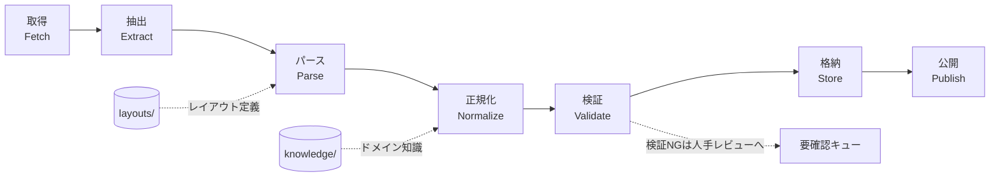

# システムアーキテクチャ

> 本ドキュメントは設計フェーズの成果物であり、実装（`src/`）はまだ存在しない。ここで定義するパイプライン構造が、以降の実装の指針になる。

## 全体像

本システムは、防衛省が公表する人事発令PDFを起点に、構造化データベースを生成・公開するまでの一方向パイプラインとして設計する。各段階は独立して差し替え可能であることを重視する（特定PDF様式の変化が、パイプライン全体を壊さないようにするため）。

## 各ステージの責務

1. **取得（Fetch）**: 防衛省の公表PDFを取得する。取得元・取得日時・PDFのハッシュ値を記録し、来歴（provenance）の起点とする。
2. **抽出（Extract）**: PDFからテキスト・表構造などの生データを取り出す。この段階ではまだ「意味」を解釈しない。
3. **パース（Parse）**: `layouts/` のレイアウト定義を使い、生データを「氏名・階級・補職・発令日」等のフィールドへ機械的に分解する。レイアウトごとの差異はここに閉じ込め、以降のステージに漏らさない。
4. **正規化（Normalize）**: `knowledge/` のドメイン知識（階級名の表記ゆれ、組織名の改称履歴、氏名の異体字等）を使い、値を統一表現に変換する。
5. **検証（Validate）**: 既知のドメイン制約（あり得る階級か、発令日が発令PDFの公表日と整合するか等）と照合し、異常値を検出する。検証NGはサイレントに捨てず、要確認キューに残す。
6. **格納（Store）**: 検証を通過したデータを永続化する。データストアの選定は [ADR-0004](adr/0004-sqlite-as-datastore.md) を参照。
7. **公開（Publish）**: 外部向けの成果物（検索可能な形式・エクスポート等）を生成する。

## 来歴（Provenance）の扱い

すべてのレコードは、どのPDF（取得日時・ハッシュ）のどの記載から生成されたかを追跡できなければならない。これは、後から誤りが発覚した際に「どこまで遡って直すべきか」を判断可能にするための必須要件である。詳細は [ADR-0006](adr/0006-pipeline-provenance.md)。

## ディレクトリとステージの対応

| ステージ | 主に関わるディレクトリ |
|---|---|
| 取得・抽出・パース・正規化・検証・格納・公開 | `src/`（実装本体） |
| パースのレイアウト依存部分 | `layouts/` |
| 正規化の知識依存部分 | `knowledge/` |
| 各ステージの単体・結合・回帰テスト | `tests/` |
| 定型化されていない一括処理・再実行 | `scripts/` |
| テスト用の入力・期待出力 | `sample_pdfs/`, `sample_outputs/` |
| 実行時の観測 | `logs/` |

## 非機能要件（長期運用の観点）

- **再現性**: 同じ入力PDFと同じバージョンのコード・レイアウト・知識ベースからは、常に同じ出力が得られる。
- **可観測性**: パイプラインの各実行が、何件処理し何件が検証NGだったかを追跡できる（`logs/` 参照）。
- **段階的な拡張性**: 新しいPDF様式への対応が、既存コードへの侵襲的な変更なしに行える（`layouts/` の追加のみで完結することを理想とする）。
