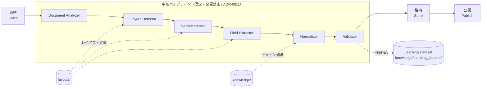

# システムアーキテクチャ

> 本ドキュメントは設計フェーズの成果物であり、実装（`src/`）はまだ存在しない。ここで定義するパイプライン構造が、以降の実装の指針になる。

## 全体像

本システムは、防衛省が公表する人事発令PDFを起点に、構造化データベースを生成・公開するまでの一方向パイプラインとして設計する。

中核となる解析パイプラインは、以下の6段階に**固定**する。この段階構成・順序は [ADR-0011](adr/0011-fixed-core-pipeline.md) により変更を禁止する。新しい様式・新しい例外への対応は、この段階構成を変えるのではなく、各段階が参照するデータ（`layouts/`・`knowledge/`）を増やすことで行う（[ADR-0012](adr/0012-error-handling-priority-order.md)）。

## 中核パイプライン各段階の責務

中核パイプラインの6段階は、それぞれ単一責務を持つ。ある段階が別の段階の責務を肩代わりする実装（例: Field ExtractorがLayout Detectorの判定をやり直す）は設計違反として扱う（[ADR-0011](adr/0011-fixed-core-pipeline.md)）。

1. **Document Analyzer**: 取得したPDFのメタデータ（SHA256・ファイル名・作成/更新日時・PDFバージョン・暗号化有無）・健全性（破損有無）・基本統計（ページ数・ファイルサイズ・画像数等）を取得し、警告（暗号化・画像PDF・破損等）を生成する。PDF解析（構造抽出）・OCR・文字抽出・様式判定は行わない（[ADR-0032](adr/0032-redefine-document-analyzer-responsibility.md)、Version 2.0）。

   > **Version 1設計（Superseded）**: 設計フェーズ当初は「取得したPDFを解析可能な内部表現（ページ・テキスト・座標等）に変換する」という、文字抽出まで含む責務だった。[ADR-0032](adr/0032-redefine-document-analyzer-responsibility.md)により、文字抽出は後続Stage（未確定、同ADR参照）の責務に変更された。
2. **Layout Detector**: Document Analyzerの出力から、`layouts/` のどの `era_id` に該当するかを判定する。未知の様式を検出した場合はエラーとして扱い、新しい様式の追加（`layouts/` への追加）を促す。既存様式の判定ロジックを無理に拡張して対応してはならない。
3. **Section Parser**: 判定されたレイアウト定義に従い、PDF内の対象セクション（発令一覧の範囲等）を切り出す。
4. **Field Extractor**: 切り出されたセクションから、レイアウト定義に従って個々のフィールド（氏名・階級・補職・発令日等）を抽出する。この段階の出力は正規化前の生の値である。
5. **Normalizer**: `knowledge/` のドメイン知識（階級名の表記ゆれ、組織名の改称履歴、氏名の異体字等）を用いて、抽出値を統一表現に変換する。
6. **Validator**: ドメイン制約（あり得る階級か、発令日が発令PDFの公表日と整合するか等）に基づき、正規化後のデータを検証する。検証NGはサイレントに捨てず、[Learning Dataset](adr/0013-learning-dataset-not-correction-log.md) に記録する。

中核パイプラインの前後には、以下の外部ステージが存在する。これらは中核パイプラインの一部ではなく、本ADR-0011の固定対象に含まれない。

- **取得（Fetch）**: 防衛省の公表PDFを取得する。取得元・取得日時・PDFのハッシュ値を記録し、来歴（provenance）の起点とする。Document Analyzerへの入力を用意する。
- **格納（Store）**: Validatorを通過したデータを永続化する。データストアの選定は [ADR-0004](adr/0004-sqlite-as-datastore.md) を参照。
- **公開（Publish）**: 外部向けの成果物（検索可能な形式・エクスポート等）を生成する。

## 未知パターンへの対応方針

新しい表記ゆれ・組織名・様式・例外に遭遇した場合、対応の優先順位は「Knowledge Base追加 > Layout追加 > `src/` 内の例外処理」の順とする。詳細は [ADR-0012](adr/0012-error-handling-priority-order.md)。

## 来歴（Provenance）とLearning Datasetの扱い

すべてのレコードは、どのPDF（取得日時・ハッシュ）のどの記載から、中核パイプラインのどの段階を経て生成されたかを追跡できなければならない。これは、後から誤りが発覚した際に「どこまで遡って直すべきか」を判断可能にするための必須要件である（[ADR-0006](adr/0006-pipeline-provenance.md)）。

Validatorでの検証NG、および事後的に判明した誤りは、単なる修正ログではなく、`knowledge/learning_dataset/`（実データは `learning_dataset` テーブル）に構造化データとして蓄積し、`layouts/` / `knowledge/` の改善に還元する（[ADR-0013](adr/0013-learning-dataset-not-correction-log.md)）。保持するフィールド・ライフサイクル（`open` → `in_review` → `reflected` → `verified`）の詳細は [`docs/architecture/learning_dataset.md`](architecture/learning_dataset.md)（[ADR-0017](adr/0017-learning-dataset-field-expansion.md)）を参照。

## ディレクトリとステージの対応

| ステージ | 主に関わるディレクトリ |
|---|---|
| Document Analyzer / Layout Detector / Section Parser / Field Extractor / Normalizer / Validator / Fetch / Store / Publish | `src/`（実装本体） |
| Layout Detector / Section Parser / Field Extractor のレイアウト依存部分 | `layouts/` |
| Normalizer の知識依存部分、検証NGの蓄積 | `knowledge/`（特に `knowledge/learning_dataset/`） |
| 各段階の単体・結合・回帰テスト | `tests/` |
| 定型化されていない一括処理・再実行 | `scripts/` |
| テスト用の入力・期待出力 | `sample_pdfs/`, `sample_outputs/` |
| 実行時の観測 | `logs/` |

## 非機能要件（長期運用の観点）

- **再現性**: 同じ入力PDFと同じバージョンのコード・レイアウト・知識ベースからは、常に同じ出力が得られる。
- **可観測性**: パイプラインの各実行が、何件処理し何件が検証NGだったかを追跡できる（`logs/` 参照）。
- **段階的な拡張性**: 新しいPDF様式・表記ゆれへの対応が、中核パイプラインの構成変更なしに行える（`layouts/` / `knowledge/` の追加のみで完結することを必須要件とする、[ADR-0011](adr/0011-fixed-core-pipeline.md)）。
- **関数・モジュールの単純性**: 各段階の実装は、大きな関数を作らず単一責務の小さな単位に分割する（[ADR-0014](adr/0014-development-discipline.md)）。
