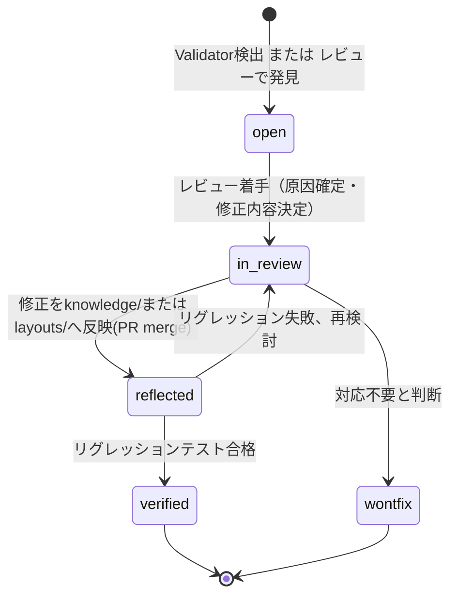

# Learning Dataset 設計

> **位置づけ**: [ADR-0013](../adr/0013-learning-dataset-not-correction-log.md)は「誤り修正情報をCorrection Log（監査用の追記ログ）ではなくLearning Dataset（システム改善のための構造化データセット）として設計する」という**方針**を決定した。本ドキュメントは、その方針を実装可能な水準まで具体化した**フィールド仕様・ライフサイクル・分析用途**の詳細設計であり、[ADR-0017](../adr/0017-learning-dataset-field-expansion.md)により正式決定として承認されている。DB上の実装（`learning_dataset`テーブル）は[`docs/database/schema.md`](../database/schema.md#9-learning_dataset)を参照。
>
> **コードはまだ実装していません。** 本ドキュメントは設計仕様である。

## 目次

1. [Correction LogとLearning Datasetの違い（再確認）](#correction-logとlearning-datasetの違い再確認)
2. [保持するフィールド](#保持するフィールド)
3. [ライフサイクル](#ライフサイクル)
4. [フェーズごとのフィールド充足状況](#フェーズごとのフィールド充足状況)
5. [DB DDL](#db-ddl)
6. [サンプルエントリ](#サンプルエントリ)
7. [分析・活用用途](#分析活用用途)
8. [関連ADR](#関連adr)

---

## Correction LogとLearning Datasetの違い（再確認）

| 観点 | Correction Log（不採用） | Learning Dataset（採用） |
|---|---|---|
| 目的 | 「誰が・いつ・何を直したか」の監査証跡 | 監査証跡に加え、**同種の誤りを繰り返さないための学習材料** |
| 記録される情報 | 変更前後の値のみ | 変更内容に加え、**原因分類・信頼度・再発防止の反映先・改善候補** |
| 完結の仕方 | 値を直せば完結 | 値の修正だけでなく、**Knowledge Base/Layoutへの反映とリグレッション検証まで**を1つのライフサイクルとして追跡する |
| 活用方法 | 個別の変更履歴の参照のみ | Parser Version別・様式別・信頼度別の傾向分析により、`knowledge/`・`layouts/`の手薄な領域を可視化する |

本ドキュメントで定めるフィールドは、この「学習材料として活用できる」という性質を成立させるために最低限必要な情報である。

---

## 保持するフィールド

| 要求項目 | 対応するフィールド | 型 | 必須 |
|---|---|---|---|
| 修正内容 | `field_name`, `wrong_value`, `correct_value`, `correction_summary` | text | `wrong_value`は必須、他は任意（レビュー確定後に埋まる） |
| Reviewerコメント | `reviewer_comment` | text | 任意（レビュー時に埋まる） |
| Parser Version | `parser_version_id` → `parser_versions.code_version` | FK | 任意（自動検出時に埋まる） |
| Layout | `layout_id` → `layouts.era_id` | FK | 任意（自動検出時に埋まる） |
| Confidence | `confidence_score`, `confidence_band` | real / text | 任意（[`json_schema.md`](../database/json_schema.md#confidenceの算出ルール)の算出ルールと同一基準） |
| Regression結果 | `regression_status`, `regression_run_at`, `regression_details` | text | `regression_status`は必須（既定値`not_run`） |
| Git Commit | `git_commit_hash` | text | 任意（反映PRがmergeされた時点で埋まる） |
| Pull Request | `pull_request_url` | text | 任意（反映PRがmergeされた時点で埋まる） |
| 原因分類 | `error_category` | enum | 必須（[ADR-0012](../adr/0012-error-handling-priority-order.md)の分類） |
| 改善候補 | `improvement_candidate` | text | 任意（レビュー時に埋まる） |

既存の来歴フィールド（`source_candidate_record_id`, `source_review_change_id`, `pipeline_stage`, `status`, `reflected_in_knowledge_item_id`, `reflected_in_layout_id`, `created_at`, `resolved_at`）は[ADR-0013](../adr/0013-learning-dataset-not-correction-log.md)で定義済みのものを継続する。

### `Layout` フィールドについて（`layout_id` と `reflected_in_layout_id` の違い）

- `layout_id`: この誤りが**発生した時点**でどの様式（`era_id`）が使われていたかを示す（発生コンテキスト）。
- `reflected_in_layout_id`: この誤りの修正が、**どの `layouts/<era_id>/` への変更として反映されたか**を示す（対応結果）。

多くの場合両者は一致するが、例えば「A様式で発生した誤りが、実はB様式の判定漏れが原因だった」というケースでは異なり得るため、意図的に別カラムとする。

### `Confidence` フィールドについて

`confidence_score` / `confidence_band` は、[公開JSON仕様](../database/json_schema.md#confidenceの算出ルール)と同じ算出ルール・バンド定義を用いる。Learning Datasetにこの値を保持することで、「信頼度が低いと自己申告していたレコードが、実際に誤りだったか」を検証でき、confidence算出ロジック自体の妥当性を継続的に検証する材料になる。

---

## ライフサイクル



- **open**: Validatorが検証NGを検出した時点、または人手レビューで新たな誤りが発見された時点で作成される。この時点では `correct_value` は未確定のことが多い。
- **in_review**: レビュー担当者が原因を分析し、`correct_value` / `field_name` / `correction_summary` / `reviewer_comment` / `improvement_candidate` を確定する。`error_category` もこの時点で暫定値から確定値に見直されることがある。
- **reflected**: `improvement_candidate` に基づく修正（`knowledge/` または `layouts/` への変更）がPRとしてmergeされた時点。`git_commit_hash` / `pull_request_url` / `reflected_in_knowledge_item_id`（または `reflected_in_layout_id`）/ `resolved_at` が埋まる。
- **verified**: 反映後にリグレッションテスト（`tests/golden`、[ADR-0007](../adr/0007-golden-file-testing.md)）を実行し、元の誤りが解消され、かつ他のゴールデンファイルを壊していないことを確認した時点。`regression_status='passed'` となる。リグレッションが失敗した場合は `in_review` に差し戻す。
- **wontfix**: レビューの結果、対応不要と判断された場合（例: 極めて稀な一過性の誤記で、Knowledge Base/Layoutへの一般化が不適切なケース）。

---

## フェーズごとのフィールド充足状況

| フィールド | open | in_review | reflected | verified | wontfix |
|---|:---:|:---:|:---:|:---:|:---:|
| `pipeline_stage` / `error_category`（暫定） | ✓ | ✓ | ✓ | ✓ | ✓ |
| `wrong_value` / `parser_version_id` / `layout_id` | ✓ | ✓ | ✓ | ✓ | ✓ |
| `confidence_score` / `confidence_band` | ✓ | ✓ | ✓ | ✓ | ✓ |
| `field_name` / `correct_value` / `correction_summary` | — | ✓ | ✓ | ✓ | ✓ |
| `reviewer_comment` / `improvement_candidate` | — | ✓ | ✓ | ✓ | ✓ |
| `git_commit_hash` / `pull_request_url` | — | — | ✓ | ✓ | — |
| `reflected_in_knowledge_item_id` / `reflected_in_layout_id` | — | — | ✓ | ✓ | — |
| `resolved_at` | — | — | ✓ | ✓ | ✓ |
| `regression_status='passed'` / `regression_run_at` / `regression_details` | — | — | — | ✓ | — |

---

## DB DDL

`docs/database/schema.md` の `learning_dataset` テーブル定義を以下に置き換える（非破壊的な列追加が中心。詳細は[ADR-0017](../adr/0017-learning-dataset-field-expansion.md)、実際の反映は[`schema.md`](../database/schema.md#9-learning_dataset)側）。以下はSQLite（`sqlite3`モジュール、外部キー有効化・実データ挿入・CHECK制約違反の異常系）で実行検証済みである。

```sql
CREATE TABLE learning_dataset (
    id                            INTEGER PRIMARY KEY,
    source_candidate_record_id    INTEGER REFERENCES candidate_records (id),
    source_review_change_id       INTEGER REFERENCES review_changes (id),
    pipeline_stage                 TEXT NOT NULL CHECK (
                                       pipeline_stage IN (
                                           'layout_detector', 'section_parser',
                                           'field_extractor', 'normalizer', 'validator'
                                       )
                                   ),
    error_category                  TEXT NOT NULL CHECK (
                                       error_category IN (
                                           'unknown_alias', 'unknown_layout',
                                           'knowledge_gap', 'layout_gap', 'true_exception'
                                       )
                                   ),
    field_name                      TEXT,
    wrong_value                     TEXT NOT NULL,
    correct_value                   TEXT,
    correction_summary              TEXT,
    reviewer_comment                TEXT,
    parser_version_id               INTEGER REFERENCES parser_versions (id),
    layout_id                       INTEGER REFERENCES layouts (id),
    confidence_score                REAL CHECK (confidence_score IS NULL OR (confidence_score >= 0 AND confidence_score <= 1)),
    confidence_band                 TEXT CHECK (confidence_band IS NULL OR confidence_band IN ('verified', 'high', 'medium', 'low')),
    status                          TEXT NOT NULL DEFAULT 'open'
                                       CHECK (status IN ('open', 'in_review', 'reflected', 'verified', 'wontfix')),
    reflected_in_knowledge_item_id  INTEGER REFERENCES knowledge_items (id),
    reflected_in_layout_id          INTEGER REFERENCES layouts (id),
    git_commit_hash                 TEXT,
    pull_request_url                TEXT,
    regression_status               TEXT NOT NULL DEFAULT 'not_run'
                                       CHECK (regression_status IN ('not_run', 'passed', 'failed')),
    regression_run_at               TEXT,
    regression_details              TEXT,
    improvement_candidate           TEXT,
    created_at                      TEXT NOT NULL DEFAULT (STRFTIME('%Y-%m-%dT%H:%M:%SZ', 'now')),
    resolved_at                     TEXT
);

CREATE INDEX idx_learning_dataset_status ON learning_dataset (status);
CREATE INDEX idx_learning_dataset_error_category ON learning_dataset (error_category);
CREATE INDEX idx_learning_dataset_pipeline_stage ON learning_dataset (pipeline_stage);
CREATE INDEX idx_learning_dataset_source_candidate_record_id ON learning_dataset (source_candidate_record_id);
CREATE INDEX idx_learning_dataset_parser_version_id ON learning_dataset (parser_version_id);
CREATE INDEX idx_learning_dataset_layout_id ON learning_dataset (layout_id);
CREATE INDEX idx_learning_dataset_regression_status ON learning_dataset (regression_status);
```

### 既存定義からの変更点

- **`correct_value` を `NOT NULL` から任意（nullable）に変更**: `open` 状態では未確定のため。既存データ（すべて非NULLだった想定）はそのまま妥当であり、制約の緩和は非破壊的変更である。
- **`status` の許容値を `('open', 'reflected', 'wontfix')` から `('open', 'in_review', 'reflected', 'verified', 'wontfix')` に拡張**: [ライフサイクル](#ライフサイクル)を表現するため。既存値はすべて新しい許容値集合に含まれるため非破壊的。
- **新規列の追加**: `field_name`, `correct_value`の任意化, `correction_summary`, `reviewer_comment`, `parser_version_id`, `layout_id`, `confidence_score`, `confidence_band`, `git_commit_hash`, `pull_request_url`, `regression_status`, `regression_run_at`, `regression_details`, `improvement_candidate`。すべて `NULL` 許容またはデフォルト値ありのため、実装時のマイグレーションは `ALTER TABLE learning_dataset ADD COLUMN ...` の列挙で表現でき、[`schema.md`のMigration方針](../database/schema.md#migration方針)に沿った非破壊的変更に分類される。

---

## サンプルエントリ

架空例（2022年10月分の発令PDFで、階級表記がOCR起因で誤読されたケース）:

| フィールド | 値 |
|---|---|
| `pipeline_stage` | `normalizer` |
| `error_category` | `knowledge_gap` |
| `field_name` | `rank` |
| `wrong_value` | `"1等陸尉(誤)"` |
| `correct_value` | `"1等陸尉"` |
| `correction_summary` | `"OCR誤読の階級表記を訂正"` |
| `reviewer_comment` | `"2022年10月分に頻出。typographyルール追加を提案。"` |
| `parser_version_id` → `code_version` | `v1.2.0` |
| `layout_id` → `era_id` | `2022_format_b` |
| `confidence_score` / `confidence_band` | `0.62` / `medium` |
| `improvement_candidate` | `"typographyに全角ローマ数字変換ルールを追加"` |
| `status` | `verified` |
| `git_commit_hash` | `deadbeef1234` |
| `pull_request_url` | `https://github.com/example/pr/1` |
| `regression_status` / `regression_details` | `passed` / `"tests/golden/2022_format_b: 14 passed, 0 failed"` |

氏名・組織名・URL等はすべて説明用の架空の値である。

---

## 分析・活用用途

Learning Datasetを「学習資産」として活かすための代表的な分析クエリ例。

```sql
-- Parser Versionごとのerror_category傾向（新バージョンで誤りの性質が変わっていないか）
SELECT pv.code_version, ld.error_category, COUNT(*) AS cnt
FROM learning_dataset ld
JOIN parser_versions pv ON pv.id = ld.parser_version_id
GROUP BY pv.code_version, ld.error_category
ORDER BY pv.released_at DESC, cnt DESC;

-- 未反映(open/in_review)のまま長期間放置されているエントリの抽出
SELECT * FROM learning_dataset
WHERE status IN ('open', 'in_review')
ORDER BY created_at ASC;

-- 様式(era_id)ごとの未反映件数（手薄なlayoutの可視化）
SELECT l.era_id, COUNT(*) AS open_count
FROM learning_dataset ld
JOIN layouts l ON l.id = ld.layout_id
WHERE ld.status IN ('open', 'in_review')
GROUP BY l.era_id
ORDER BY open_count DESC;

-- confidenceバンドと実際の誤り発生の相関（confidence算出ロジック自体の妥当性検証）
SELECT confidence_band, COUNT(*) AS error_count
FROM learning_dataset
GROUP BY confidence_band
ORDER BY error_count DESC;
```

これらの分析結果は、[`knowledge/`の追加](../knowledge/schema.md)や[`layouts/`の追加](../architecture.md)の優先順位付け（[ADR-0012](../adr/0012-error-handling-priority-order.md)）の判断材料として、`docs/operations/`（実装時整備）の定期棚卸し手順に組み込むことを想定する。

---

## 関連ADR

- [ADR-0006](../adr/0006-pipeline-provenance.md): 来歴管理方針（`source_candidate_record_id`等の設計根拠）
- [ADR-0007](../adr/0007-golden-file-testing.md): リグレッション検証（`regression_status`等）の基盤
- [ADR-0011](../adr/0011-fixed-core-pipeline.md): `pipeline_stage`の値域の根拠
- [ADR-0012](../adr/0012-error-handling-priority-order.md): `error_category`の分類・`improvement_candidate`の優先順位判断の根拠
- [ADR-0013](../adr/0013-learning-dataset-not-correction-log.md): Learning Dataset設計方針の原点
- [ADR-0017](../adr/0017-learning-dataset-field-expansion.md): 本ドキュメントを正式なフィールド拡張・ライフサイクル決定として承認
