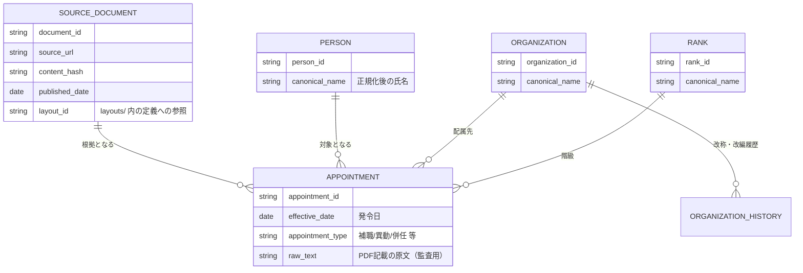

# データモデル（概念設計）

> 実装前の概念モデル。実装可能な物理設計（テーブル定義・主キー・外部キー・インデックス・マイグレーション方針）は [`docs/database/schema.md`](database/schema.md) を参照（[ADR-0015](adr/0015-sqlite-schema-finalization.md) により正式決定として承認済み）。本ドキュメントは概念設計として維持し、物理設計とは役割を分ける。

## 設計方針

- 「人」「組織」「階級」「発令」を分離したエンティティとしてモデル化し、それぞれの改称・改編の履歴を独立に追跡できるようにする。
- すべての事実（fact）は、その根拠となる発令PDF（`source_documents`）に紐づく。根拠のないデータは存在させない。
- 同一人物・同一組織の名寄せ（表記ゆれの統合）は、正規化ステージの責務であり、生データを上書きせず「正規化前」と「正規化後」を両方保持する。

## 主要エンティティ（概念）

## 補足

- `APPOINTMENT.raw_text` のように、正規化前の原文を保持するフィールドを各所に残す。これは監査・誤り修正・将来の再正規化を可能にするための設計判断であり、[ADR-0006](adr/0006-pipeline-provenance.md) の来歴管理方針に基づく。
- `SOURCE_DOCUMENT.layout_id` により、どの `layouts/` 定義でパースされたかを追跡できる。レイアウト定義自体が後から修正された場合に、影響範囲を特定するために使う。
- 組織・階級の改称履歴（`ORGANIZATION_HISTORY` 等）は `knowledge/` のデータと対応する概念であり、DBスキーマとしてもコード上の定数としてでもなく、追跡可能なデータとして表現する。

## 用語

具体的な用語の意味は [`glossary.md`](glossary.md) を参照。
