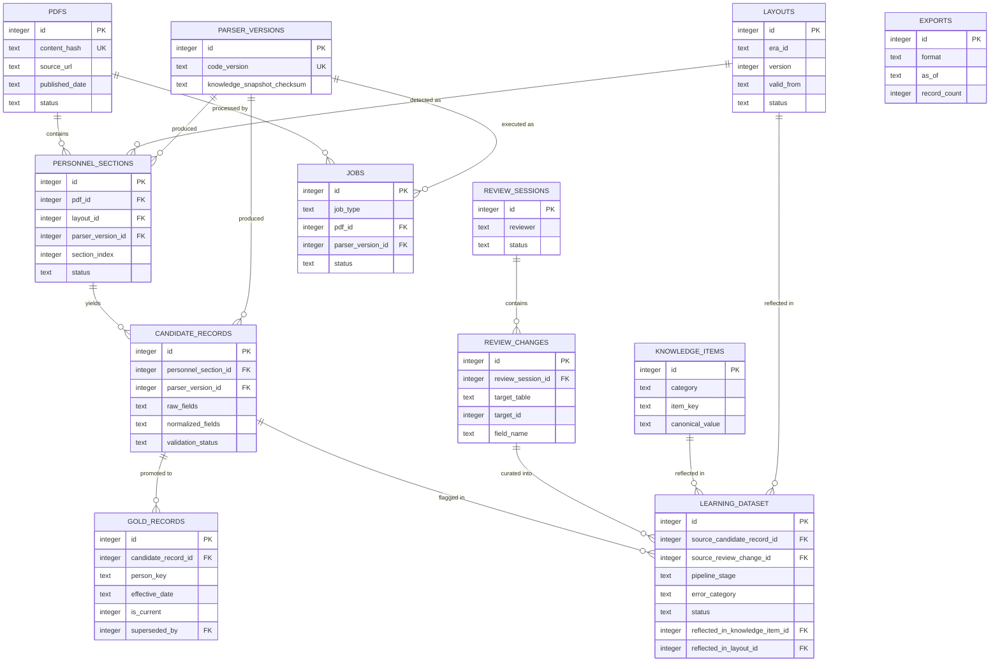

# SQLiteデータベース設計（物理スキーマ）

> **位置づけ**: 本ドキュメントは [`docs/data_model.md`](../data_model.md) の概念設計を、実装可能な物理設計（テーブル定義・主キー・外部キー・インデックス・マイグレーション方針）まで具体化したものです。[ADR-0015](../adr/0015-sqlite-schema-finalization.md) により正式決定として承認されています。
>
> **コードはまだ実装していません。** 本ドキュメント内のSQL DDLは「設計仕様」であり、実行可能なマイグレーションファイルは `src/` 実装着手時に本仕様に基づいて作成します（配置予定パスは [Migration方針](#migration方針) を参照）。

## 目次

1. [設計方針・命名規約](#設計方針命名規約)
2. [ER図](#er図)
3. [テーブル一覧](#テーブル一覧)
4. [テーブル詳細](#テーブル詳細)
5. [インデックス一覧](#インデックス一覧)
6. [バージョン管理](#バージョン管理)
7. [Migration方針](#migration方針)
8. [運用上の注意事項](#運用上の注意事項)
9. [今後の検討事項（スコープ外）](#今後の検討事項スコープ外)
10. [関連ADR](#関連adr)

---

## 設計方針・命名規約

- **テーブル名**: 複数形・snake_case（例: `pdfs`, `candidate_records`）
- **主キー**: 原則すべてのテーブルで `id INTEGER PRIMARY KEY`（SQLiteの `rowid` エイリアス）を使う。自然キーが存在する場合も、結合の単純化のため surrogate key を優先し、自然キーは `UNIQUE` 制約で保証する。
- **日時**: `TEXT` 型でISO8601（`YYYY-MM-DDTHH:MM:SSZ`、UTC）を使う。SQLiteに専用の日時型はなく、ISO8601文字列は辞書順ソートが時系列ソートと一致するため採用する。
- **真偽値**: `INTEGER`（0/1）+ `CHECK` 制約で表現する（SQLiteにBOOLEAN型はない）。
- **JSON列**: `TEXT` 型 + `CHECK (json_valid(col))` で構文の妥当性のみ保証する。JSON内部のフィールド構造（スキーマ）の妥当性は、Validator（[ADR-0011](../adr/0011-fixed-core-pipeline.md)）などアプリケーション層の責務とする。
- **列挙値**: `TEXT` + `CHECK (col IN (...))` で表現する。専用のマスタテーブル（例: ステータスマスタ）は、この規模のプロジェクトには過剰と判断し導入しない。
- **削除しない設計**: 来歴（[ADR-0006](../adr/0006-pipeline-provenance.md)）を保つため、業務データの物理削除（`DELETE`）は原則行わない。無効化は `status` / `is_current` 等のフラグ更新で表現する。
- **外部キー制約**: SQLiteは接続ごとに `PRAGMA foreign_keys = ON;` を明示しない限りFK制約を強制しない。運用上の必須設定として [運用上の注意事項](#運用上の注意事項) に明記する。

---

## ER図



補足:

- `GOLD_RECORDS.superseded_by` は自己参照FK（訂正時の新バージョンを指す）だが、図の可読性のため関係線は省略している。詳細は [gold_records](#5-gold_records) を参照。
- `REVIEW_CHANGES.target_table` / `target_id` は `candidate_records` または `gold_records` を指す多態的参照であり、SQLiteの機能では通常のFK制約を張れない。詳細は [review_changes](#7-review_changes) を参照。
- `EXPORTS` は他テーブルへの直接FKを持たない（`as_of` 時点のスナップショットとして `gold_records.is_current` 相当を再構成する設計）。詳細は [exports](#11-exports) を参照。

---

## テーブル一覧

| # | テーブル名 | 目的（一言） | 主キー | 主な外部キー |
|---|---|---|---|---|
| 1 | `pdfs` | 取得したPDFの来歴の起点 | `id` | — |
| 2 | `layouts` | PDF様式（`layouts/`）のDBインデックス | `id` | — |
| 3 | `personnel_sections` | Section Parserが切り出したセクション | `id` | `pdf_id`, `layout_id`, `parser_version_id` |
| 4 | `candidate_records` | Field Extractor/Normalizer出力の候補レコード | `id` | `personnel_section_id`, `parser_version_id` |
| 5 | `gold_records` | Validator通過後の公開対象データ（版管理） | `id` | `candidate_record_id`, `superseded_by`（自己参照） |
| 6 | `review_sessions` | 人手レビューの実施単位 | `id` | — |
| 7 | `review_changes` | レビュー中の個々のフィールド変更 | `id` | `review_session_id` |
| 8 | `knowledge_items` | `knowledge/` の内容をDB化した正規化用知識 | `id` | — |
| 9 | `learning_dataset` | 誤り修正のLearning Dataset（ADR-0013, ADR-0017） | `id` | `source_candidate_record_id`, `source_review_change_id`, `parser_version_id`, `layout_id`, `reflected_in_knowledge_item_id`, `reflected_in_layout_id` |
| 10 | `parser_versions` | コード・レイアウト・知識ベースの実行時バージョン | `id` | — |
| 11 | `exports` | 公開エクスポートの実行記録 | `id` | — |
| 12 | `jobs` | パイプライン実行（バッチ）の記録 | `id` | `pdf_id`, `parser_version_id` |

管理用テーブル（業務テーブルの12種とは別枠）: `schema_migrations`（[バージョン管理](#バージョン管理) 参照）。

---

## テーブル詳細

### 1. `pdfs`

**目的**: 防衛省が公表した人事発令PDFを取得した記録。全データの来歴（provenance）の起点（[ADR-0006](../adr/0006-pipeline-provenance.md)）。

**責務**: 取得元URL・取得日時・内容ハッシュを保持し、以降の全パイプライン段階が「どのPDFに由来するか」を遡れるようにする。実PDFファイル自体は本リポジトリでは管理しない（[`sample_pdfs/README.md`](../../sample_pdfs/README.md)）ため、`file_path` は本番運用時の外部ストレージ参照とする。

**保持期間**: 永久保持。来歴の起点であるため、対応する発令情報が存在する限り削除しない。

**更新方法**: 取得時に1回のみ `INSERT`。`content_hash` により同一PDFの重複取得を検知する。`status` のみパイプライン進行に応じて `UPDATE`（`fetched` → `analyzed` → `parsed` → `validated`、失敗時は `failed`）。`content_hash` / `source_url` / `fetched_at` 等の来歴に関わる列は不変。

```sql
CREATE TABLE pdfs (
    id              INTEGER PRIMARY KEY,
    content_hash    TEXT NOT NULL UNIQUE,
    source_url      TEXT NOT NULL,
    published_date  TEXT NOT NULL,
    fetched_at      TEXT NOT NULL DEFAULT (STRFTIME('%Y-%m-%dT%H:%M:%SZ', 'now')),
    file_path       TEXT NOT NULL,
    file_size_bytes INTEGER NOT NULL,
    status          TEXT NOT NULL DEFAULT 'fetched'
                        CHECK (status IN ('fetched', 'analyzed', 'parsed', 'validated', 'failed')),
    created_at      TEXT NOT NULL DEFAULT (STRFTIME('%Y-%m-%dT%H:%M:%SZ', 'now')),
    updated_at      TEXT NOT NULL DEFAULT (STRFTIME('%Y-%m-%dT%H:%M:%SZ', 'now'))
);

CREATE INDEX idx_pdfs_published_date ON pdfs (published_date);
CREATE INDEX idx_pdfs_status ON pdfs (status);
```

- **主キー**: `id`
- **一意制約**: `content_hash`（内容アドレス方式の重複排除）
- **外部キー**: なし（来歴の根）
- **インデックス**: `published_date`（時系列検索）、`status`（未処理PDFの抽出）

---

### 2. `layouts`

**目的**: `layouts/` ディレクトリのレイアウト定義（[ADR-0003](../adr/0003-layout-definition-strategy.md)）をDB上でクエリ可能にし、Layout Detectorの判定結果・適用期間を管理する。

**責務**: どの `era_id` がいつからいつまで有効か（`valid_from` / `valid_to`）を保持し、`personnel_sections` から参照されることで「どのPDFがどの様式で解釈されたか」を追跡可能にする。ファイル内容（`layouts/<era_id>/manifest.yaml`）が正（source of truth）であり、本テーブルはそれをロード・インデックスしたものという位置づけ。

**保持期間**: 永久保持。過去のPDFの再現性（[ADR-0006](../adr/0006-pipeline-provenance.md)）のため、廃止された様式の定義も参照可能である必要がある。

**更新方法**: 新しい様式・manifest改訂ごとに新規行を `INSERT`（`era_id` は同じまま `version` を増分）。既存行の `era_id` / `valid_from` / `manifest_checksum` は不変。`valid_to` / `status` のみ、様式の廃止時に `UPDATE`。

```sql
CREATE TABLE layouts (
    id                INTEGER PRIMARY KEY,
    era_id            TEXT NOT NULL,
    version           INTEGER NOT NULL DEFAULT 1,
    manifest_path     TEXT NOT NULL,
    manifest_checksum TEXT NOT NULL,
    valid_from        TEXT NOT NULL,
    valid_to          TEXT,
    status            TEXT NOT NULL DEFAULT 'active'
                          CHECK (status IN ('active', 'deprecated')),
    created_at        TEXT NOT NULL DEFAULT (STRFTIME('%Y-%m-%dT%H:%M:%SZ', 'now')),
    updated_at        TEXT NOT NULL DEFAULT (STRFTIME('%Y-%m-%dT%H:%M:%SZ', 'now')),
    UNIQUE (era_id, version)
);

CREATE INDEX idx_layouts_valid_from ON layouts (valid_from);
CREATE INDEX idx_layouts_status ON layouts (status);
```

- **主キー**: `id`
- **一意制約**: `(era_id, version)`
- **外部キー**: なし
- **インデックス**: `valid_from`（Layout Detectorの期間検索）、`status`

---

### 3. `personnel_sections`

**目的**: Document Analyzer → Layout Detector → Section Parser（[ADR-0011](../adr/0011-fixed-core-pipeline.md)）を経て切り出された、PDF内の「発令一覧」等のセクション単位の中間成果物。

**責務**: PDFのどの範囲（ページ・セクション）が、どのレイアウト定義で、どのコードバージョンにより切り出されたかを記録する。Field Extractorの入力単位となる。`layout_id`列（`layouts.id`へのFK）は、Section Parser（Repositoryにアクセスしない）が保持する`era_id`（[`models.md`](../api/models.md#personnelsection)の`PersonnelSection.layout_id`、[ADR-0037](../adr/0037-layout-detector-produces-layout-artifact.md)）から、`SqliteCandidateRepository.add_section`が永続化時に解決する。

**保持期間**: 永久保持（監査・再現性のため）。`section_text` は大容量になり得るため、将来的に一定期間経過後の外部ストレージへのアーカイブを運用判断で検討してよいが、既定は永久保持とする。

**更新方法**: `INSERT` のみ。レイアウト定義修正後の再パース等で同一PDFを再処理する場合は、新しい `parser_version_id` で新規行を追加し、旧行は `status='superseded'` に更新する（物理削除しない）。

```sql
CREATE TABLE personnel_sections (
    id                INTEGER PRIMARY KEY,
    pdf_id            INTEGER NOT NULL REFERENCES pdfs (id),
    layout_id         INTEGER NOT NULL REFERENCES layouts (id),
    parser_version_id INTEGER NOT NULL REFERENCES parser_versions (id),
    section_index     INTEGER NOT NULL,
    section_label     TEXT,
    page_range        TEXT,
    section_text      TEXT NOT NULL,
    status            TEXT NOT NULL DEFAULT 'parsed'
                          CHECK (status IN ('parsed', 'superseded')),
    created_at        TEXT NOT NULL DEFAULT (STRFTIME('%Y-%m-%dT%H:%M:%SZ', 'now')),
    UNIQUE (pdf_id, section_index, parser_version_id)
);

CREATE INDEX idx_personnel_sections_pdf_id ON personnel_sections (pdf_id);
CREATE INDEX idx_personnel_sections_layout_id ON personnel_sections (layout_id);
CREATE INDEX idx_personnel_sections_parser_version_id ON personnel_sections (parser_version_id);
CREATE INDEX idx_personnel_sections_status ON personnel_sections (status);
```

- **主キー**: `id`
- **一意制約**: `(pdf_id, section_index, parser_version_id)`
- **外部キー**: `pdf_id → pdfs.id`, `layout_id → layouts.id`, `parser_version_id → parser_versions.id`
- **インデックス**: `pdf_id`（PDFからの逆引き）、`layout_id`、`parser_version_id`、`status`

---

### 4. `candidate_records`

**目的**: Field Extractor → Normalizer（[ADR-0011](../adr/0011-fixed-core-pipeline.md)）を経た、Validator適用前の人物単位の「候補」発令レコード。

**責務**: 正規化前（`raw_fields`）と正規化後（`normalized_fields`）の両方の値を保持し、Validatorの入力となる。どの `knowledge_items` を適用して正規化したかも記録し、監査可能にする（[ADR-0005](../adr/0005-knowledge-base-normalization.md)）。

**保持期間**: 永久保持。`gold_records` の根拠として、また `learning_dataset` の由来として参照され続ける。

**更新方法**: `INSERT` のみ。同一セクションの再処理は新しい `parser_version_id` で新規行を追加する。値の書き換え（`UPDATE`）は行わない（再現性のため）。`validation_status` のみVal­idator実行後に一度だけ `UPDATE` する。

```sql
CREATE TABLE candidate_records (
    id                     INTEGER PRIMARY KEY,
    personnel_section_id   INTEGER NOT NULL REFERENCES personnel_sections (id),
    parser_version_id      INTEGER NOT NULL REFERENCES parser_versions (id),
    record_index           INTEGER NOT NULL,
    raw_fields              TEXT NOT NULL CHECK (json_valid(raw_fields)),
    normalized_fields       TEXT CHECK (normalized_fields IS NULL OR json_valid(normalized_fields)),
    normalization_applied   TEXT CHECK (normalization_applied IS NULL OR json_valid(normalization_applied)),
    validation_status       TEXT NOT NULL DEFAULT 'pending'
                                 CHECK (validation_status IN ('pending', 'passed', 'failed')),
    created_at              TEXT NOT NULL DEFAULT (STRFTIME('%Y-%m-%dT%H:%M:%SZ', 'now')),
    UNIQUE (personnel_section_id, record_index, parser_version_id)
);

CREATE INDEX idx_candidate_records_section_id ON candidate_records (personnel_section_id);
CREATE INDEX idx_candidate_records_parser_version_id ON candidate_records (parser_version_id);
CREATE INDEX idx_candidate_records_validation_status ON candidate_records (validation_status);
```

- **主キー**: `id`
- **一意制約**: `(personnel_section_id, record_index, parser_version_id)`
- **外部キー**: `personnel_section_id → personnel_sections.id`, `parser_version_id → parser_versions.id`
- **インデックス**: `personnel_section_id`、`parser_version_id`、`validation_status`（Validator処理対象の抽出）

---

### 5. `gold_records`

**目的**: Validatorを通過した、公開対象の確定版データ。人事発令情報の「正」。

**責務**: 訂正履歴を持つ時点管理（SCD Type 2的な設計）を行う。同一 `person_key` + `effective_date` に対する訂正は新バージョンとして追加し、旧バージョンは `is_current=0` に更新した上で `superseded_by` で新バージョンを指す。物理削除・上書きは行わない。

**保持期間**: 永久保持。過去バージョンも「いつ・なぜ訂正されたか」の説明責任のために保持する。

**更新方法**: 新規発令の確定は `INSERT`（`version=1`, `is_current=1`）。訂正時は (1) 新バージョンを `INSERT`、(2) 旧バージョンの `is_current` を0に、`superseded_by` を新バージョンの `id` に、`valid_to` を訂正時刻に `UPDATE` — の2ステップのみを許可する。

```sql
CREATE TABLE gold_records (
    id                   INTEGER PRIMARY KEY,
    candidate_record_id  INTEGER NOT NULL REFERENCES candidate_records (id),
    person_key           TEXT NOT NULL,
    effective_date       TEXT NOT NULL,
    appointment_type     TEXT NOT NULL,
    fields                TEXT NOT NULL CHECK (json_valid(fields)),
    version               INTEGER NOT NULL DEFAULT 1,
    is_current            INTEGER NOT NULL DEFAULT 1 CHECK (is_current IN (0, 1)),
    superseded_by          INTEGER REFERENCES gold_records (id),
    valid_from              TEXT NOT NULL DEFAULT (STRFTIME('%Y-%m-%dT%H:%M:%SZ', 'now')),
    valid_to                 TEXT,
    created_at                TEXT NOT NULL DEFAULT (STRFTIME('%Y-%m-%dT%H:%M:%SZ', 'now')),
    UNIQUE (person_key, effective_date, version)
);

CREATE INDEX idx_gold_records_person_key ON gold_records (person_key);
CREATE INDEX idx_gold_records_effective_date ON gold_records (effective_date);
CREATE INDEX idx_gold_records_current ON gold_records (person_key, is_current);
CREATE INDEX idx_gold_records_candidate_record_id ON gold_records (candidate_record_id);
```

- **主キー**: `id`
- **一意制約**: `(person_key, effective_date, version)`
- **外部キー**: `candidate_record_id → candidate_records.id`, `superseded_by → gold_records.id`（自己参照）
- **インデックス**: `person_key`、`effective_date`、`(person_key, is_current)`（現行データの高速検索）、`candidate_record_id`

**設計メモ**: `fields` は正規化済みの文字列値をそのまま保持し、`knowledge_items` への直接FKは持たない。`knowledge_items` は「原表記→正規化値」のマッピング規則のインデックスであり、正規化後の値そのものに対する永続的な識別子ではないため。氏名の名寄せ精度が実運用で不十分と判明した場合、専用の `people` マスタテーブル導入を将来検討する（[今後の検討事項](#今後の検討事項スコープ外)）。

---

### 6. `review_sessions`

**目的**: 人手レビューの実施単位（バッチ）。いつ・誰が・何を目的にレビューしたかを管理する。

**責務**: `review_changes` をグルーピングする器。検証NGキューの処理、新レイアウト導入後の確認作業等、レビュー作業のまとまりを表す。

**保持期間**: 永久保持（監査証跡）。

**更新方法**: レビュー開始時に `INSERT`（`status='in_progress'`）。完了・中断時に `status` / `completed_at` を1度だけ `UPDATE`。

```sql
CREATE TABLE review_sessions (
    id           INTEGER PRIMARY KEY,
    reviewer     TEXT NOT NULL,
    reason       TEXT NOT NULL,
    target_scope TEXT CHECK (target_scope IS NULL OR json_valid(target_scope)),
    status       TEXT NOT NULL DEFAULT 'in_progress'
                     CHECK (status IN ('in_progress', 'completed', 'abandoned')),
    started_at   TEXT NOT NULL DEFAULT (STRFTIME('%Y-%m-%dT%H:%M:%SZ', 'now')),
    completed_at TEXT
);

CREATE INDEX idx_review_sessions_status ON review_sessions (status);
CREATE INDEX idx_review_sessions_started_at ON review_sessions (started_at);
```

- **主キー**: `id`
- **外部キー**: なし
- **インデックス**: `status`、`started_at`

---

### 7. `review_changes`

**目的**: レビュー中に行われた個々のフィールド変更の記録。Learning Dataset（[ADR-0013](../adr/0013-learning-dataset-not-correction-log.md)）の主要な入力源。

**責務**: どのレコードのどのフィールドを、何から何に、なぜ変更したかを追跡する。

**保持期間**: 永久保持。

**更新方法**: `INSERT` のみ（追記専用。変更履歴自体を後から書き換えない）。

```sql
CREATE TABLE review_changes (
    id                INTEGER PRIMARY KEY,
    review_session_id INTEGER NOT NULL REFERENCES review_sessions (id),
    target_table      TEXT NOT NULL CHECK (target_table IN ('candidate_records', 'gold_records')),
    target_id         INTEGER NOT NULL,
    field_name        TEXT NOT NULL,
    old_value         TEXT,
    new_value         TEXT NOT NULL,
    change_reason     TEXT,
    created_at        TEXT NOT NULL DEFAULT (STRFTIME('%Y-%m-%dT%H:%M:%SZ', 'now'))
);

CREATE INDEX idx_review_changes_session_id ON review_changes (review_session_id);
CREATE INDEX idx_review_changes_target ON review_changes (target_table, target_id);
```

- **主キー**: `id`
- **外部キー**: `review_session_id → review_sessions.id`
- **インデックス**: `review_session_id`、`(target_table, target_id)`

**設計メモ（多態的参照について）**: `target_table` + `target_id` は `candidate_records` または `gold_records` のいずれかを指す多態的参照であり、SQLiteは複数テーブルにまたがるFK制約を表現できない。`target_table` は `CHECK` 制約で値を限定するが、`target_id` の参照整合性はアプリケーション層（Validator / レビューツール）の責務とする。これは意図的なトレードオフであり、対象を2テーブルに限定してリスクを抑えている。

---

### 8. `knowledge_items`

**目的**: `knowledge/` 配下のドメイン知識（[ADR-0005](../adr/0005-knowledge-base-normalization.md)）をDB上でクエリ可能にした、Normalizerが実行時に参照する正規化用の知識エントリ。`knowledge/` の8カテゴリの詳細なYAML構造は [`docs/knowledge/schema.md`](../knowledge/schema.md) を参照。

**責務**: 表記ゆれ・別名・改称履歴等の「原表記 → 正規化値」マッピングを検索可能な形で保持し、`candidate_records.normalization_applied` からの参照により、どのレコードの正規化にどの知識項目が使われたかを追跡可能にする。`knowledge/` のファイルが正（source of truth）であり、本テーブルはそれをロード・インデックスしたものという位置づけ。

**保持期間**: 永久保持。過去に使われていた知識項目も、当時の正規化結果の説明責任のために必要。

**更新方法**: `knowledge/` のファイル変更を検知して再ロードする一方向同期（ファイル→DB）。既存項目の内容変更は新規行の `INSERT`（`effective_from` を新しく）で表現し、旧項目は `effective_to` の `UPDATE` のみで無効化する。本テーブルへの直接的な内容変更（ファイルを経由しないUPDATE）は行わない。

```sql
CREATE TABLE knowledge_items (
    id              INTEGER PRIMARY KEY,
    category        TEXT NOT NULL CHECK (
                        category IN (
                            'organization', 'position', 'rank', 'alias',
                            'historical', 'typography', 'layout', 'validation'
                        )
                    ),
    source_file     TEXT NOT NULL,
    item_key        TEXT NOT NULL,
    canonical_value TEXT NOT NULL,
    effective_from  TEXT,
    effective_to    TEXT,
    source_checksum TEXT NOT NULL,
    created_at      TEXT NOT NULL DEFAULT (STRFTIME('%Y-%m-%dT%H:%M:%SZ', 'now')),
    UNIQUE (category, item_key, effective_from)
);

CREATE INDEX idx_knowledge_items_category_key ON knowledge_items (category, item_key);
CREATE INDEX idx_knowledge_items_source_file ON knowledge_items (source_file);
```

- **主キー**: `id`
- **一意制約**: `(category, item_key, effective_from)`
- **外部キー**: なし
- **インデックス**: `(category, item_key)`（Normalizerの主要な検索経路）、`source_file`

**設計メモ（`item_key` / `canonical_value` の解釈について）**: `organization` / `position` / `rank` / `alias` の4カテゴリでは、`item_key` に原表記、`canonical_value` に正規化後の値をそのまま格納する単純な「原表記→正規化値」マッピングとして使う。一方 `historical` / `typography` / `layout` / `validation` の4カテゴリは、[`docs/knowledge/schema.md`](../knowledge/schema.md) が定めるとおりイベントログ・変換規則・制約ルールという単純なマッピングでは表現しきれない構造を持つため、`item_key` にはエントリの `id`、`canonical_value` には代表値（例: `validation` なら `target_field` の値）を格納し、構造化された全内容は `source_file` が指すYAMLファイル自体を正とする。本テーブルはあくまで検索・監査用の軽量インデックスであり、詳細な構造の読み取りは常にファイルを参照する。

---

### 9. `learning_dataset`

**目的**: Validatorでの検証NG、および人手修正の情報を、Correction Log（単なる修正ログ）ではなくシステム改善のための構造化データセットとして保持する（[ADR-0013](../adr/0013-learning-dataset-not-correction-log.md)）。フィールド仕様・ライフサイクル・分析用途の詳細設計は [`docs/architecture/learning_dataset.md`](../architecture/learning_dataset.md) を参照（[ADR-0017](../adr/0017-learning-dataset-field-expansion.md)）。

**責務**: 由来（`source_candidate_record_id` / `source_review_change_id`）、誤りが発生した中核パイプライン段階、誤りの分類（[ADR-0012](../adr/0012-error-handling-priority-order.md) の優先順位分類に対応）、修正内容・Reviewerコメント・信頼度・改善候補、そして修正が `knowledge_items` / `layouts` への反映（コミット・Pull Request）とリグレッション検証につながったかを記録する。

**保持期間**: 永久保持。傾向分析（どの分類の誤りが多いか等）には長期的なデータ蓄積が必要。

**更新方法**: Validator検出時、または `review_changes` 確定時に `INSERT`（`status='open'`）。以降、[`docs/architecture/learning_dataset.md`](../architecture/learning_dataset.md#ライフサイクル)が定めるライフサイクル（`open` → `in_review` → `reflected` → `verified`、または `wontfix`）に沿って該当フィールドを段階的に `UPDATE` する。

```sql
CREATE TABLE learning_dataset (
    id                            INTEGER PRIMARY KEY,
    source_candidate_record_id    INTEGER REFERENCES candidate_records (id),
    source_review_change_id       INTEGER REFERENCES review_changes (id),
    pipeline_stage                 TEXT NOT NULL CHECK (
                                       pipeline_stage IN (
                                           'layout_detector', 'section_parser',
                                           'field_extractor', 'normalizer', 'validator'
                                       )
                                   ),
    error_category                  TEXT NOT NULL CHECK (
                                       error_category IN (
                                           'unknown_alias', 'unknown_layout',
                                           'knowledge_gap', 'layout_gap', 'true_exception'
                                       )
                                   ),
    field_name                      TEXT,
    wrong_value                     TEXT NOT NULL,
    correct_value                   TEXT,
    correction_summary              TEXT,
    reviewer_comment                TEXT,
    parser_version_id               INTEGER REFERENCES parser_versions (id),
    layout_id                       INTEGER REFERENCES layouts (id),
    confidence_score                REAL CHECK (confidence_score IS NULL OR (confidence_score >= 0 AND confidence_score <= 1)),
    confidence_band                 TEXT CHECK (confidence_band IS NULL OR confidence_band IN ('verified', 'high', 'medium', 'low')),
    status                          TEXT NOT NULL DEFAULT 'open'
                                       CHECK (status IN ('open', 'in_review', 'reflected', 'verified', 'wontfix')),
    reflected_in_knowledge_item_id  INTEGER REFERENCES knowledge_items (id),
    reflected_in_layout_id          INTEGER REFERENCES layouts (id),
    git_commit_hash                 TEXT,
    pull_request_url                TEXT,
    regression_status               TEXT NOT NULL DEFAULT 'not_run'
                                       CHECK (regression_status IN ('not_run', 'passed', 'failed')),
    regression_run_at               TEXT,
    regression_details              TEXT,
    improvement_candidate           TEXT,
    created_at                      TEXT NOT NULL DEFAULT (STRFTIME('%Y-%m-%dT%H:%M:%SZ', 'now')),
    resolved_at                     TEXT
);

CREATE INDEX idx_learning_dataset_status ON learning_dataset (status);
CREATE INDEX idx_learning_dataset_error_category ON learning_dataset (error_category);
CREATE INDEX idx_learning_dataset_pipeline_stage ON learning_dataset (pipeline_stage);
CREATE INDEX idx_learning_dataset_source_candidate_record_id ON learning_dataset (source_candidate_record_id);
CREATE INDEX idx_learning_dataset_parser_version_id ON learning_dataset (parser_version_id);
CREATE INDEX idx_learning_dataset_layout_id ON learning_dataset (layout_id);
CREATE INDEX idx_learning_dataset_regression_status ON learning_dataset (regression_status);
```

- **主キー**: `id`
- **外部キー**: `source_candidate_record_id → candidate_records.id`, `source_review_change_id → review_changes.id`, `parser_version_id → parser_versions.id`, `layout_id → layouts.id`, `reflected_in_knowledge_item_id → knowledge_items.id`, `reflected_in_layout_id → layouts.id`
- **インデックス**: `status`（未反映エントリの抽出）、`error_category`（傾向分析）、`pipeline_stage`、`source_candidate_record_id`、`parser_version_id`、`layout_id`、`regression_status`

**設計メモ（`layout_id` と `reflected_in_layout_id` の違い）**: `layout_id` はこの誤りが発生した時点の様式（発生コンテキスト）、`reflected_in_layout_id` は修正がどの様式定義への変更として反映されたか（対応結果）を表す。多くの場合一致するが、判定漏れの原因が別様式にあったケース等では異なり得るため、意図的に別カラムとしている（詳細は [`docs/architecture/learning_dataset.md`](../architecture/learning_dataset.md#layout-フィールドについてlayout_id-と-reflected_in_layout_id-の違い)）。

---

### 10. `parser_versions`

**目的**: 中核パイプラインの実行コード・知識ベースの組み合わせをバージョンとして記録し、再現性（[`architecture.md`](../architecture.md) の非機能要件）を担保する。

**責務**: `personnel_sections` / `candidate_records` / `jobs` が「どのコードバージョン（gitコミット）・どの知識ベーススナップショットで生成されたか」を追跡可能にする。

**保持期間**: 永久保持。

**更新方法**: デプロイ・リリースごとに `INSERT`。既存行は不変（`code_version` は一意でありリリースの再定義は行わない）。

```sql
CREATE TABLE parser_versions (
    id                          INTEGER PRIMARY KEY,
    code_version                TEXT NOT NULL UNIQUE,
    knowledge_snapshot_checksum TEXT NOT NULL,
    released_at                 TEXT NOT NULL DEFAULT (STRFTIME('%Y-%m-%dT%H:%M:%SZ', 'now')),
    notes                       TEXT
);

CREATE INDEX idx_parser_versions_released_at ON parser_versions (released_at);
```

- **主キー**: `id`
- **一意制約**: `code_version`
- **外部キー**: なし
- **インデックス**: `released_at`

> **「バージョン」という語の使い分けについて**: `parser_versions` は「どのコード・知識ベースでデータが生成されたか」という**業務データの再現性バージョン**を表す。これは、DBの表構造そのものの版を表す**スキーマバージョン**（[バージョン管理](#バージョン管理) の `schema_migrations` / `PRAGMA user_version`）とは別の概念であるため、混同しないこと。

---

### 11. `exports`

**目的**: 公開用データのエクスポート実行記録（[ADR-0010](../adr/0010-ci-cd-and-publish-strategy.md)）。`format='json'` の生成物が満たすべき詳細な契約（フィールド定義・バージョン管理）は [`json_schema.md`](json_schema.md) を参照（[ADR-0016](../adr/0016-public-json-format.md)）。

**責務**: いつ・どの形式で・`gold_records` のどの時点のスナップショット（`as_of`）を公開したかを追跡する。

**保持期間**: 永久保持（監査・事後訂正時の遡及のため）。

**更新方法**: エクスポート実行時に `INSERT`。完了後の内容変更は行わない（再エクスポートは新規行として記録する）。

```sql
CREATE TABLE exports (
    id           INTEGER PRIMARY KEY,
    format       TEXT NOT NULL CHECK (format IN ('csv', 'parquet', 'json')),
    destination  TEXT NOT NULL,
    as_of        TEXT NOT NULL,
    record_count INTEGER NOT NULL,
    checksum     TEXT NOT NULL,
    status       TEXT NOT NULL DEFAULT 'completed' CHECK (status IN ('completed', 'failed')),
    created_at   TEXT NOT NULL DEFAULT (STRFTIME('%Y-%m-%dT%H:%M:%SZ', 'now'))
);

CREATE INDEX idx_exports_as_of ON exports (as_of);
CREATE INDEX idx_exports_status ON exports (status);
```

- **主キー**: `id`
- **外部キー**: なし（設計メモ参照）
- **インデックス**: `as_of`、`status`

**設計メモ**: `exports` は `gold_records` への直接FKを持たない。エクスポート対象は「`as_of` 時点で `is_current=1` の全 `gold_records`」という**問い合わせ条件**として表現し、個々のレコードとの中間テーブル（例: `export_records`）は最小構成のスコープでは設けない。エクスポート単位で個々のレコードとの厳密な対応づけが必要になった場合は、[今後の検討事項](#今後の検討事項スコープ外) で中間テーブルの追加を検討する。

---

### 12. `jobs`

**目的**: パイプライン実行（バッチ）の記録。可観測性（[`architecture.md`](../architecture.md) の非機能要件）を担保する。

**責務**: Fetch・中核パイプライン・Export等の各実行が、いつ開始・終了し、何件処理し何件失敗したかを追跡する。`logs/` の詳細ログと対になる構造化サマリ。

**保持期間**: 既定は永久保持。運用上、件数が膨大になった場合は一定期間（例: 3年）経過後に集計サマリのみ残しアーカイブする方針を別途運用判断・ADRとして検討してよい。

**更新方法**: 実行開始時に `INSERT`（`status='running'`）。完了・失敗時に `status` / `finished_at` / `processed_count` / `failed_count` / `error_summary` を1度だけ `UPDATE`。

```sql
CREATE TABLE jobs (
    id                INTEGER PRIMARY KEY,
    job_type          TEXT NOT NULL CHECK (
                          job_type IN ('fetch', 'core_pipeline', 'export', 'backfill', 'knowledge_reload')
                      ),
    pdf_id            INTEGER REFERENCES pdfs (id),
    parser_version_id INTEGER REFERENCES parser_versions (id),
    status            TEXT NOT NULL DEFAULT 'running'
                          CHECK (status IN ('running', 'succeeded', 'failed')),
    started_at        TEXT NOT NULL DEFAULT (STRFTIME('%Y-%m-%dT%H:%M:%SZ', 'now')),
    finished_at       TEXT,
    processed_count   INTEGER NOT NULL DEFAULT 0,
    failed_count      INTEGER NOT NULL DEFAULT 0,
    error_summary     TEXT
);

CREATE INDEX idx_jobs_status ON jobs (status);
CREATE INDEX idx_jobs_job_type ON jobs (job_type);
CREATE INDEX idx_jobs_started_at ON jobs (started_at);
CREATE INDEX idx_jobs_pdf_id ON jobs (pdf_id);
```

- **主キー**: `id`
- **外部キー**: `pdf_id → pdfs.id`（nullable。`export` 等PDFに紐づかないジョブ種別のため）、`parser_version_id → parser_versions.id`
- **インデックス**: `status`（実行中・失敗ジョブの抽出）、`job_type`、`started_at`、`pdf_id`

---

## インデックス一覧

| テーブル | インデックス名 | 対象列 | 目的 |
|---|---|---|---|
| `pdfs` | `idx_pdfs_published_date` | `published_date` | 時系列検索 |
| `pdfs` | `idx_pdfs_status` | `status` | 未処理PDFの抽出 |
| `layouts` | `idx_layouts_valid_from` | `valid_from` | Layout Detectorの期間検索 |
| `layouts` | `idx_layouts_status` | `status` | 有効な様式の絞り込み |
| `personnel_sections` | `idx_personnel_sections_pdf_id` | `pdf_id` | PDFからの逆引き |
| `personnel_sections` | `idx_personnel_sections_layout_id` | `layout_id` | 様式別の集計 |
| `personnel_sections` | `idx_personnel_sections_parser_version_id` | `parser_version_id` | バージョン別の再処理範囲特定 |
| `personnel_sections` | `idx_personnel_sections_status` | `status` | 有効セクションの絞り込み |
| `candidate_records` | `idx_candidate_records_section_id` | `personnel_section_id` | セクションからの逆引き |
| `candidate_records` | `idx_candidate_records_parser_version_id` | `parser_version_id` | バージョン別集計 |
| `candidate_records` | `idx_candidate_records_validation_status` | `validation_status` | Validator処理対象の抽出 |
| `gold_records` | `idx_gold_records_person_key` | `person_key` | 人物単位の検索 |
| `gold_records` | `idx_gold_records_effective_date` | `effective_date` | 時系列検索・エクスポート |
| `gold_records` | `idx_gold_records_current` | `(person_key, is_current)` | 現行データの高速検索 |
| `gold_records` | `idx_gold_records_candidate_record_id` | `candidate_record_id` | 来歴の逆引き |
| `review_sessions` | `idx_review_sessions_status` | `status` | 進行中セッションの抽出 |
| `review_sessions` | `idx_review_sessions_started_at` | `started_at` | 時系列検索 |
| `review_changes` | `idx_review_changes_session_id` | `review_session_id` | セッションからの逆引き |
| `review_changes` | `idx_review_changes_target` | `(target_table, target_id)` | 対象レコードの変更履歴検索 |
| `knowledge_items` | `idx_knowledge_items_category_key` | `(category, item_key)` | Normalizerの主要検索経路 |
| `knowledge_items` | `idx_knowledge_items_source_file` | `source_file` | ファイル単位の再ロード |
| `learning_dataset` | `idx_learning_dataset_status` | `status` | 未反映エントリの抽出 |
| `learning_dataset` | `idx_learning_dataset_error_category` | `error_category` | 誤り傾向の分析 |
| `learning_dataset` | `idx_learning_dataset_pipeline_stage` | `pipeline_stage` | 段階別の傾向分析 |
| `learning_dataset` | `idx_learning_dataset_source_candidate_record_id` | `source_candidate_record_id` | 由来レコードからの逆引き |
| `learning_dataset` | `idx_learning_dataset_parser_version_id` | `parser_version_id` | Parser Version別の傾向分析 |
| `learning_dataset` | `idx_learning_dataset_layout_id` | `layout_id` | 様式別の傾向分析 |
| `learning_dataset` | `idx_learning_dataset_regression_status` | `regression_status` | 未検証エントリの抽出 |
| `parser_versions` | `idx_parser_versions_released_at` | `released_at` | 時系列検索 |
| `exports` | `idx_exports_as_of` | `as_of` | スナップショット時点の検索 |
| `exports` | `idx_exports_status` | `status` | 失敗エクスポートの抽出 |
| `jobs` | `idx_jobs_status` | `status` | 実行中・失敗ジョブの抽出 |
| `jobs` | `idx_jobs_job_type` | `job_type` | 種別ごとの集計 |
| `jobs` | `idx_jobs_started_at` | `started_at` | 時系列検索 |
| `jobs` | `idx_jobs_pdf_id` | `pdf_id` | PDFからの逆引き |

方針: 全FK列には検索・結合性能のため必ずインデックスを張る（SQLiteはFK列を自動でインデックス化しない）。それ以外は、想定されるクエリパターン（時系列検索、ステータス絞り込み、逆引き）に基づき最小限を張り、未使用インデックスは実装・運用開始後に計測のうえ整理する。

---

## バージョン管理

本プロジェクトでは「バージョン」を2つの独立した概念として管理する。混同しないこと。

1. **スキーマバージョン**（本セクションの対象）: DBの**表構造そのもの**の版。`schema_migrations` テーブルと `PRAGMA user_version` で管理する。
2. **データ生成バージョン**: どの**コード・知識ベース**でデータが生成されたか。[`parser_versions`](#10-parser_versions) テーブルで管理する（業務データの再現性のため、[ADR-0006](../adr/0006-pipeline-provenance.md)）。

### スキーマバージョンの管理方法

- SQLite組み込みの `PRAGMA user_version = N;` を用いて、DBファイル自体に現在のスキーマバージョン番号（整数、マイグレーション適用ごとに+1）を保持する。どのツールからでも `PRAGMA user_version;` だけで即座にバージョンを確認できるようにするため。
- 加えて、適用済みマイグレーションの詳細な履歴を管理用テーブル `schema_migrations` に記録する。

```sql
CREATE TABLE schema_migrations (
    version    INTEGER PRIMARY KEY,
    name       TEXT NOT NULL,
    checksum   TEXT NOT NULL,
    applied_at TEXT NOT NULL DEFAULT (STRFTIME('%Y-%m-%dT%H:%M:%SZ', 'now'))
);
```

- `schema_migrations` は業務テーブル（12種）には数えない、マイグレーション基盤専用のテーブルである。
- `version` はマイグレーションファイルの連番と一致させ、`PRAGMA user_version` と常に同期させる。

### DDL適用順（依存関係に基づく）

上記の[テーブル詳細](#テーブル詳細)は本タスクで指定された順序（`pdfs, layouts, personnel_sections, candidate_records, gold_records, review_sessions, review_changes, knowledge_items, learning_dataset, parser_versions, exports, jobs`）で記載しているが、FK依存関係上、実際の `CREATE TABLE` 適用順は異なる。初期マイグレーションでは以下の順序を用いる。

```
1. schema_migrations（管理用）
2. pdfs
3. layouts
4. parser_versions
5. personnel_sections   (FK: pdfs, layouts, parser_versions)
6. candidate_records    (FK: personnel_sections, parser_versions)
7. gold_records         (FK: candidate_records, gold_records[自己参照])
8. knowledge_items
9. review_sessions
10. review_changes      (FK: review_sessions)
11. learning_dataset    (FK: candidate_records, review_changes, knowledge_items, layouts, parser_versions)
12. exports
13. jobs                (FK: pdfs, parser_versions)
```

---

## Migration方針

- **手法**: ORMのマイグレーション機構（Alembic等）には依存せず、手書きのSQLマイグレーションファイルで管理する。「枯れた技術を選ぶ」方針（[ADR-0001](../adr/0001-python-packaging.md)）・SQLite採用方針（[ADR-0004](../adr/0004-sqlite-as-datastore.md)）と整合させるため。
- **配置（実装時）**: `src/mod_personnel_db/store/migrations/NNNN_description.sql`（4桁連番、ADRと同じ命名思想）。実装着手前の現時点ではディレクトリは未作成。
- **適用順**: `version` 番号の昇順に1ファイルずつ適用する。各マイグレーションは単一トランザクションで実行し、成功時に `schema_migrations` へ記録、`PRAGMA user_version` を更新する。いずれかに失敗した場合はトランザクション全体をロールバックし、DBを変更前の状態に保つ。
- **Forward-only（前進のみ）**: down migration（ロールバック用SQL）は用意しない。誤りが発覚した場合は、それを是正する新しいforward migrationを追加する。これは「削除せず追記する」という本プロジェクト全体の設計思想（[ADR-0006](../adr/0006-pipeline-provenance.md)）と整合させるための意図的な選択である。緊急時の復旧は、後述のバックアップからのファイル単位の復元で対応する。
- **破壊的変更の制限**: カラム削除・型変更・既存データを損なう `NOT NULL` 化等の破壊的変更は、原則として避ける。SQLiteの `ALTER TABLE` は列の追加（`ADD COLUMN`）と一部のリネームのみを安全にサポートし、それ以上の変更はできない。破壊的変更がどうしても必要な場合は、以下の「テーブル再構築パターン」を用いる。

  ```sql
  BEGIN;
  CREATE TABLE <table>_new ( ... 新しい定義 ... );
  INSERT INTO <table>_new SELECT ... FROM <table>;
  DROP TABLE <table>;
  ALTER TABLE <table>_new RENAME TO <table>;
  -- 元のインデックスを再作成する
  COMMIT;
  ```

- **ADRの要否**: 本ドキュメントで定めた12の業務テーブルの新設・削除、PK/FKの変更は、`docs/adr/README.md` の基準（「データモデルの決定・変更」）に従い新規ADRを要する。カラムの追加・インデックスの追加など非破壊的な変更は、通常のPRレビューで足り、本ドキュメントの該当箇所の更新のみでよい。
- **テスト**: 各マイグレーションは、実装着手後に整備する代表的なフィクスチャDB（`tests/` 配下、[ADR-0007](../adr/0007-golden-file-testing.md) のゴールデンファイルテストの精神を拡張したもの）に適用し、成功することを確認するテストを伴わせる。
- **バックアップ**: SQLiteが単一ファイルであることを活かし、マイグレーション適用前に必ずファイルスナップショットを取得する。これが実質的な「ロールバック手段」を兼ねる。

---

## 運用上の注意事項

- **外部キー制約の有効化**: SQLiteはデフォルトでFK制約を強制しない。すべての接続確立時に `PRAGMA foreign_keys = ON;` を実行することを必須とする。
- **WALモードの検討**: 書き込み中の読み取り（エクスポート処理・分析クエリ等）をブロックしないよう、`PRAGMA journal_mode = WAL;` の採用を実装時に検討する。
- **JSON列のバリデーション範囲**: `raw_fields` / `normalized_fields` / `fields` 等のJSON列は、`CHECK (json_valid(...))` により構文の妥当性のみをDB層で保証する。必須フィールドの有無等のスキーマレベルの妥当性は、Validator（アプリケーション層、[ADR-0011](../adr/0011-fixed-core-pipeline.md)）の責務とする。
- **個人情報の取り扱い**: `candidate_records` / `gold_records` / `learning_dataset` 等、個人に関する情報を含むテーブルへのアクセス範囲・エクスポート範囲は、[ADR-0008](../adr/0008-data-ethics-policy.md) の方針に従う。

---

## 今後の検討事項（スコープ外）

以下は、現時点の最小テーブル構成（12テーブル）のスコープには含めないが、実運用で必要性が明らかになった場合に別途ADRとして検討する拡張候補である。

- **`people` / `organizations` マスタテーブル**: `gold_records.person_key` による名寄せの精度が実運用で不足する場合（同姓同名の別人を誤って同一視する等）、安定した識別子を持つ人物・組織マスタテーブルの導入を検討する。
- **`export_records` 中間テーブル**: `exports` と個々の `gold_records` の対応を厳密に追跡する要件が生じた場合、中間テーブルの追加を検討する。
- **大量蓄積テーブルのアーカイブ方針**: `jobs` / `personnel_sections` 等、実行のたびに増加するテーブルについて、実データ量を見た上でアーカイブ・パーティショニング方針を別途検討する。

---

## 関連ADR

- [ADR-0004](../adr/0004-sqlite-as-datastore.md): データストアとしてのSQLite採用
- [ADR-0005](../adr/0005-knowledge-base-normalization.md): ドメイン知識ベースによる正規化戦略（`knowledge_items` の設計根拠）
- [ADR-0006](../adr/0006-pipeline-provenance.md): 来歴管理方針（`pdfs` / `personnel_sections` / `candidate_records` の設計根拠）
- [ADR-0011](../adr/0011-fixed-core-pipeline.md): 中核処理パイプラインの固定化（`pipeline_stage` の値域、テーブル間の処理順の根拠）
- [ADR-0012](../adr/0012-error-handling-priority-order.md): 未知パターンへの対応優先順位（`learning_dataset.error_category` の分類根拠）
- [ADR-0013](../adr/0013-learning-dataset-not-correction-log.md): Learning Dataset設計方針（`learning_dataset` テーブルの設計根拠）
- [ADR-0015](../adr/0015-sqlite-schema-finalization.md): 本ドキュメントを正式なスキーマ決定として承認
- [ADR-0016](../adr/0016-public-json-format.md): `exports`（`format='json'`）の詳細契約（[`json_schema.md`](json_schema.md)）
- [ADR-0017](../adr/0017-learning-dataset-field-expansion.md): `learning_dataset` のフィールド拡張・ライフサイクル定義（[`architecture/learning_dataset.md`](../architecture/learning_dataset.md)）
