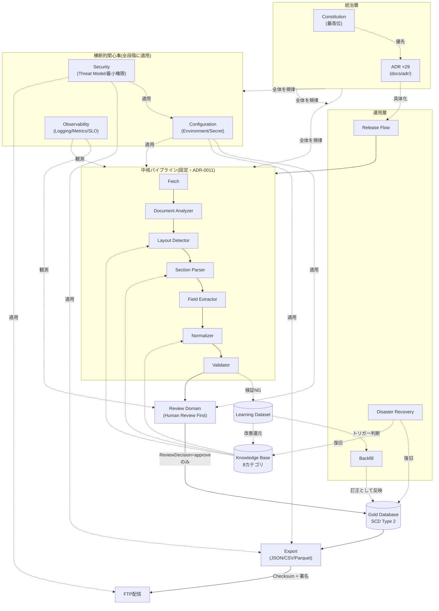

# Design Freeze Review

> 本ドキュメントは、Task 1〜15にわたり積み上げてきた設計corpus（`docs/`配下92本のMarkdown、29本のADR、ルート規約群）を横断的にレビューし、設計フェーズの完了可否を判定するための文書である。個々の設計内容の本文はここに複製せず、各領域の正となるドキュメントへのリンクと評価のみを記す（単一情報源の原則、これまでの全ドキュメントで一貫させてきた方針をここでも踏襲する）。
>
> 本ドキュメントは[`docs/constitution.md`](constitution.md)に従属する。特に「Design before Implementation」原則の到達点を確認する文書であり、Constitutionそのものを変更するものではない。
>
> **検証方法**: 本レビューの数値（ファイル数・ADR数・エッジ数等）は、レビュー時点で実際にリポジトリを走査・機械検証した結果であり、記憶や見積もりではない（検証コマンドは各節に付記）。

## レビュー対象領域

### Architecture

- **対象**: [`docs/architecture.md`](architecture.md)（中核パイプラインの全体像）、[`docs/architecture/architecture-contract.md`](architecture/architecture-contract.md)（9つの分離保証）、[`docs/architecture/learning_dataset.md`](architecture/learning_dataset.md)、[`docs/data_model.md`](data_model.md)（概念設計）。
- **確認事項**: 中核パイプライン6段階（Document Analyzer → Layout Detector → Section Parser → Field Extractor → Normalizer → Validator）が[ADR-0011](adr/0011-fixed-core-pipeline.md)により固定され、全設計文書を通じて一貫して参照されていることを確認した。Architecture Contractの9保証（`grep -c '^## [0-9]' docs/architecture/architecture-contract.md` で実測）は、[`docs/api/dependency-rule.md`](api/dependency-rule.md)のパッケージ依存境界と1対1で対応しており、宣言だけでなく依存グラフ上の構造的事実として担保されている。
- **評価**: 概念設計（`data_model.md`）と物理設計（`database/schema.md`）の役割分担が明示され、矛盾は見つからなかった。中核パイプラインという「変えない部分」と、Knowledge/Layoutという「変わる部分」の境界線が一貫している。

### ADR

- **対象**: [`docs/adr/`](adr/)配下、29本（0001〜0029）。
- **確認事項**: 全ADRが`Accepted`ステータスであることを実測確認（`grep -L '^Accepted' docs/adr/00*.md` で不一致0件）。ADR依存グラフ（[`dependency-map.md`](adr/dependency-map.md)）は29ノード・70エッジで、DFS彩色法・Kahnのアルゴリズムの双方でグラフ全体が非巡回であることを検証済み（[`docs/api/import-graph.md`](api/import-graph.md)のパッケージimportグラフとは別のグラフである点に注意。パッケージimportグラフは21ノード・47エッジで別途検証済み）。
- **評価**: [`gap-analysis.md`](adr/gap-analysis.md)による体系的なギャップ抽出（10候補中9件を採用）から始まり、Task 9・13・14でReview Domain・Configuration・Security領域の新規決定（0027〜0029）を追加する際も、既存決定を上書きせず参照追加に留める規律が一貫して守られている。被参照数0のADR（`0009`, `0018`, `0020`, `0023`, `0024`, `0027`, `0028`, `0029`）は[`dependency-map.md`](adr/dependency-map.md#被参照数in-degreeランキング上位実測値)で個別に評価済みであり、孤立ノード（in=0かつout=0）は存在しない。

### Review

- **対象**: [`docs/review/`](review/)（`domain.md`, `policy.md`, `queue.md`, `metrics.md`, `README.md`）。
- **確認事項**: Review LifecycleがGUIではなく独立したドメインとして設計され（`ReviewSession`, `ReviewAssignment`, `ReviewDecision`, `ReviewComment`, `ReviewHistory`, `ReviewStatistics`の6モデル）、Architecture Contractの保証8・9（「Reviewだけがgold_recordsを書き換えられる」）と構造的に対応している。
- **評価**: Human Review Firstという[`docs/constitution.md`](constitution.md)のCore Principleが、抽象的な理念ではなく、`ReviewDecision`が`gold_records`更新の唯一の経路であるという実装可能な制約として落とし込まれている点は、設計として強い部類に入る。CLI止まりのReview UI（[ADR-0021](adr/0021-review-ui-strategy.md)）は「不足点」として後述する。

### Workflow

- **対象**: [`docs/workflow/state-machine.md`](workflow/state-machine.md)。
- **確認事項**: 10状態（`Queued`〜`Archived`）が、Job/Review Lifecycle/Pipeline Stageという既存の3つの粒度とは異なる「最上位のライフサイクル」として明示的に位置づけられている（実測: 状態一覧表10行）。Timeout・Retry Policy・Rollback・Checkpointの4節を持つ。
- **評価**: `Approved`を境にRollbackの性質が「真のロールバック可能」から「Compensating Actionのみ」に切り替わるという設計は、[ADR-0006](adr/0006-pipeline-provenance.md)の来歴不変原則と一貫しており、後発の[`docs/operations/release.md`](operations/release.md)のRollback節もこの区分を再定義せずそのまま参照している。重複のない一貫した設計と評価する。

### Knowledge

- **対象**: [`docs/knowledge/schema.md`](knowledge/schema.md)、`knowledge/`配下8カテゴリのディレクトリ・README。
- **確認事項**: organization/position/rank/alias/historical/typography/layout/validationの8カテゴリが、YAML Schema・物理ディレクトリ・`knowledge_items.category`のDB制約（[`database/schema.md`](database/schema.md)）の3箇所で一致していることを確認した（実測: `### `見出し8件と物理ディレクトリ8件が1対1）。
- **評価**: 「Knowledge First」原則（正規表現追加よりKnowledge追加を優先、[ADR-0012](adr/0012-error-handling-priority-order.md)）が、8カテゴリという具体的な受け皿として一貫して用意されている。Backfillの判断基準（`error_category`集計）を通じて[`docs/operations/release.md`](operations/release.md#backfill)とも接続済み。

### Repository

- **対象**: [`docs/api/repositories.md`](api/repositories.md)。
- **確認事項**: 8 Repository（`CandidateRepository`, `GoldRepository`, `KnowledgeRepository`, `LearningRepository`, `PDFRepository`, `JobRepository`, `ExportRepository`, `ReviewRepository`）+ `UnitOfWork`（実測: `## \`` 見出し9件）。SQLite非依存の設計原則が明示され、PostgreSQL移行時の影響範囲が「参考」として別途整理されている。
- **評価**: Repository Patternの目的（[ADR-0004](adr/0004-sqlite-as-datastore.md)のSQLite採用が将来の移行を妨げないようにする）が、抽象的な方針で終わらず、8つの具体的なインターフェースとして表現されている。

### Interface

- **対象**: [`docs/api/interfaces.md`](api/interfaces.md)、[`docs/api/pipeline.md`](api/pipeline.md)、[`docs/api/models.md`](api/models.md)、[`docs/api/python-contract.md`](api/python-contract.md)、[`docs/api/dependency-rule.md`](api/dependency-rule.md)、[`docs/api/import-graph.md`](api/import-graph.md)。
- **確認事項**: 中核パイプライン6段階＋9サービス（`ReviewService`, `ExportService`, `FTPService`, `KnowledgeService`, `LearningService`, `FeatureStore`, `Scheduler`, `JobRunner`）＋Repository総称、計15コンポーネント（実測: `対象コンポーネント`表と一致）。モデルは13種（実測: `対象モデル（13、要求通り）`という自己申告見出しと実際の`## \`` 見出し13件が一致）。全パイプライン段階が`run()`のみを公開する制約により、副作用（DB書き込み）が`pipeline/`層に閉じ込められている。
- **評価**: 本レビュー時点で最も重大な過去の欠陥（`repositories/sqlite/ → config/ → repositories/sqlite/`循環参照）は、DFS・Kahnの二重検証により発見・修正済みであることを再確認した（[`import-graph.md`](api/import-graph.md#検証の過程で発見修正した循環参照)）。この種の構造的欠陥が実装着手前に発見されたことは、Interface First原則が機能した実例と評価できる。

### Security

- **対象**: [`docs/security.md`](security.md)、[ADR-0026](adr/0026-security-policy.md)、[ADR-0029](adr/0029-export-integrity-and-audit-log-policy.md)。
- **確認事項**: 資産6種・脅威アクター5種・脅威T1〜T6の対応表を起点に、Secret/Supply Chain/GitHub Actions/Dependency/JSON改ざん/FTP/Checksum・Hash/署名/Audit Log/最小権限/Security Reviewの11節すべてが埋まっている。チェックサムフィールド6箇所（`pdfs.content_hash`等）がすべてSHA-256に統一されていることを確認済み。
- **評価**: 「チェックサムは改ざん検知はできるが真正性の証明はできない」という区別を明示し、署名（デタッチド署名、鍵は`production`限定Secret）を追加した設計は妥当。ただし署名アルゴリズム・ツールの確定は実装時に持ち越されており、「不足点」として後述する。

### Observability

- **対象**: [`docs/operations/observability.md`](operations/observability.md)。
- **確認事項**: Logging/Metrics/Tracing/Health Check/Alert/Dashboard/SLO/SLI/Error Budget/OpenTelemetry対応方針の10節すべてが、常時稼働サーバーを持たないバッチ実行モデル（[ADR-0025](adr/0025-deployment-strategy.md)）に即した形で再定義されている（HTTPヘルスチェックではなく`jobs`テーブルベースの健全性判定、常時稼働Collectorではなくファイルベースのエクスポート等）。
- **評価**: 一般的なWebサービス向けSRE語彙（SLO/SLI/Error Budget/OpenTelemetry）を、そのまま輸入せずバッチ・データパイプラインの文脈に翻訳した点は評価できる設計判断である。SLOの数値目標が運用実績蓄積まで暫定という誠実な留保も、他の設計文書（`schema.md`の「今後の検討事項」等）と同じ姿勢で一貫している。

### Configuration

- **対象**: [`docs/configuration.md`](configuration.md)、[ADR-0028](adr/0028-pydantic-settings-for-configuration.md)。
- **確認事項**: Environment（dev/test/staging/production）・Pydantic Settings・Secret管理・Validation Rule・設定Version・Migration・Hot Reload可否の7節が揃っている。Pydantic Settings採用は`config/`パッケージ境界に限定され、[`docs/api/python-contract.md`](api/python-contract.md#pydantic利用可否)の「`models/`にはPydantic不採用」という既存決定と矛盾しないことを、ADR-0028本文および同ファイルへの追記の両方で確認した。
- **評価**: Hot Reload不採用の判断が、単なる「やらない」ではなく[ADR-0025](adr/0025-deployment-strategy.md)のバッチ実行モデルから論理的に導かれている点は、場当たり的でない設計の一例。設定Versionを既存の3層バージョン管理（[`json_schema.md`](database/json_schema.md#バージョン管理)）への第4層追加として設計し、独自の並行した仕組みを作らなかった点も一貫性の観点で妥当。

### Release

- **対象**: [`docs/operations/release.md`](operations/release.md)。
- **確認事項**: Release Flow（コードリリースとデータ公開を9段階で分離）・Rollback・Parser Upgrade・Knowledge Upgrade・Migration・Backfill・Recovery・Backup・Disaster Recovery・Maintenance Windowの10節。[ADR-0024](adr/0024-knowledge-versioning-and-backfill.md)が明示的に本ドキュメントへ委ねていたBackfillの実行手順（トリガー条件・サンプル実行・本実行・監視）が確定していることを確認した。
- **評価**: 「バッチ実行環境ではrunnerの異常終了時に永続ストレージが自然に保護される」という、実行モデル固有の復旧特性を明示的に文書化した点は、実装者が誤って過剰な復旧機構を作ることを防ぐ実用的な記述である。

## 不足点

設計フェーズとして許容される「実装時に決定」という先送りと、本来ここで決めるべきだった欠落を区別して列挙する。

| # | 不足点 | 該当箇所 | 区分 |
|---|---|---|---|
| 1 | ライセンス未選定 | [`README.md`](../README.md)「ライセンス」節 | 実装着手前に要決定 |
| 2 | `CODEOWNERS`のオーナーが仮のダミー（`@yastdkhs`）のまま | [`CODEOWNERS`](../CODEOWNERS) | 実チーム編成確定後に要更新 |
| 3 | 署名アルゴリズム・ツールが未確定（候補のみ） | [`docs/security.md`](security.md#署名) | 実装時ADR起票を明示済み |
| 4 | 依存脆弱性スキャンツール未選定（`pip-audit`等は例示） | [ADR-0026](adr/0026-security-policy.md) | 実装時決定を明示済み |
| 5 | PDF本体の外部ストレージ製品未選定 | [ADR-0018](adr/0018-pdf-registry-and-retention.md) | 実装時決定を明示済み |
| 6 | `release.yml` / `layout-validation.yml`ワークフロー未実装 | [`.github/workflows/README.md`](../.github/workflows/README.md) | 実装フェーズのタスク |
| 7 | ベンチマークデータセットの評価レポート形式が未設計 | [ADR-0020](adr/0020-benchmark-dataset.md) | `docs/operations/`への追加が必要（本ドキュメントの範囲外） |
| 8 | Review UIはCLI止まりで、Web化の具体的なUI設計は未着手 | [ADR-0021](adr/0021-review-ui-strategy.md), [`docs/constitution.md`](constitution.md)Evolution Policy | 評価条件は定義済みだが詳細設計は将来 |
| 9 | DR訓練の頻度・具体的な訓練手順が未定 | [`docs/operations/release.md`](operations/release.md#disaster-recovery) | 実装後にRunbook化を明示済み |
| 10 | Secret・署名鍵のローテーション手順が具体化されていない | [`docs/security.md`](security.md#secret), [`docs/operations/release.md`](operations/release.md) | 実装時Runbook化を明示済み |

**評価**: 1・2・6・7は実装フェーズ開始前に埋めるべき純粋な欠落。3・4・5・8・9・10は各ADR・設計文書内で「実装時に決定する」と明示的に先送りされており、意図的な保留として設計フェーズの完了を妨げないと判断する。

## 改善点

設計として誤っているわけではないが、より良くできる余地。

1. **`docs/adr/quality-check.md`がTask 7時点のスナップショットのまま**: 0018〜0026追加時点の機械チェック結果であり、その後追加された0027〜0029、および`docs/api/`, `docs/review/`, `docs/security.md`等の大量のドキュメント（Task 8〜15）に対する参照切れ・重複・矛盾の機械チェックは、本ドキュメント作成時に個別に実施した（本レビューの「検証方法」参照）ものの、`quality-check.md`自体は更新していない。次回のドキュメント整備時に再実行し、レポートとして残すことが望ましい。
2. **前提説明の散在**: 「常時稼働サーバーを持たないバッチ実行モデル」（[ADR-0025](adr/0025-deployment-strategy.md)）という前提が、`docs/operations/observability.md`・`docs/configuration.md`・`docs/security.md`・`docs/operations/release.md`のそれぞれの冒頭で個別に説明されている。内容は一貫しているが、`docs/architecture.md`または新設の用語集的な位置に正典を1箇所置き、他はリンクのみにする余地がある。
3. **`docs/glossary.md`が21用語のみ**: 8カテゴリのKnowledge Base、9つのArchitecture Contract保証、Review Lifecycleの状態名等、実装が参照する専門用語が`docs/glossary.md`に反映されていないものが多い。「初期案であり実装を進める中で増える」という同ファイル末尾の注記どおりではあるが、設計フェーズ終了時点で用語集を一度棚卸しする価値はある。
4. **凍結後の変更プロセスの粒度が未定義**: 本ドキュメントによる「設計完了」宣言後、軽微な追記（誤字修正・リンク修正）と、設計の実質的な変更（新規ADR相当）をどう区別して扱うかが明文化されていない。`docs/constitution.md`の変更プロセスはプロジェクトオーナー承認を必須としているが、それ以外の設計文書群の「凍結解除」基準は本ドキュメントにも存在しない。

## リスク

| # | リスク | 影響 | 現状の緩和策 |
|---|---|---|---|
| 1 | 実装未着手のため、ここまでの設計が実際にコードとして実現可能か（過剰設計・見積もり誤り）を検証できていない | 実装着手後に大規模な設計手戻りが発生する可能性 | ゴールデンファイルテスト・Interface Firstの方針により、部分的な検証は先行して可能だが、全体の妥当性検証は実装を待つほかない |
| 2 | ドキュメント量が92ファイルに達し、新しいAIセッション・新しい担当者が全体像を把握するコストが増大している | 属人化・文脈喪失のリスク（本プロジェクトが最も避けたいリスクそのもの） | `docs/constitution.md`と本ドキュメントが、それぞれ最上位の理念・最新の全体像スナップショットとしてエントリポイントの役割を果たす設計にした |
| 3 | GitHub Actions + SQLite単一ファイルという技術選定が、将来のデータ量・処理頻度増加時にスケールしない可能性 | 移行コスト、移行までの間の運用負荷増大 | [ADR-0019](adr/0019-workflow-orchestration.md)・[ADR-0025](adr/0025-deployment-strategy.md)が移行の考え方（新規ADRでの再検討）を既に明記しているが、具体的な閾値（実行時間・処理件数）は未定義 |
| 4 | Pydantic Settings採用（[ADR-0028](adr/0028-pydantic-settings-for-configuration.md)）が将来「`models/`にも使うべき」という圧力を生む | 依存最小化方針（[ADR-0001](adr/0001-python-packaging.md)）の形骸化 | ADR-0028自体がこのリスクを認識し、`python-contract.md`に適用範囲限定の明記を追加済み。今後のADR起票時にこのADRを参照して判断する運用に依存する |
| 5 | 防衛省側のPDF公開形式変更・過去PDFの公開停止等、外部要因への依存 | Layout追加対応の負荷増、過去PDFの再取得不能によるDisaster Recovery失敗 | [ADR-0003](adr/0003-layout-definition-strategy.md)のLayout外部データ定義化、[ADR-0018](adr/0018-pdf-registry-and-retention.md)のPDF内部保管により、公開停止後も自組織内のコピーから復旧可能な設計にしている |
| 6 | Secret・署名鍵の運用手順が未Runbook化のまま本番運用を迎えると、一貫しない手順で事故が起きる可能性 | Secret漏えい・署名鍵紛失時の対応遅延 | 「不足点」10と同一。実装着手前のRunbook整備をTODOとして明記する |

## Mermaid

以下は、Task 1〜15で構築した設計corpus全体を1枚に俯瞰する図である。個々の詳細図（パイプライン詳細は[`architecture.md`](architecture.md)、Review Lifecycleは[`review/domain.md`](review/domain.md)、Workflow状態遷移は[`workflow/state-machine.md`](workflow/state-machine.md)、ADR依存関係は[`adr/dependency-map.md`](adr/dependency-map.md)）を重複させず、それらの**関係**を示すことに専念する。

## TODO一覧

実装フェーズ開始前後に着手すべき項目を、種別ごとに整理する（「不足点」節の内容を実行可能な単位に変換したもの）。

**着手前に決定すべきもの**:
- [ ] ライセンスの選定
- [ ] `CODEOWNERS`の実チームハンドルへの置き換え

**実装と並行して選定するもの（各ADRが実装時決定として明示済み）**:
- [ ] 署名ツール・アルゴリズムの選定と新規ADR起票（[`docs/security.md`](security.md#署名)）
- [ ] 依存脆弱性スキャンツールの選定（[ADR-0026](adr/0026-security-policy.md)）
- [ ] PDF本体の外部ストレージ製品の選定（[ADR-0018](adr/0018-pdf-registry-and-retention.md)）
- [ ] 設定管理ライブラリ（`pydantic-settings`）のバージョン固定・脆弱性スキャン組み込み（[ADR-0028](adr/0028-pydantic-settings-for-configuration.md)）

**実装タスクそのもの**:
- [ ] `src/`配下、中核パイプライン6段階の実装着手
- [ ] `tests/`配下のテストスイート整備（ゴールデンファイルテスト含む）
- [ ] `src/mod_personnel_db/store/migrations/`の新設と初期マイグレーション作成（[`database/schema.md`](database/schema.md#migration方針)）
- [ ] `.github/workflows/release.yml` / `layout-validation.yml`の実装（[`.github/workflows/README.md`](../.github/workflows/README.md)）
- [ ] `sample_pdfs/` / `sample_outputs/`への代表サンプルの用意

**運用文書の具体化（Runbook化）**:
- [ ] `docs/operations/pipeline_run.md`（定期実行・手動実行手順）
- [ ] `docs/operations/incident_response.md`（抽出失敗・検証NG急増時の対応）
- [ ] `docs/operations/new_layout_rollout.md`（新様式対応の実務手順）
- [ ] `docs/operations/data_correction.md`（公開後の訂正・再公開フロー）
- [ ] Secret・署名鍵のローテーション手順
- [ ] Disaster Recovery訓練の頻度・手順

**ドキュメント整備**:
- [ ] `docs/adr/quality-check.md`の再実行（0027〜0029、`docs/api/` `docs/review/` `docs/security.md`等を含めた全体の機械チェック）
- [ ] `docs/glossary.md`の棚卸し・拡充
- [ ] ベンチマークデータセットの評価レポート形式の設計（[ADR-0020](adr/0020-benchmark-dataset.md)）

## 設計完了

以上のレビューに基づき、本ドキュメントをもって**設計完了（Design Freeze）を宣言する**。

この宣言が意味すること・意味しないことを明確にしておく。

- **意味すること**: Architecture・ADR・Review・Workflow・Knowledge・Repository・Interface・Security・Observability・Configuration・Releaseの11領域について、内部矛盾なく、単一情報源の原則を保ったまま、実装に着手するための十分な設計corpusが揃ったと判断する。「不足点」に列挙した項目は、いずれも実装フェーズと並行して、または実装着手の直前に解決可能な既知の残課題であり、設計の骨格を変更するものではない。
- **意味しないこと**: 「今後一切設計文書を変更しない」という意味ではない。[`docs/constitution.md`](constitution.md)自身がADRによる拡張を前提として設計されているように、実装を進める中で判明する新しい知見は、新規ADRの追加という既存の手続きを通じて設計に反映され続ける。「設計完了」とは「変更しない」ではなく「実装を始めてよいだけの一貫性と網羅性に達した」という判定である。
- **凍結の対象**: 中核パイプラインの6段階構成（[ADR-0011](adr/0011-fixed-core-pipeline.md)）、Repository Pattern・Dependency Inversion等のArchitecture Principles（[`docs/constitution.md`](constitution.md)）、Human Review Firstの構造的保証（Architecture Contract保証8・9）は、通常のADR追加では変更できない高いハードルを既に持つ。それ以外の設計判断は、今後の実装から得られる知見に応じて、既存の手続き（新規ADRの追加、Supersede）により正しく進化することを前提とする。

実装フェーズへの移行にあたっては、「TODO一覧」の該当項目から着手することを推奨する。

## 関連ドキュメント

本ドキュメントは`docs/`配下の全設計文書を対象とするため、個別のADR・設計文書への網羅的なリンクは各節に埋め込み済みである。特に以下は本ドキュメントの構成上の基点となる。

- [`docs/constitution.md`](constitution.md) — Project Constitution。本ドキュメントが従属する最高位文書。
- [`docs/architecture-review-package.md`](architecture-review-package.md) — Task 9時点のArchitecture Reviewパッケージ（本ドキュメントは、それ以降のTask 10〜15を含めた最終レビューに相当する）。
- [`README.md`](../README.md) — プロジェクト概要・ドキュメント目次。
