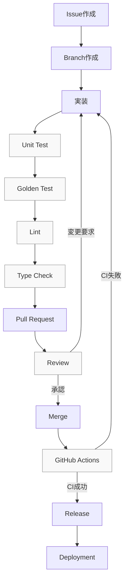

# Developer Workflow

> 開発者（人間・Claude Code問わず）が、Issue作成からDeploymentまでの一連の流れの中で、どの段階で何をするかを可視化する。個々の段階の詳細規約は既存の設計文書（[`CONTRIBUTING.md`](../CONTRIBUTING.md), [`docs/testing/test-policy.md`](testing/test-policy.md), [`docs/operations/release.md`](operations/release.md)等）を正とし、本ドキュメントはそれらのつながりを1つの流れとして示すことに専念する。実装コードは含まない。

## 全体フロー（Mermaid）

`Review`での差戻し、`GitHub Actions`でのCI失敗は、それぞれ`実装`段階へ戻るループとして表現している（一方向の直線的なフローではない）。

## 各段階の説明

### Issue作成

- バグ修正・機能追加・新規PDFレイアウト対応は、着手前にIssueを作成する。テンプレートは`.github/ISSUE_TEMPLATE/`（`bug_report.md`, `feature_request.md`, `pdf_format_change.md`）を使う。
- データモデル・技術選定・パイプライン構成に関わる変更が見込まれる場合、この時点でADRが必要かを判断する（[`docs/adr/README.md`](adr/README.md#いつadrを書くか作成ルール)）。

### Branch作成

- ブランチ命名は[`CONTRIBUTING.md`](../CONTRIBUTING.md)の規約に従う: `feature/<短い説明>`, `fix/<短い説明>`, `layout/<年度・様式名>`。
- `main`は常にデプロイ可能な状態を保つ。`main`への直接pushは行わない。

### 実装

- [`docs/implementation.md`](implementation.md)のImplementation Philosophy（Repository First, Interface First, Domain First, Knowledge First, Review First等）に従う。
- コーディングスタイルは[`docs/coding-style.md`](coding-style.md)に従う。
- Parser（中核パイプライン6段階）に関わる変更は[`docs/parser-guidelines.md`](parser-guidelines.md)に従う。
- 1つのPRで1つの責務のみを変更する意識で、実装単位を小さく保つ（[`docs/implementation.md`](implementation.md#small-commit)の「Small Commit」）。

### Unit Test

- 変更したロジックに対応するUnit Testを追加する（[`docs/testing/test-policy.md`](testing/test-policy.md#unit-test)）。
- ローカルで`pytest`を実行し、グリーンであることを確認してからコミットする。

### Golden Test

- Parser・正規化ロジックに関わる変更は、`tests/golden`のゴールデンファイルテストを実行し、既存様式の処理を壊していないことを確認する（[ADR-0007](adr/0007-golden-file-testing.md)、[`docs/testing/test-policy.md`](testing/test-policy.md#golden-test)）。
- 新しい様式（`layouts/`）を追加する場合は、対応する`sample_pdfs/` / `sample_outputs/`をこの段階で用意する。
- 期待値（ゴールデンファイル）自体を変更する場合は、無言で更新せず、変更理由をコミット・PR説明に明記する（[`CLAUDE.md`](../CLAUDE.md)）。

### Lint

- `ruff check` / `ruff format --check`をローカルで実行する。`pre-commit install`（[`CONTRIBUTING.md`](../CONTRIBUTING.md)）により、コミット時に自動実行される。

### Type Check

- `mypy --strict`を実行する。すべての公開関数・メソッドに完全な型ヒントが付与されていることを確認する（[`docs/api/python-contract.md`](api/python-contract.md#型ヒント必須)）。

### Pull Request

- `.github/PULL_REQUEST_TEMPLATE.md`に従って記述する。関連Issue・関連ADRへのリンクを含める。
- 詳細なPRルールは[`docs/implementation.md`](implementation.md#pull-request-rule)を参照。

### Review

- `CODEOWNERS`に基づくレビュー担当者の承認を得る。
- **AI（Claude Code等）が生成したコードも、この段階で必ず人間のレビューを経る**（[`docs/constitution.md`](constitution.md)のAI Principles、[`docs/implementation.md`](implementation.md#code-review-rule)）。
- データモデル・レイアウトフォーマット・ドメイン知識のスキーマに影響する変更は、最低1名の追加レビューを必須とする（[`CONTRIBUTING.md`](../CONTRIBUTING.md)）。
- 変更要求があれば「実装」段階に戻る（上図の差戻しループ）。

### Merge

- レビュー承認後、`main`へマージする。マージ自体はコードの統合であり、[ADR-0010](adr/0010-ci-cd-and-publish-strategy.md)が定めるとおり、データの公開はこの時点では発生しない（コードリリースとデータ公開は別ステップ、[`docs/operations/release.md`](operations/release.md#release-flow)）。

### GitHub Actions

- `main`へのマージ（および各PR）をトリガーに、`.github/workflows/ci.yml`のlint・型チェック・テストジョブが実行される。
- CIが失敗した場合は「実装」段階に戻り、修正する（上図のループ）。
- 詳細なワークフロー構成は[`docs/testing/test-policy.md`](testing/test-policy.md#github-actionsワークフローとの対応まとめ)を参照。

### Release

- 意図的にタグ付けされたリリースのみが`parser_versions`の新しい行としてCIにより自動記録される（[ADR-0023](adr/0023-parser-versioning-policy.md)）。
- 詳細な9段階のRelease Flow（コードリリースとデータ公開の分離）は[`docs/operations/release.md`](operations/release.md#release-flow)を正とする。

### Deployment

- 本プロジェクトは常時稼働サーバーを持たないバッチ実行モデルである（[ADR-0025](adr/0025-deployment-strategy.md)）。「デプロイ」とは、次回のスケジュール実行（GitHub Actions）が最新のリリースタグに基づくコードで動作することを指し、追加のデプロイ操作は不要である。
- `staging`での検証を経て`production`へ展開する順序は[`docs/configuration.md`](configuration.md#environment)のEnvironment定義・昇格順序に従う。

## この図に含まれないもの

以下は本ドキュメントの範囲外であり、それぞれの正となる文書を参照する。

- Human Review（`ReviewDecision`によるGold Database反映）の詳細な状態遷移: [`docs/review/domain.md`](review/domain.md)
- Rollback・Backfill・Disaster Recovery: [`docs/operations/release.md`](operations/release.md)
- Workflowの10状態（Queued〜Archived）: [`docs/workflow/state-machine.md`](workflow/state-machine.md)

## 関連ドキュメント

- [`CONTRIBUTING.md`](../CONTRIBUTING.md) — 人間の開発者向け開発フロー・規約
- [`docs/implementation.md`](implementation.md) — Implementation Guide
- [`docs/testing/test-policy.md`](testing/test-policy.md) — Test Policy
- [`docs/operations/release.md`](operations/release.md) — Release Flow
- [ADR-0010](adr/0010-ci-cd-and-publish-strategy.md) — CI/CDと公開戦略
- [ADR-0019](adr/0019-workflow-orchestration.md) — 実行オーケストレーション戦略
- [ADR-0025](adr/0025-deployment-strategy.md) — デプロイメント戦略
