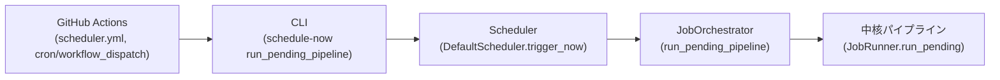

# 運用設計: Release / Rollback / Recovery

> **本ドキュメントに実装（コード）はない。** 運用フローの設計のみを扱う。個々の決定の根拠は既存ADR（[ADR-0006](../adr/0006-pipeline-provenance.md), [ADR-0010](../adr/0010-ci-cd-and-publish-strategy.md), [ADR-0018](../adr/0018-pdf-registry-and-retention.md), [ADR-0022](../adr/0022-export-policy.md), [ADR-0023](../adr/0023-parser-versioning-policy.md), [ADR-0024](../adr/0024-knowledge-versioning-and-backfill.md), [ADR-0025](../adr/0025-deployment-strategy.md)）を正とし、本ドキュメントはこれらを実際に「いつ・誰が・どの順で行うか」という運用手順として具体化する。特に[ADR-0024](../adr/0024-knowledge-versioning-and-backfill.md)が「判断基準・実行手順の詳細は`docs/operations/`に別途まとめる」と明示的に本ドキュメントへ委ねていたBackfillの実行手順を、本ドキュメントで確定する。
>
> 本ドキュメントは[`docs/constitution.md`](../constitution.md)に従属する。特に「Pipeline Never Breaks」「Reproducibility」「Small Pull Requests」原則を運用面で具体化したものである。

## 位置づけ: 本ドキュメントが扱う範囲と扱わない範囲

「ロールバック」「復旧」という言葉は、本プロジェクトの複数の階層で異なる意味を持つ。混同を避けるため、範囲を明確にする。

| 階層 | 対応するドキュメント | 本ドキュメントとの関係 |
|---|---|---|
| 1レコード・1Workflow実行単位の異常終了・差戻し | [`docs/workflow/state-machine.md`](../workflow/state-machine.md#rollback)のRollback節 | 参照するのみ。再定義しない |
| DBスキーマの前進のみマイグレーション | [`docs/database/schema.md`](../database/schema.md#migration方針)のMigration方針 | 参照するのみ。本ドキュメントは適用の運用手順（順序・Maintenance Window）を補う |
| 設定スキーマの移行 | [`docs/configuration.md`](../configuration.md#migration)のMigration節 | 参照するのみ |
| **コードリリース・データ公開・大規模障害からの復旧**（本ドキュメントの範囲） | 本ドキュメント | Release Flow・Parser/Knowledge Upgrade・Backfill・Backup・Disaster Recoveryを新規に定義する |

## Release Flow

「コードのリリース」と「データの公開」は別の意思決定ステップである（[ADR-0010](../adr/0010-ci-cd-and-publish-strategy.md)）。本節はこの2つを1つの一貫したフローとして順序づける。

> **実装状況（Phase8 Task18-3時点）**: [`.github/workflows/release.yml`](../../.github/workflows/release.yml)は現在、`workflow_dispatch`・`v*`タグpushをトリガーに、[`ci.yml`](../../.github/workflows/ci.yml)と同じ品質ゲート（ruff lint・ruff format check・mypy・pytest）をPoetry経由で再実行するのみである。下記9段階のうち2（CI検証）・3（マージ）に相当する部分はci.ymlが担い、4はrelease.ymlのトリガー（タグpush）に対応するが、`parser_versions`テーブルへの自動記録自体は未実装である。`ftp/`・`fetch/`・`services/`（`JobOrchestrator`・`Scheduler`）は、Phase7 Task17-1〜17-4で`cli/`（Composition Root）へ配線済みであり、`fetch-stage`/`run-workflow`/`schedule-now`/`list-schedule`の4コマンドとしてCLIから手動実行できる（[`docs/reports/phase7-final-audit.md`](../reports/phase7-final-audit.md)）。Task18-3で、[`.github/workflows/scheduler.yml`](../../.github/workflows/scheduler.yml)がGitHub Actions cronから`schedule-now run_pending_pipeline`（中核パイプライン処理のみ）を自動起動するようになった（詳細は「[Scheduler運用フロー](#scheduler運用フローgithub-actions--schedule-now--scheduler--joborchestrator)」を参照）。しかし、`staging`検証・`production`昇格・Fetch（新規PDF取得）・Human Review・Export/FTP Publishを含む5〜9段階全体の自動化（環境分離・`FtpSettings`実接続・Fetch対象の自動決定・CI/CDワークフローからの呼び出し）は依然未実装であり、その実装設計は[`docs/phase8-integration-design.md`](../phase8-integration-design.md)（Task18-0）が確定した（実装は別タスク）。以下のフローは、この自動化が完了した後の設計目標として記載する。

1. **開発**: `dev`環境でのローカル作業。1PR1責務（[ADR-0014](../adr/0014-development-discipline.md)）。
2. **CI検証**: PRごとにlint・型チェック・テスト（ゴールデンファイル含む、[ADR-0007](../adr/0007-golden-file-testing.md)）を実行（`test`環境、[`docs/configuration.md`](../configuration.md#environment)）。
3. **マージ**: `main`ブランチへのマージ。この時点ではまだ本番実行環境のコードは更新されない（[ADR-0025](../adr/0025-deployment-strategy.md)のバッチ実行モデルでは、次回のスケジュール実行が`main`の最新状態を都度チェックアウトする）。
4. **リリースタグ付与**: 意図的にタグ付けされたリリースのみが`parser_versions`テーブルの新しい行としてCIが自動記録する（[ADR-0023](../adr/0023-parser-versioning-policy.md)のSemVer規則）。
5. **`staging`での検証**: 新しいリリースタグに基づくコードを`staging`環境で実行し、代表的な入力に対する出力が期待どおりであることを確認する（[`docs/configuration.md`](../configuration.md#environment)の昇格順序）。
6. **`production`への昇格**: `staging`での検証を経て、`production`のスケジュール実行が新しいコードを使用するようになる。これは追加のデプロイ操作を要さない（バッチ実行モデルでは、次回の定期実行が自動的に最新のリリースタグに基づくコードで動く）。
7. **データ生成**: 新しいコードによって`candidate_records`が生成される。この時点ではまだ公開されない。
8. **Human Review**: [`docs/review/`](../review/)のレビューを経て`gold_records`に反映される（[ADR-0010](../adr/0010-ci-cd-and-publish-strategy.md)の人手ゲート）。
9. **公開（Export/FTP送信）**: [ADR-0022](../adr/0022-export-policy.md)のExport Policyに従い、検証済みデータのみがエクスポート・配布される。

**この9段階のうち、1〜6は「コードリリース」、7〜9は「データ公開」であり、両者は独立して失敗しうる**。コードリリースが成功しても、Human Reviewが承認しなければデータは公開されない。この分離こそが[ADR-0010](../adr/0010-ci-cd-and-publish-strategy.md)の意図である。

## Scheduler運用フロー（GitHub Actions → schedule-now → Scheduler → JobOrchestrator）

Phase8 Task18-3で実装した、`schedule-now`（`run_pending_pipeline`）の自動起動経路の運用フローを示す（[`docs/phase8-integration-design.md#3-scheduler自動起動設計`](../phase8-integration-design.md#3-scheduler自動起動設計)の設計に基づく）。

- **起動主体**: [`.github/workflows/scheduler.yml`](../../.github/workflows/scheduler.yml)。`schedule: cron`（毎日17:45 JST）・`workflow_dispatch`（手動実行）の2経路。常駐プロセスは持たない（[ADR-0025](../adr/0025-deployment-strategy.md)のバッチ実行モデル）。
- **CLI経由のみ**: ワークフローは`python -m mod_personnel_db.cli ... schedule-now run_pending_pipeline`というCLIコマンドのみを呼び出す。`Scheduler`・`JobOrchestrator`等のPythonコードをワークフロー自身が直接importすることはない。
- **Composition Root**: `schedule-now`は`cli/bootstrap.py`（Composition Root）が構築する`Scheduler`（`DefaultScheduler`）をProtocol型経由で呼び出す。ワークフロー追加によって`cli/`側の配線（Task17-4実装済み）は変更されない。
- **排他制御**: `concurrency`グループにより、cron起動と手動起動が重なった場合の同時書き込みを防ぐ（[ADR-0025](../adr/0025-deployment-strategy.md)が要求するワークフロー側の排他制御）。
- **正常系としての「処理対象なし」**: 未処理PDFが0件の場合、`Scheduler.trigger_now()`は`NoPendingJobError`を送出する。これは定期実行のたびに頻発しうる正常な結果であるため、`scheduler.yml`は出力を判定し、この場合のみジョブを成功として扱う（それ以外の失敗は通常どおりジョブ失敗として扱う）。
- **Secrets**: `MOD_PERSONNEL_DB_DB_PATH`・`MOD_PERSONNEL_DB_KNOWLEDGE_ROOT`・`MOD_PERSONNEL_DB_LAYOUTS_ROOT`の3件（README.mdの「[Scheduler運用（GitHub Actions）](../../README.md#scheduler運用github-actions)」参照）。FTP接続情報は`run_pending_pipeline`が使用しないため対象外。
- **スコープ**: 現時点で自動化されているのは`run_pending_pipeline`（既に`fetch-stage`等で取得済みのPDFの中核パイプライン処理）のみである。Fetch（新規PDF取得）・Export・FTP Publishを含む`run_workflow`系の自動化は、Fetch対象の自動決定方法が未解決のため対象外のまま残る（[`docs/phase8-integration-design.md#4-production-workflow設計`](../phase8-integration-design.md#4-production-workflow設計)）。

## Release Candidateからv1.0.0正式版までの残タスク

Phase6 Task15-0の最終監査（[`RELEASE_STATUS.md`](../../RELEASE_STATUS.md)のKnown Limitations参照）に基づき、v1.0.0 Release Candidateから正式版へ昇格するまでの残タスクを整理する。個々の実装順序・優先度の確定は本ドキュメントの範囲外とし、実装着手時に別途判断する。

| カテゴリ | 内容 | 対応する制限事項 |
|---|---|---|
| データ整備 | `layouts/`・`knowledge/`を実運用規模（複数様式・表記ゆれ）へ拡充し、Golden Testフィクスチャを`era_id`ごとに整備する | [`RELEASE_STATUS.md`](../../RELEASE_STATUS.md)のKnown Limitations 1・2 |
| Composition Root配線・CLI統合（**Task17-1〜17-4で完了**） | ~~Phase7（Task16-1〜16-4）で実装済みの`ftp/`・`fetch/`・`services/`（`JobOrchestrator`による横断オーケストレーション）を`cli/`（Composition Root）へ配線し、CLIサブコマンドとして公開する。~~ Task17-1〜17-4で完了済み（`fetch-stage`/`run-workflow`/`schedule-now`/`list-schedule`の4コマンド、[`docs/reports/phase7-final-audit.md`](../reports/phase7-final-audit.md)）。`features/`（特徴量計算）の統合のみ、`JobRunner`のコンストラクタ拡張を伴うため別途新規ADRが前提のまま未着手（[`docs/phase7-integration-design.md`](../phase7-integration-design.md#7-featurestore生成位置)参照） | 同3（`features/`統合分のみ残存） |
| Scheduler自動実行（**Task17-3/17-4で本体・CLI統合は完了、自動起動経路はPhase8で設計**） | [`docs/api/interfaces.md`](../api/interfaces.md#scheduler)が定める`Scheduler`Protocol・標準実装`DefaultScheduler`はTask17-3で実装済み、`schedule-now`/`list-schedule`のCLI統合はTask17-4で完了済み。ただしCLIからの手動トリガーのみに対応し、GitHub Actions cron等による自動的な定期実行の経路・`FtpSettings`実装によるFTP実接続はまだ確立していない。実装設計は[`docs/phase8-integration-design.md`](../phase8-integration-design.md)（Task18-0）が確定した（実装は別タスク） | 同3（自動実行経路・FTP実接続分のみ残存） |
| Export完全性・監査の強化 | [ADR-0029](../adr/0029-export-integrity-and-audit-log-policy.md)が定めるEd25519署名・GitHub Actionsの`GITHUB_TOKEN`最小権限設定（`permissions:`ブロック）・サードパーティActionsのコミットSHAピン留めを実装する | 同4 |
| 依存脆弱性スキャン | [ADR-0026](../adr/0026-security-policy.md)が求める`pip-audit`等を3ワークフロー（`ci.yml`/`release.yml`/`nightly.yml`）へ導入する | 同5 |
| CLI公開範囲の拡張 | `ExportService`の新機能（`PersonnelRecord`/CSV/Parquet/完全性メタデータ、Phase6 Task14-2〜14-4）をCLIサブコマンドとして公開する | 同6 |
| リリース自動化 | 「Release Flow」節が定める`parser_versions`テーブルへのタグ起点自動記録、`staging`/`production`環境分離（[`docs/configuration.md`](../configuration.md#environment)）を実装する | 同7 |
| スキーマMigration基盤 | [`docs/database/schema.md`](../database/schema.md#migration方針)が定める`schema_migrations`管理テーブル・`PRAGMA user_version`によるバージョン管理を実装する | 同11 |
| 残りのテスト層整備 | Regression / Performance / Acceptance / Benchmark / Mutation Test（[`docs/testing/test-policy.md`](../testing/test-policy.md)が定める8種のうち残り5種）に着手する | 同13 |

このうち「データ整備」「未実装パッケージの実装」「セキュリティ強化（Export完全性・依存脆弱性スキャン）」の3カテゴリは、[`RELEASE_STATUS.md`](../../RELEASE_STATUS.md)のRelease Recommendationが正式リリースの前提条件として挙げているものである。

## Rollback

### コードリリースのロールバック（本ドキュメントで新規定義）

新しいリリースタグに起因する不具合（例: 特定様式の誤抽出が急増）が判明した場合:

1. 直前の正常なリリースタグへコードを戻す（`main`上でのRevertコミット、[ADR-0023](../adr/0023-parser-versioning-policy.md)の「リリースタグは削除・強制上書きしない」方針に従い、既存タグの付け替えではなく新しいタグとして戻す）。
2. 次回のスケジュール実行から、戻したコードが自動的に使用される（[ADR-0025](../adr/0025-deployment-strategy.md)のバッチ実行モデルの性質上、追加のデプロイ操作は不要）。
3. **不具合のあるコードが既に生成した`gold_records`・公開済みエクスポートは、コードを戻しても自動的には訂正されない**（[ADR-0006](../adr/0006-pipeline-provenance.md)の来歴不変の原則）。影響範囲の特定と是正は、後述の「Backfill」節の手順に従う。

### データのロールバック

`Approved`以降（`gold_records`への反映後）の真のロールバック（削除・撤回）は行わない。詳細な状態遷移と根拠は[`docs/workflow/state-machine.md`](../workflow/state-machine.md#rollback)を正とし、本ドキュメントでは再定義しない。誤りの是正は常に新しいバージョンの追加（Compensating Action）で行う。

## Parser Upgrade

Parserのアップグレード（新しいリリースタグの導入）に伴う運用手順。バージョン採番規則自体は[ADR-0023](../adr/0023-parser-versioning-policy.md)を正とする。

1. **事前確認**: 変更がMAJOR（再現性を壊す）・MINOR（後方互換な追加）・PATCH（無影響）のいずれに該当するかを、PRの時点で明示する（[ADR-0023](../adr/0023-parser-versioning-policy.md)の規則）。
2. **ゴールデンファイル回帰**: 既存の`sample_pdfs/` / `sample_outputs/`（[ADR-0007](../adr/0007-golden-file-testing.md)）に対して、新旧バージョンの出力差分を確認する。MINOR/PATCHでは既存の期待出力が変化しないことを確認し、MAJORでは変化が意図したものであることをレビューで確認する。
3. **段階的展開**: 「Release Flow」節の`staging`→`production`の順に展開する。
4. **MAJORバージョンの場合のBackfill判断**: MAJORバージョン（再現性を壊す変更）は、過去に確定済みの`gold_records`の再現結果に影響しうる。ただし[ADR-0024](../adr/0024-knowledge-versioning-and-backfill.md)と同じ「既定は将来分のみ適用」の原則をParserにも適用し、自動的な全件再処理は行わない。影響範囲が広いと判断される場合は、「Backfill」節の手順に従い明示的に判断する。

## Knowledge Upgrade

Knowledge Base（`knowledge/`）の変更に伴う運用手順。適用範囲の既定方針は[ADR-0024](../adr/0024-knowledge-versioning-and-backfill.md)を正とする。

1. **変更の追加**: `knowledge/`への変更はPRとして提出し、[`docs/review/policy.md`](../review/policy.md)のKnowledge追加条件に従いレビューを経る（AIエージェントは提案のみ行い、確定はできない、[`docs/constitution.md`](../constitution.md)のAI Principles）。
2. **`knowledge_reload`ジョブ**: マージされたKnowledgeの変更を次回のパイプライン実行に反映するため、`jobs.job_type='knowledge_reload'`（[`docs/database/schema.md`](../database/schema.md)）としてスナップショット（`parser_versions.knowledge_snapshot_checksum`）を更新する。このジョブは既存の`candidate_records` / `gold_records`を一切変更しない。**適用対象は将来のPDF処理のみ**である点が、次項の`backfill`ジョブとの決定的な違いである。
3. **将来分への適用確認**: 次回以降の新規PDF処理で、更新後のKnowledgeが使われていることを、当該PDFに対応する`candidate_records`が参照する`knowledge_snapshot_checksum`の値で確認する。
4. **過去分への遡及要否の判断**: 「Backfill」節を参照。

## Migration

DBスキーマ移行の技術的な方針（Forward-only、テーブル再構築パターン、スナップショットバックアップ）は[`docs/database/schema.md`](../database/schema.md#migration方針)を正とし、本ドキュメントでは重複させない。本節では、この移行を実際に**いつ・どの順で**適用するかという運用面を補う。

1. **適用順序**: `dev`で作成・検証したマイグレーションファイルを、`test`（CI上のフィクスチャDB）→`staging`→`production`の順に適用する（[`docs/configuration.md`](../configuration.md#environment)の昇格順序と同一）。
2. **`production`適用前のバックアップ**: [`docs/database/schema.md`](../database/schema.md#migration方針)が既に定めるとおり、適用前に必ずファイルスナップショットを取得する。このスナップショットは「Backup」節で定義する定期バックアップとは別に、マイグレーション専用の一時バックアップとして扱い、後続のマイグレーション適用が安定するまで（目安1リリースサイクル）保持する。
3. **Maintenance Window内での適用**: `production`環境へのスキーマ移行は、「Maintenance Window」節で定義する保守枠内で行う。スケジュール実行と同時にマイグレーションが走ると、[ADR-0025](../adr/0025-deployment-strategy.md)が要求する排他制御と衝突する可能性があるため。
4. **適用後の検証**: マイグレーション適用直後に、ゴールデンファイルテスト一式を再実行し、既存データへの影響がないことを確認する。
5. **失敗時の対応**: 適用中の失敗はトランザクションによって自動的にロールバックされる（[`docs/database/schema.md`](../database/schema.md#migration方針)）。トランザクション外の要因（ストレージ書き戻し失敗等）による不整合が疑われる場合は、手順2のスナップショットから復元する（「Recovery」節）。

## Backfill

[ADR-0024](../adr/0024-knowledge-versioning-and-backfill.md)が方針のみを定め、詳細手順を本ドキュメントに委ねていた運用手順。KnowledgeまたはParserの変更に起因して、既に確定済みの`gold_records`を遡って再処理する場合に適用する。

### トリガー条件

以下のいずれかに該当する場合、Backfillの要否を人手で判断する（自動トリガーはしない、[ADR-0024](../adr/0024-knowledge-versioning-and-backfill.md)）。

- [Learning Dataset](../architecture/learning_dataset.md)の`error_category`（`knowledge_gap` / `layout_gap`等）別集計で、同一原因による誤りが広範囲（複数PDF・複数レコード）に及んでいたと判明した場合。
- Knowledge Upgrade・Parser Upgradeの過程で、過去データへの影響が疑われると判断された場合（前2節参照）。
- レビュー担当者・利用者からの指摘により、広範囲な誤りが発覚した場合。

### 実行手順

1. **対象範囲の明示的指定**: 期間・様式（Layout）・組織等で対象範囲を人手で指定する。無条件の全件再処理は行わない。
2. **影響件数の事前確認**: 対象範囲に含まれる`gold_records`件数を事前に集計し、影響規模を把握する。
3. **サンプル実行**: 対象範囲のうち少数のサンプルに対してBackfillを試行し、想定どおりの訂正になるかを確認する。
4. **本実行**: `jobs.job_type='backfill'`として記録しながら対象範囲全体を処理する。Maintenance Window内での実行を推奨する（対象件数が多い場合、通常のスケジュール実行と競合する可能性があるため）。
5. **訂正の反映**: 変更された`gold_records`は、通常の訂正と同様に新バージョンとして追加され（SCD Type 2、[ADR-0015](../adr/0015-sqlite-schema-finalization.md)）、変更理由に起因するKnowledge/Parser変更を記録する（[ADR-0024](../adr/0024-knowledge-versioning-and-backfill.md)）。
6. **公開への反映**: 訂正された`gold_records`は、次回のエクスポート再生成（イベント駆動または月次、[ADR-0022](../adr/0022-export-policy.md)）で自動的に反映される。

### 監視

Backfill実行中は、[`docs/operations/observability.md`](observability.md#metrics)のパイプライン実行系メトリクスに加え、訂正件数・訂正前後のConfidence分布の変化を監視し、想定より広範囲・大規模な訂正が発生していないかを確認する。想定を大きく超える訂正件数が検出された場合は、実行を中断し、対象範囲の見直しを行う。

## Recovery

パイプライン実行・ジョブ実行レベルでの障害からの復旧。個々のジョブのTimeout/Retry Policyは[`docs/workflow/state-machine.md`](../workflow/state-machine.md#retry-policy)を正とし、本節ではそれを補う運用上の復旧手順を扱う。

- **実行途中でのプロセス異常終了**: [ADR-0025](../adr/0025-deployment-strategy.md)のバッチ実行モデルでは、実行環境（GitHub Actions runner）は処理完了後に初めてSQLiteファイルを永続ストレージへ書き戻す。実行途中でrunnerが異常終了した場合、書き戻しが発生しないため、**永続ストレージ側のデータは実行前の状態のまま保たれる**という復旧上望ましい性質を持つ。このため、実行途中の異常終了に対する特別な復旧操作は不要であり、次回の再実行が自然な復旧になる。
- **排他制御のデッドロック・スタックしたロック**: [ADR-0025](../adr/0025-deployment-strategy.md)が定める同時書き込み禁止の排他制御機構が、異常終了によりロックを保持したまま解放されない場合、次回の実行が開始できなくなる。この場合、当該ロックが対応する実行が確実に終了していることをGitHub Actionsの実行履歴で確認した上で、ロックを人手で解放する。
- **ストレージ読み込み・書き戻し失敗**: 読み込み・書き戻し自体の失敗（外部ストレージの一時的な障害等）は、[`docs/workflow/state-machine.md`](../workflow/state-machine.md#retry-policy)のRetry Policyに従い再試行する。恒久的な失敗の場合は「Disaster Recovery」節の対象とする。
- **復旧後の検証**: いずれの復旧操作の後も、ゴールデンファイルテスト一式の再実行と、[`docs/security.md`](../security.md#checksum--hash)のチェックサム検証（DBファイル・PDF Registryの内容ハッシュ再確認）により、データの整合性を確認してから通常運用に戻す。

## Backup

| 対象 | バックアップ方式 | 頻度 | 保持期間 |
|---|---|---|---|
| SQLiteデータベースファイル | 永続ストレージ上のファイルスナップショット | マイグレーション適用前（都度）+ 定期（少なくとも週次） | 直近N世代（実装時に確定）+ マイグレーション専用スナップショットは1リリースサイクル |
| PDF本体（PDF Registry） | 外部ストレージ側のバックアップ体制（[ADR-0018](../adr/0018-pdf-registry-and-retention.md)が要求する「10年規模の可用性・バックアップ体制」） | ストレージ側の方針に従う（実装時に選定） | PDF Registryの保持期間（永久） |
| コード・Knowledge・Layout・ADR等の設計文書 | Gitのフルクローン自体が実質的な分散バックアップ（各開発者・CIランナーのクローンがそれぞれ独立した複製） | コミットのたびに（自然に） | Gitリポジトリの保持期間に従う |
| 公開成果物（Export） | `exports`テーブルでの永久保持（[ADR-0022](../adr/0022-export-policy.md)）＋配布先（FTP等）でのミラー | エクスポート生成のたびに | 永久 |
| GitHub Secrets（Secret値そのもの） | GitHub側の管理機構に依存（本プロジェクト独自のバックアップは持たない） | — | — |

- **検証**: バックアップの有効性は、取得して終わりではなく、定期的な復元テスト（実装時にRunbook化）で確認する。特にSQLiteスナップショットは、[`docs/security.md`](../security.md#checksum--hash)のチェックサムと同じ考え方で、復元後にゴールデンファイルテストが通ることを検証の基準とする。
- **PDF Registryの再ハッシュ検証**: [ADR-0018](../adr/0018-pdf-registry-and-retention.md)が既に定める年1回以上の再ハッシュ検証を、バックアップ全体の健全性確認の一部として扱う。

## Disaster Recovery

「Backup」節のバックアップが対応する日常的な障害を超え、主要な保管場所そのものが失われる規模の災害を想定する。

| シナリオ | 復旧方針 |
|---|---|
| SQLiteデータベースファイルの永続ストレージが失われる | 直近のバックアップスナップショットから復元する。スナップショット取得以降に確定した`gold_records`（該当があれば）は、対応する`jobs`実行履歴とソースPDFから再現可能な範囲で再処理し、再現できない範囲は損失として記録する。 |
| PDF Registryの外部ストレージが失われる | バックアップ（[ADR-0018](../adr/0018-pdf-registry-and-retention.md)が要求する体制）から復元する。バックアップも失われた場合、`pdfs.source_url`から再取得を試みる（防衛省側の公表情報が既に非公開になっている場合は再取得不可能であり、この場合は`content_hash`によるメタデータのみが残る）。 |
| GitHubリポジトリ自体が失われる（アカウント停止・サービス障害等） | 各開発者・CIランナーのローカルクローンが分散バックアップとして機能する（「Backup」節）。最新のクローンを新しいリモートへ`push`し直すことで復旧する。 |
| 署名鍵（[`docs/security.md`](../security.md#署名)）が失われる | 過去に署名済みの成果物は、旧鍵の公開鍵が別途保管されていれば検証可能な状態を維持できる。新規署名は新しい鍵ペアで再開し、公開鍵を「失効済み鍵は残しつつ新鍵を追加する」方針（[`docs/security.md`](../security.md#署名)）で公開し直す。 |
| `production`用GitHub Secretsがすべて失われる | Secret自体はGitHub側の責任範囲外の消失に備え、鍵管理者（[`docs/security.md`](../security.md#最小権限)の最小権限に従いアクセス権を持つ担当者）が安全な手段（実装時に確定）で別途保管した複製から再登録する。 |

- **優先順位**: 複数の資産が同時に失われる規模の災害では、まずコード・設計文書（Gitの分散バックアップにより最も復旧が容易）、次にSQLiteデータベース（直近スナップショットからの復元）、最後にPDF本体（再取得可能性が最も低く、復旧に時間を要する）の順に着手する。
- **DR訓練**: 実際の災害を待たずに、バックアップからの復元手順が機能することを定期的に検証する（頻度・具体的な訓練手順は実装後にRunbookとして確定する）。

## Maintenance Window

本プロジェクトは常時稼働サービスを持たない（[ADR-0025](../adr/0025-deployment-strategy.md)）ため、「サービスを停止して保守する」という一般的なMaintenance Windowの概念はそのままでは成立しない。代わりに、**次回以降のスケジュール実行を一時的に無効化する期間**として定義する。

- **必要な場面**: DBスキーマのMigration（「Migration」節）、大規模なBackfill（「Backfill」節）、署名鍵のローテーション（[`docs/security.md`](../security.md#署名)）、GitHub Environment/Secretsの再構成。いずれも、通常のスケジュール実行と同時に走ると[ADR-0025](../adr/0025-deployment-strategy.md)の排他制御と衝突しうる操作である。
- **宣言方法**: GitHub Actionsのスケジュールトリガー（`schedule: cron`、[ADR-0019](../adr/0019-workflow-orchestration.md)）を保守作業の間だけ一時的に無効化し、保守作業専用の手動トリガーのみを許可する。
- **Error Budgetとの関係**: 宣言されたMaintenance Window内でのスケジュール実行の非実行は、[`docs/operations/observability.md`](observability.md#error-budget)の可用性SLOの失敗としてカウントしない（意図的な停止と障害を区別する）。
- **通知**: 本システムは常時稼働のAPIを提供しないため、緊急の利用者通知の仕組みは持たない。公開データの更新が一時的に遅延しうることは、Maintenance Windowの期間・理由とあわせて、実装時に用意する公開ステータス情報（README等）に記載する。
- **期間**: 保守作業の内容に応じて必要最小限とする。DBのMigration単体であれば通常は数分〜数十分、大規模Backfillは対象件数に応じて数時間規模になりうる。長時間化が見込まれる場合は、事前に「Backfill」節のサンプル実行で所要時間を見積もる。

## 関連ADR・ドキュメント

- [ADR-0006](../adr/0006-pipeline-provenance.md) — パイプライン段階分割と来歴管理。ロールバックが「削除ではなく追記」である根拠。
- [ADR-0007](../adr/0007-golden-file-testing.md) — ゴールデンファイルテスト戦略。Parser Upgrade・Migration・Recoveryの検証基準。
- [ADR-0010](../adr/0010-ci-cd-and-publish-strategy.md) — CI/CDと公開戦略。Release Flowの「コードリリースとデータ公開の分離」の根拠。
- [ADR-0012](../adr/0012-error-handling-priority-order.md) — 未知パターンへの対応優先順位。Backfillのトリガー判断（`error_category`分類）と関連。
- [ADR-0014](../adr/0014-development-discipline.md) — 開発規律。Release Flowの1PR1責務の前提。
- [ADR-0018](../adr/0018-pdf-registry-and-retention.md) — PDF Registry・長期保管方針。Backup/Disaster RecoveryのPDF本体の扱い。
- [ADR-0019](../adr/0019-workflow-orchestration.md) — 実行オーケストレーション戦略。Maintenance Windowのスケジュール無効化と関連。
- [ADR-0022](../adr/0022-export-policy.md) — Export Policy。公開データのBackup・Backfill反映先。
- [ADR-0023](../adr/0023-parser-versioning-policy.md) — Parserバージョニング方針。Release Flow・Parser Upgrade・Rollbackの前提。
- [ADR-0024](../adr/0024-knowledge-versioning-and-backfill.md) — Knowledgeバージョニング・再処理方針。Knowledge Upgrade・Backfillの上位決定（本ドキュメントが手順を具体化する）。
- [ADR-0025](../adr/0025-deployment-strategy.md) — デプロイメント戦略。バッチ実行モデル。Recovery・Maintenance Windowの前提。
- [`docs/database/schema.md`](../database/schema.md#migration方針) — DBスキーマMigration方針（正）。
- [`docs/configuration.md`](../configuration.md) — Environment定義・設定Migration。
- [`docs/workflow/state-machine.md`](../workflow/state-machine.md) — 1レコード単位のRollback・Retry Policy・Checkpoint（正）。
- [`docs/architecture/learning_dataset.md`](../architecture/learning_dataset.md) — Backfillトリガー判断に用いる`error_category`集計。
- [`docs/security.md`](../security.md) — Backupのチェックサム検証、署名鍵のDisaster Recovery。
- [`docs/operations/observability.md`](observability.md) — Backfill監視・Maintenance WindowとError Budgetの関係。
- [`docs/constitution.md`](../constitution.md) — Core Principles「Pipeline Never Breaks」「Reproducibility」。本ドキュメント全体が従属する上位方針。
