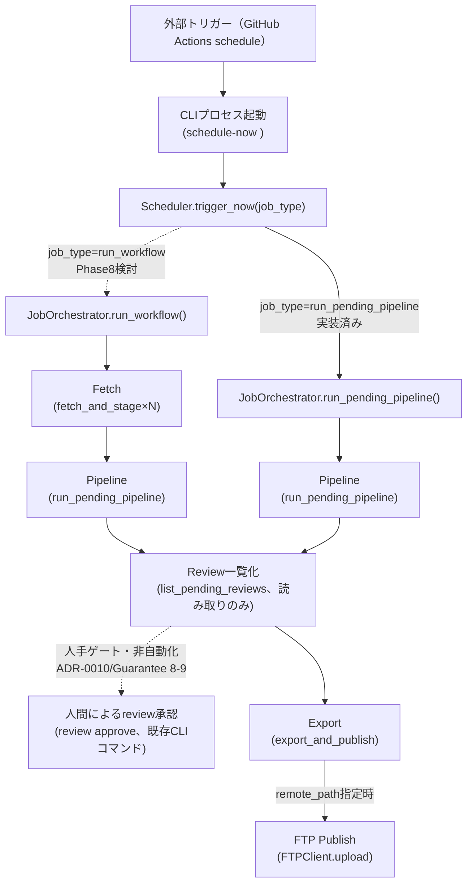

# Phase8 Integration Design

> **本ドキュメントに実装（コード）はない。** Task17-6（Phase7 Closeout）が整理した「Phase8開始前の残課題一覧」（[`RELEASE_STATUS.md`](../RELEASE_STATUS.md#phase8開始前の残課題一覧task17-6で整理)の5項目: `FtpSettings`実装・`Scheduler`永続化・自動実行経路・`release.yml`・Production FTP接続）に対する実装設計をTask18-0として確定する。実装そのもの（`config/`・`cli/bootstrap.py`・`.github/workflows/`等の変更）は本ドキュメントの対象外であり、着手する場合は本ドキュメントが定める前提条件（新規ADR起票が必要な項目は[7](#7-新規adr起票が必要な項目実装着手前に確認すること)で明示する）に従う別タスクで行う。
>
> 対象読者・関連ドキュメントとの関係は[`docs/phase7-integration-design.md`](phase7-integration-design.md)と同じ扱いに準じる。本ドキュメントは同ドキュメントの後継であり、Phase7で確立した「Composition Rootへの加算的統合」という方針を踏襲する。各パッケージの詳細な責務・依存先は[`docs/api/package-design.md`](api/package-design.md)、依存方向のグラフは[`docs/api/dependency-rule.md`](api/dependency-rule.md)、Protocol定義は[`docs/api/interfaces.md`](api/interfaces.md)、設定管理の設計は[`docs/configuration.md`](configuration.md)を正とし、本ドキュメントはこれらと矛盾しない**統合計画**のみを記述する。実装状況の確認根拠は[`docs/reports/phase7-final-audit.md`](reports/phase7-final-audit.md)（Task17-5）を用いた。

## 1. 位置づけ・Non-goal

- Phase7（Task17-1〜17-4）は、`fetch/`・`ftp/`・`services/`（`JobOrchestrator`・`Scheduler`）をComposition Root（`cli/`）へ配線し、`fetch-stage`/`run-workflow`/`schedule-now`/`list-schedule`の4コマンドとしてCLIから**手動**実行可能にした（[`docs/reports/phase7-final-audit.md`](reports/phase7-final-audit.md)で確認済み）。しかし、（a）`ftp/`の実接続情報（`FtpSettings`）が未実装のため実FTPサーバへ接続できない、（b）`schedule-now`/`list-schedule`はCLIからの手動トリガーのみに対応し、cron等による自動的な定期実行の経路が存在しない、という2点により、「PDF公表 → 自動取得 → 自動処理 → 人手レビュー → 自動公開」という本プロジェクトの中核目的（README.mdの「これは何か」節）に到達する自動化された経路は依然として存在しない。
- 本Task18-0は、この残る2つのギャップ（FTP実接続・自動実行）を解消するための実装設計を、Composition Rootの更新方針・Production Workflow全体の整理とあわせて確定する。**対象は設計のみであり、実装の実施そのものではない。**
- **Non-goal**: 本ドキュメントに登場する関数名・シグネチャ例・環境変数名は設計意図を明確にするための**予定案**であり、確定した実装契約ではない（[`docs/phase7-integration-design.md`](phase7-integration-design.md)のNon-goalと同じ扱い）。実装着手時は、本ドキュメントを起点としつつ、実装レベルの詳細（引数名・例外処理の粒度等）は当該タスクのレビューで確定する。データモデル・パイプライン段階に関わる変更（[3](#3-scheduler自動起動設計)の永続化案の一部）は新規ADR起票を前提とし、[7](#7-新規adr起票が必要な項目実装着手前に確認すること)で個別に明示する。

## 2. FtpSettings導入設計

[`docs/configuration.md`](configuration.md)がPydantic Settingsの階層化方針・環境変数プレフィックス規約・Secret管理・Validation方針を既に設計済みである。本節はこれを`FtpSettings`という具体的な型として確定し、`config/settings.py`（`AppSettings`）・`cli/bootstrap.py`（`build_ftp_client()`）への反映方法を定める。

### 2.1 AppSettingsへの追加方法

`AppSettings`（`config/settings.py`）に、既存4フィールド（`db_path`/`knowledge_root`/`layouts_root`/`parser_code_version`）と並ぶ第5フィールドとして`ftp: FtpSettings | None = None`を追加する。`FtpSettings`自体は`config/`パッケージ内の新規モジュール（例: `config/ftp.py`）に定義する`BaseSettings`のネストしたサブモデルとする。

```python
# config/ftp.py（予定案）
from pydantic import SecretStr
from pydantic_settings import BaseSettings, SettingsConfigDict


class FtpSettings(BaseSettings):
    model_config = SettingsConfigDict(env_prefix="MOD_PERSONNEL_DB_FTP__", frozen=True)

    host: str
    port: int = 21
    username: str = ""
    password: SecretStr = SecretStr("")
    timeout: float = 30.0
    passive: bool = True
```

`FtpSettings`の各フィールド名は、既存の`FTPConnectionConfig`（`ftp/config.py`、Phase7 Task16-1実装済み）のフィールド構成（`host`/`port`/`username`/`password`/`timeout`/`passive`）とそのまま対応させる。両者を同一名称にすることで、`build_ftp_client()`（[2.5](#25-build_ftp_client更新方法)）でのマッピングを機械的な1対1変換に留める。`AppSettings`本体を`ftp: FtpSettings | None`（Optional）とするのは、`dev`/`test`環境ではFTP Secretそのものを保持しない（[`docs/configuration.md`](configuration.md#secret管理)の設計）ため、フィールドの**不在**を型で表現するためである。

### 2.2 環境変数名

[`docs/configuration.md`](configuration.md#pydantic-settings)が既に定める「ネストしたサブ設定は区切り文字で表現する」規約に従い、`MOD_PERSONNEL_DB_FTP__<FIELD>`（二重アンダースコアがネスト区切り）を用いる。

| フィールド | 環境変数名 | 型 |
|---|---|---|
| `host` | `MOD_PERSONNEL_DB_FTP__HOST` | `str`（必須、デフォルトなし） |
| `port` | `MOD_PERSONNEL_DB_FTP__PORT` | `int`（デフォルト`21`） |
| `username` | `MOD_PERSONNEL_DB_FTP__USERNAME` | `str`（デフォルト`""`） |
| `password` | `MOD_PERSONNEL_DB_FTP__PASSWORD` | `SecretStr`（デフォルト`""`、GitHub Secretsからのみ注入、[`docs/configuration.md`](configuration.md#ftp-secret)） |
| `timeout` | `MOD_PERSONNEL_DB_FTP__TIMEOUT` | `float`（デフォルト`30.0`） |
| `passive` | `MOD_PERSONNEL_DB_FTP__PASSIVE` | `bool`（デフォルト`True`） |

`AppSettings`自体が`ftp`フィールドを`None`のまま起動できる（`FtpSettings`全体が未指定）ことと、`FtpSettings`が存在する場合に`host`のみ必須である（他は接続既定値を持つ）ことの2段階でOptionalityを表現する。

### 2.3 デフォルト値

[`docs/configuration.md`](configuration.md#environment)が定める4環境（`dev`/`test`/`staging`/`production`）ごとの既定を以下のように確定する。

| Environment | `ftp`フィールドの既定 | 理由 |
|---|---|---|
| `dev` | `None`（未設定） | FTP送信は常に無効化（[`docs/configuration.md`](configuration.md#environment)の表） |
| `test` | `None`（未設定） | CI実行はFTP送信を行わない |
| `staging` | 必須（起動時Validationで強制、[2.4](#24-validation方針)） | 検証用FTP宛先への送信を許可 |
| `production` | 必須（起動時Validationで強制） | 本番FTP宛先への送信を許可 |

`AppSettings`自体には`environment`フィールドが現時点で存在しない（`docs/configuration.md`が設計する`Environment`概念は未実装、[`docs/reports/phase7-final-audit.md`](reports/phase7-final-audit.md)確認済み）。したがって`environment`に基づく上記の出し分けを実装するには、`FtpSettings`単体の追加だけでなく`AppSettings.environment: Environment`フィールドの追加が前提となる。この2つは同一タスク内で一体的に実装する（`environment`なしに`ftp`必須/禁止のクロスフィールド検証は書けないため）。

### 2.4 Validation方針

[`docs/configuration.md`](configuration.md#validation-rule)が既に定めるクロスフィールド検証をそのまま採用する。

- `environment`が`staging`または`production`の場合、`ftp`が`None`であれば起動時エラー（fail-fast）とする。
- `environment`が`dev`または`test`の場合、`ftp`が`None`でなければ起動時エラーとする（誤って本番Secretを開発環境に紛れ込ませる事故防止）。
- `FtpSettings.host`が空文字列の場合はPydanticの標準的な必須項目検証（`min_length=1`相当）で拒否する。
- エラーメッセージにはフィールド名のみを含め、値（`password`はもちろん、`host`等の非Secretフィールドも含む）を含めない（[`docs/configuration.md`](configuration.md#validation-rule)の「Secretの値そのものは検証ログに出力しない」方針を、非Secretフィールドにも一貫して適用する）。

### 2.5 build_ftp_client()更新方法

現状（Task17-1実装済み、`cli/bootstrap.py`）:

```python
def build_ftp_client(settings: CompositionSettings) -> StandardFTPClient:
    del settings
    return StandardFTPClient(FTPConnectionConfig(host=""))
```

Phase8での更新後（予定案）:

```python
def build_ftp_client(settings: CompositionSettings) -> StandardFTPClient:
    if settings.ftp is None:
        raise CliCommandError(
            "FTP接続情報が設定されていません（MOD_PERSONNEL_DB_FTP__HOST等）。"
            "run-workflow --remote-path・schedule-now（run_workflow系job_type）は利用できません。"
        )
    return StandardFTPClient(
        FTPConnectionConfig(
            host=settings.ftp.host,
            port=settings.ftp.port,
            username=settings.ftp.username,
            password=settings.ftp.password.get_secret_value(),
            timeout=settings.ftp.timeout,
            passive=settings.ftp.passive,
        )
    )
```

- **関数シグネチャは変更しない**（`build_ftp_client(settings: CompositionSettings) -> StandardFTPClient`のまま）。[`docs/phase7-integration-design.md`](phase7-integration-design.md#11-既存build_関数との整合)が確立した「既存`build_*`関数のシグネチャを変更しない」加算的統合の方針を、Phase8でも維持する。
- `settings.ftp is None`の場合に`CliCommandError`を送出する設計は、`_require_settings()`（`cli/app.py`）が既に採用している「必須設定欠落時はCLIレベルのエラーとして扱う」既存パターンと一致させる。これにより`main()`の既存`except CliCommandError`節（変更不要）がそのままハンドリングする。
- **後方互換性への影響**: `fetch-stage`・`schedule-now`（現行の`run_pending_pipeline`のみ）・`init-db`・`run-pending`等、FTPを必要としないコマンドは`build_ftp_client()`を呼び出さない経路のまま変更を受けない。`run-workflow`（`--remote-path`指定時のみ）・将来追加する`run_workflow`系`job_type`（[4](#4-production-workflow設計)）のみが本変更の影響を受ける。
- **`config/`の依存先制約**: `FtpSettings`追加は`config/`パッケージ内で完結し、`config/`の依存先（`utils/`のみ、[`docs/api/package-design.md`](api/package-design.md#config)）を変更しない。`pydantic`の`SecretStr`は既存依存（`pydantic-settings`）に含まれる。

## 3. Scheduler自動起動設計

[ADR-0025](adr/0025-deployment-strategy.md)（デプロイメント戦略）が定める**バッチ実行モデル**（常時稼働サーバーを持たない）が、本節の全決定を拘束する制約である。[`docs/phase7-integration-design.md`](phase7-integration-design.md#12-scheduler導入予定位置)が整理した「案A（軽量・ADR-0025と親和）」を、Phase7で実装済みの`Scheduler`（`services/scheduler.py`の`DefaultScheduler`、Task17-3）を前提に具体化する。

### 3.1 CLI起動方法

既存のCLIエントリポイント（`python -m mod_personnel_db.cli schedule-now <job_type>`、Task17-4実装済み）を**変更しない**。Phase8で追加するのは、この既存コマンドを**外部から定期的に起動するトリガー**のみである。

- 起動主体はGitHub Actions（[ADR-0019](adr/0019-workflow-orchestration.md)）の`schedule: cron`。既存`nightly.yml`（品質ゲートの日次再確認、[`.github/workflows/README.md`](../.github/workflows/README.md)）とは別の、新規ワークフロー（例: `production-run.yml`、ファイル名は実装時に確定）を追加する想定とする。`.github/workflows/`自体の変更は本Task18-0のScope外であり、ここでは「何が必要か」のみを設計する。
- 新規ワークフローの各ステップ（予定案）: (1) リポジトリチェックアウト、(2) 依存インストール、(3) 永続ストレージから`db_path`が指すSQLiteファイルを読み込み（[ADR-0025](adr/0025-deployment-strategy.md)の実行間永続化）、(4) `python -m mod_personnel_db.cli ... schedule-now run_pending_pipeline`（または[4](#4-production-workflow設計)で整理する`run_workflow`系エントリポイント）を実行、(5) 処理後のSQLiteファイルを永続ストレージへ書き戻し、(6) ログ・成果物のアップロード（[`docs/operations/observability.md`](operations/observability.md#logging)）。
- **排他制御**: [ADR-0025](adr/0025-deployment-strategy.md)が要求する「複数の書き込みプロセスが同時に走らない」制約は、GitHub Actionsのワークフロー同時実行制御（`concurrency:`キー、実装時に確定）で満たす。本ドキュメントは制御の**必要性**を明記するのみとし、具体的なYAML構文は実装タスクで確定する。

### 3.2 常駐方式

**採用しない。** `Scheduler`（`DefaultScheduler`）・CLIプロセスとも、1回の起動で1回の`trigger_now()`呼び出しを行い処理完了後にプロセスを終了する、既存実装のままとする（`services/scheduler.py`のdocstringが既に明記する設計）。

- [ADR-0025](adr/0025-deployment-strategy.md)が明示的に退けた「常時稼働サーバー」「サーバー常駐でのcron実行」（[ADR-0019](adr/0019-workflow-orchestration.md)の「検討した代替案」）のいずれにも該当しない。
- 常駐方式（[`docs/phase7-integration-design.md`](phase7-integration-design.md#12-scheduler導入予定位置)の「案B」）を採用する場合はADR-0025のSupersedeを伴う新規ADRが前提となるが、Phase8ではこの案を採用しない（[7](#7-新規adr起票が必要な項目実装着手前に確認すること)参照）。

### 3.3 停止方法

常駐プロセスを持たないため、SIGTERM等によるグレースフルシャットダウンの実装は不要である。「停止」は以下のいずれかを意味する。

- **一時停止**: GitHub Actionsワークフローの`schedule`トリガーを無効化する（リポジトリ設定、またはワークフローファイルの`schedule:`セクションをコメントアウト、実装時に確定）。
- **単発の中止**: 実行中のワークフロー実行をGitHub Actions UI/APIからキャンセルする（GitHub Actions標準機能、CLIプロセス自体には追加のシグナルハンドリングを実装しない）。
- **恒久的な廃止**: ワークフローファイル自体を削除する。

### 3.4 例外処理

現状（Task17-4実装済み）、`cli/app.py::main()`は`CliCommandError`のみを捕捉し、`services/scheduler.py`が定義する`NoPendingJobError`・`UnknownJobTypeError`・`SchedulerError`はいずれも捕捉されず、Pythonの未処理例外としてトレースバックとともにプロセスが異常終了する（終了コード1、ただし`sys.exit`由来ではなくPythonランタイムの既定動作）。これは**GitHub Actions cron運用において問題となる**: 「処理対象のPDFが1件もない」（`NoPendingJobError`）は定期実行のたびに頻発しうる正常系の結果であり、これをワークフロー失敗として扱うと、Alert（[`docs/operations/observability.md`](operations/observability.md#alert)）が意味のある異常（`UnknownJobTypeError`・`SchedulerError`・インフラ層の例外）から埋もれてしまう。

**設計方針（予定案、実装は`cli/app.py`の変更を伴うため本Task18-0のScope外）**:

- `main()`に`except NoPendingJobError`節を追加し、`CliCommandError`とは異なる扱いとする: メッセージを出力した上で終了コード**0**（成功）を返す。「処理対象がない」は失敗ではなく、正常に完了した「何もすべきことがなかった」という結果であるため。
- `UnknownJobTypeError`・`SchedulerError`（`NoPendingJobError`を除く）は、`CliCommandError`と同様に終了コード1を返す扱いとする（設定ミス・内部矛盾は明確な失敗として扱う）。
- この変更は`cli/app.py`の`_dispatch`/`main`関数へのexcept節追加のみであり、既存コマンドの挙動（`fetch-stage`/`run-workflow`/`review`/`export`等）には影響しない。`services/scheduler.py`（`SchedulerError`の型階層）も変更不要である。

### 3.5 ログ出力

現状（`src/mod_personnel_db/`全体をgrep確認済み）、`cli/`・`services/`のいずれにも標準ライブラリ`logging`の使用が存在せず、CLIコマンドの出力は`print()`のみで行われている。これは[`docs/api/python-contract.md`](api/python-contract.md#logging設計)が定める「`print()`は本番コードに使わない」「標準ライブラリの`logging`モジュールを使う」「構造化ログ（JSON Lines）」という既存規約と乖離している（Phase3〜Phase7を通じて存在した既知のギャップであり、本Task18-0が新たに発見したものではないが、GitHub Actions cronでの自動運用開始にあたり顕在化する）。

**設計方針（予定案）**:

- `schedule_now_command`/`list_schedule_command`（`cli/commands.py`）の呼び出し前後に、`logging.getLogger(__name__)`経由でINFOログ（開始・完了）・WARNINGログ（`NoPendingJobError`）・ERRORログ（`UnknownJobTypeError`・`SchedulerError`・その他未処理例外）を出力する。
- ログの相関IDは、`Scheduler.trigger_now()`が返す`JobId`（成功時）を用いる。`JobId`は`JobRunner`が発行する`jobs`テーブルの主キーであり、[`docs/operations/observability.md`](operations/observability.md#logging)が定める既存の相関方針（`job_id`によるログ相関）とそのまま整合する。
- 保存先・保持期間は[`docs/operations/observability.md`](operations/observability.md#logging)の既定（`logs/`への出力、GitHub Actions Artifact化、1年保持）をそのまま適用する。CLI標準出力（既存の`print()`ベースの人間可読メッセージ）は残し、構造化ログは追加のログハンドラとして併存させる（既存コマンドの出力契約を壊さないため）。
- [`docs/operations/observability.md`](operations/observability.md#health-check)の「Scheduler Heartbeat」「Last Success Check」の判定基準（`jobs.started_at`の最新値・`jobs.status`）は、既存の`jobs`テーブルへの記録（`JobRunner`が既に行う）のみで満たせるため、Scheduler自動実行のために`jobs`テーブルのスキーマ変更は不要である。

## 4. Production Workflow設計

以下は、Scheduler起動から公開までの一連の流れを、**既存実装済みの経路**と**Phase8で追加検討する経路**に分けて整理したものである。



- **すでに実装済み（Task17-1〜17-4）**: `Fetch`（`fetch_and_stage()`、`services/orchestrator.py`）・`Pipeline`（`run_pending_pipeline()`、`JobRunner`への委譲）・`Review`一覧化（`list_pending_reviews()`、読み取り専用）・`Export`（`export_and_publish()`）・`FTP Publish`（`remote_path`指定時の`FTPClient.upload()`）は、いずれも`DefaultJobOrchestrator.run_workflow()`（`services/orchestrator.py`、Task16-4実装・Task17-2でCLIの`run-workflow`コマンドから到達可能化）として**既に1つのメソッドに統合済み**である。
- **Reviewは自動化しない**: `run_workflow()`内の`list_pending_reviews()`は、レビュー待ち件数を`WorkflowResult.pending_review_count`として返すのみであり、承認・却下（`review approve`/`review reject`）を自動実行しない。これは[Architecture Contract 保証8・9](architecture/architecture-contract.md#8-reviewはgold_recordsだけ更新できる)（Reviewのみがgold_recordsを書き換える）・[ADR-0010](adr/0010-ci-cd-and-publish-strategy.md)の人手ゲート方針を維持するための**意図的な設計**であり、Phase8でもこの境界を変更しない。したがって`Export`は常に「その時点で`gold_records`に存在する、既に人手承認済みのレコード」のみを対象とし、当該実行でPipelineが生成した新しい`candidate_records`を含まない（人手レビューが将来完了した際、次回以降の`Export`実行で反映される）。
- **未解決のギャップ（Phase8での検討事項）**: `run_workflow()`の`fetch_items: list[FetchWorkItem]`引数は、呼び出し元が明示的に渡すURLリストを要求する。しかし現状（Task17-2実装のCLI`run-workflow`コマンド）は常に空リストを渡す仕様であり（[`docs/reports/phase7-final-audit.md`](reports/phase7-final-audit.md)確認済み）、「どのURLを毎回自動的にポーリングするか」という**Fetch対象の自動決定**（例: 防衛省サイトの一覧ページをスクレイピングする、既知のURLパターンから推測する等）は、`fetch/`・`services/`のいずれにも設計・実装が存在しない。これは本Task18-0が新たに発見した未解決事項であり、**推測で解決策を提示しない**（実装内容を推測で書かないという本Taskのレビュー方針に従う）。Phase8での対応候補（優先順位は未確定、実装着手前に個別タスクとして具体化する）:
  1. 当面は`fetch_items`を空リストのまま運用し、`Scheduler`は`run_pending_pipeline`（既に`fetch-stage`コマンドで個別に取得済みのPDFを処理する）のみを自動化対象とする。新規PDF取得は引き続き手動（`fetch-stage`の個別実行）に委ねる。
  2. 将来、Fetch対象の自動決定（Webスクレイピング等）を実装する場合は、対象サイトの構造への依存を`fetch/`に持ち込むか、新規パッケージに切り出すかを含め、新規ADRとして検討する（`fetch/`の既存の依存禁止制約・「HTTP経由の取得機構に限定」というScope、[`docs/api/package-design.md`](api/package-design.md#fetch実装済みphase7-task16-3http経由の取得機構に限定)を変更しうるため）。
- **`Scheduler`の`job_type`拡張（Phase8での検討事項）**: `run_workflow()`全体（Fetch〜FTP Publishまで）を`Scheduler.trigger_now()`経由でトリガーする場合、`services/scheduler.py`に`RUN_WORKFLOW_JOB_TYPE = "run_workflow"`のような新しい定数を追加し、`DefaultScheduler`のコンストラクタに`run_workflow`呼び出し時のパラメータ（`export_format`/`export_destination`/`remote_path`等）をあらかじめ束ねた設定オブジェクトを追加注入する設計になる（`Scheduler` Protocol自体のシグネチャ`trigger_now(job_type: str) -> JobId`は変更不要、`services/`内部の実装拡張のみ）。この拡張は新規ADRを必要としない加算的変更である（[7](#7-新規adr起票が必要な項目実装着手前に確認すること)参照）が、上記のFetch対象自動決定の課題が未解決である限り、`run_workflow`系`job_type`は「新規PDF取得を伴わない、既存の`gold_records`に対する再Export・再Publish」用途に限定した方が安全である。

## 5. Composition Root更新方針

Phase7で確立した5つのBuilder（`build_application()`・`build_fetch_client()`・`build_ftp_client()`・`build_job_orchestrator()`・`build_scheduler()`、いずれも`cli/bootstrap.py`）の責務は、Phase8でも変更しない。Phase8が加える変更は、既存Builderの**内部実装**（`build_ftp_client()`の実接続情報化、[2.5](#25-build_ftp_client更新方法)）と、必要であれば新規`build_*`関数の**追加**（[4](#4-production-workflow設計)の`run_workflow`系`job_type`対応、未確定）のみであり、Builder間の呼び出し関係・生成順序（[`docs/phase7-integration-design.md`](phase7-integration-design.md#9-依存生成順序)の順序1〜10）を変更しない。

| Builder | 現在の責務（Task17-1〜17-4実装済み） | Phase8での変更 |
|---|---|---|
| `build_application()` | 生成順序1〜7（Repository・KnowledgeService・LearningService・ReviewService・ExportService・JobRunnerRepositories・JobRunner）を構築し`Application`を返す。Phase7で変更なし。 | **変更なし**。`FtpSettings`・`Scheduler`拡張のいずれも本関数の責務（中核パイプライン側の合成）に影響しない。 |
| `build_fetch_client()` | `HTTPFetchClient()`を引数なしで生成する（生成順序8）。 | **変更なし**。[4](#4-production-workflow設計)のFetch対象自動決定が具体化しない限り、本Builderへの変更は不要。 |
| `build_ftp_client()` | `StandardFTPClient(FTPConnectionConfig(host=""))`というプレースホルダを生成する（生成順序9）。 | **内部実装のみ変更**（[2.5](#25-build_ftp_client更新方法)）。`settings.ftp`（新設、[2](#2-ftpsettings導入設計)）を読み取り、`FtpSettings`未設定時は`CliCommandError`を送出する。シグネチャ（`settings: CompositionSettings) -> StandardFTPClient`）は変更しない。 |
| `build_job_orchestrator()` | `application`・`repositories`・`fetch_client`・`ftp_client`を`OrchestratorDependencies`へ束ね`DefaultJobOrchestrator`を生成する（生成順序10）。新規具象実装は生成しない（Constructor Injectionのみ）。 | **変更なし**。`FtpSettings`・Scheduler拡張のいずれも本Builderの引数・戻り値型に影響しない。 |
| `build_scheduler()` | `orchestrator`・`schedules: tuple[JobSchedule, ...]`・`clock`を受け取り`DefaultScheduler`を生成する。`cli/commands.py`の`_build_scheduler()`は現状`schedules`に常に空タプルを渡す。 | **呼び出し元（`cli/commands.py`の`_build_scheduler()`）の引数のみ変更しうる**（[3](#3-scheduler自動起動設計)の永続化設計が具体化した場合、`schedules`に永続化された`JobSchedule`一覧を渡す）。`build_scheduler()`自体のシグネチャは変更しない。 |

**Composition Root一本化の維持**: 上記いずれの変更も、具象実装（`StandardFTPClient`・`DefaultJobOrchestrator`・`DefaultScheduler`・`HTTPFetchClient`）の生成箇所を`cli/bootstrap.py`以外へ広げない。[Architecture Contract 保証15](architecture/architecture-contract.md#15-依存生成責務はcomposition-rootcliに一本化される)・[`tests/unit/cli/test_bootstrap.py`](../tests/unit/cli/test_bootstrap.py)のAST検証（変更禁止、`tests/**`）が引き続きこれを機械的に保証する前提で設計している。

## 6. Release Readiness — 残Task一覧

Task17-6が整理した5項目（[`RELEASE_STATUS.md`](../RELEASE_STATUS.md#phase8開始前の残課題一覧task17-6で整理)）を、本ドキュメントの設計に基づき具体化した残Task一覧を以下に示す。優先順位・着手順の確定は本ドキュメントの範囲外とする。

| # | 残Task | 対応する本ドキュメントの節 | 新規ADRの要否 |
|---|---|---|---|
| 1 | `config/`へ`FtpSettings`・`Environment`を追加し、`AppSettings.ftp`・`AppSettings.environment`フィールドを実装する | [2.1](#21-appsettingsへの追加方法)〜[2.4](#24-validation方針) | 不要（ADR-0028が既に採用済み、[`docs/configuration.md`](configuration.md)が設計済み） |
| 2 | `cli/bootstrap.py`の`build_ftp_client()`を実接続情報化する | [2.5](#25-build_ftp_client更新方法) | 不要（加算的変更、Builderシグネチャ不変） |
| 3 | `cli/app.py::main()`へ`NoPendingJobError`専用のexcept節を追加し、終了コードを分離する | [3.4](#34-例外処理) | 不要（実装詳細の改善） |
| 4 | `cli/`・`services/`へ構造化ログ（`logging`モジュール、JSON Lines）を追加する | [3.5](#35-ログ出力) | 不要（[`docs/api/python-contract.md`](api/python-contract.md#logging設計)の既存規約に従うのみ） |
| 5 | GitHub Actions新規ワークフロー（cron定期実行、CLIの`schedule-now`起動）を追加する | [3.1](#31-cli起動方法) | 不要（[ADR-0019](adr/0019-workflow-orchestration.md)が既に許容する範囲） |
| 6 | `.github/workflows/release.yml`へ、`parser_versions`自動記録・`staging`/`production`環境分離を追加する | （本ドキュメントでは詳細設計せず、[`docs/operations/release.md`](operations/release.md#release-flow)の既存設計を実装するのみ） | 不要（ADR-0023・[`docs/configuration.md`](configuration.md#environment)が既に設計済み） |
| 7 | Production FTPサーバーへの実接続を検証する（外部インフラの準備・GitHub Environment Secretsの登録を含む、コード変更ではなく運用作業） | [2](#2-ftpsettings導入設計)（1・2完了後の前提） | 不要（運用作業） |
| 8 | `Scheduler`の永続化方式を確定し実装する（[3](#3-scheduler自動起動設計)内では意図的に未確定のまま残した） | [3](#3-scheduler自動起動設計)、[7](#7-新規adr起票が必要な項目実装着手前に確認すること) | **要**（DBテーブル案を採用する場合のみ、下記参照） |
| 9 | Fetch対象の自動決定（新規PDFのURL一覧をどう取得するか）を設計・実装する | [4](#4-production-workflow設計)の未解決のギャップ | **要**（`fetch/`のScope拡張を伴う可能性があるため） |
| 10 | （既存、Phase6時点からの継続課題）`layouts/`・`knowledge/`の実運用規模データ整備、依存脆弱性スキャン導入、Golden Test以外のテスト層整備 | 本ドキュメントの対象外（[`RELEASE_STATUS.md`](../RELEASE_STATUS.md#remaining-work)を正とする） | 不要（既存方針のまま） |

**Scheduler永続化（#8）の選択肢（未確定、本ドキュメントでは決定しない）**:

1. **SQLiteテーブル案**: `repositories.sqlite`へ新規`job_schedules`テーブルを追加し、`JobScheduleRepository`（新規Protocol）経由で永続化する。データモデルの追加（[`docs/database/schema.md`](database/schema.md)への新規テーブル追加）を伴うため、[CLAUDE.mdの「大きな設計変更（データモデル...）を行う場合は、先にADRを追加してから実装する」](../CLAUDE.md)規律に従い**新規ADR起票が前提**となる。
2. **設定ファイル案**: `JobSchedule`一覧をYAML等の設定ファイル（例: `config/schedules.yaml`、`knowledge/`・`layouts/`と同様の人手管理データ）として表現し、`cli/bootstrap.py`が起動時に読み込む。データベーススキーマの変更を伴わないため、新規ADRなしで着手できる可能性が高いが、ファイル形式・配置場所の決定は実装タスクで具体化する。
3. **当面は永続化しない案**: `list-schedule`が常に0件を返す現状（Task17-4実装済み）を維持し、`schedule-now`（`run_pending_pipeline`のみ、GitHub Actions cronから直接起動）のみを自動化する。`JobSchedule`（周期表現）自体を使わない運用とし、「次回実行予定の表示」機能は将来の課題として保留する。

本ドキュメントはこの3案を提示するに留め、決定は行わない（[CLAUDE.md](../CLAUDE.md)の「不明な設計判断がある場合は、憶測で実装を進めず、ユーザーに確認する」に従い、データモデルの変更を伴いうる決定はユーザー確認を経て個別タスクで確定する）。

## 7. 新規ADR起票が必要な項目（実装着手前に確認すること）

| 項目 | 新規ADR要否 | 理由 |
|---|---|---|
| `FtpSettings`・`Environment`の`config/`への追加 | 不要 | ADR-0028が既にPydantic Settings採用を決定済み。[`docs/configuration.md`](configuration.md)が構造を設計済み。純粋な実装フェーズ。 |
| `build_ftp_client()`の実接続情報化 | 不要 | Builderのシグネチャ・生成順序を変更しない加算的変更（[`docs/phase7-integration-design.md`](phase7-integration-design.md#2-composition-rootへの統合方針全体像)の既存方針の延長）。 |
| `Scheduler`常駐化（[3.2](#32-常駐方式)の「案B」） | **要**（ADR-0025のSupersede） | 常時稼働サーバーを持たないバッチ実行モデルからの逸脱。**Phase8では採用しない**（[3.2](#32-常駐方式)）。 |
| `Scheduler`の`job_type`拡張（`run_workflow`対応） | 不要 | `Scheduler` Protocol自体（`trigger_now(job_type: str) -> JobId`）は変更しない。`services/`内部実装の拡張のみ。 |
| `Scheduler`永続化 — SQLiteテーブル案 | **要** | データモデル（DBスキーマ）の追加。[CLAUDE.md](../CLAUDE.md)の開発規律に従う。 |
| `Scheduler`永続化 — 設定ファイル案 | 不要（可能性が高いが実装タスクで最終確認） | データモデル変更を伴わない。 |
| Fetch対象の自動決定 | **要**（`fetch/`のScope拡張を伴う場合） | [`docs/api/package-design.md`](api/package-design.md#fetch実装済みphase7-task16-3http経由の取得機構に限定)が定める`fetch/`の依存禁止・Scope制約に影響しうる。 |
| `cli/app.py::main()`の例外処理拡張（[3.4](#34-例外処理)） | 不要 | 実装の堅牢性向上であり、Protocol・依存関係・データモデルのいずれも変更しない。 |
| 構造化ログ導入（[3.5](#35-ログ出力)） | 不要 | [`docs/api/python-contract.md`](api/python-contract.md#logging設計)が既に定める既存規約の遵守であり、新しい設計判断ではない。 |

## 関連ドキュメント

- [`docs/phase7-integration-design.md`](phase7-integration-design.md) — Phase7 Composition Root統合設計（Task17-0、本ドキュメントの前身・方針の踏襲元）
- [`docs/reports/phase7-final-audit.md`](reports/phase7-final-audit.md) — Phase7最終監査（Task17-5、本ドキュメントの事実確認の根拠）
- [`docs/configuration.md`](configuration.md) — `FtpSettings`・`Environment`・Secret管理・Validation方針の設計
- [`docs/operations/observability.md`](operations/observability.md) — Logging・Health Check・Alert設計
- [`docs/operations/release.md`](operations/release.md) — Release Flow・バッチ実行モデル（ADR-0025）
- [`docs/api/package-design.md`](api/package-design.md) — 各パッケージの責務・依存先
- [`docs/api/interfaces.md`](api/interfaces.md) — `Scheduler`/`JobOrchestrator`のProtocol定義
- [`docs/adr/0019-workflow-orchestration.md`](adr/0019-workflow-orchestration.md) — 実行オーケストレーション戦略（GitHub Actions cron）
- [`docs/adr/0025-deployment-strategy.md`](adr/0025-deployment-strategy.md) — デプロイメント戦略（バッチ実行モデル、本ドキュメントの中心的制約）
- [`RELEASE_STATUS.md`](../RELEASE_STATUS.md) — v1.0.0 Release Candidateのリリース判定・Phase8開始前の残課題一覧
