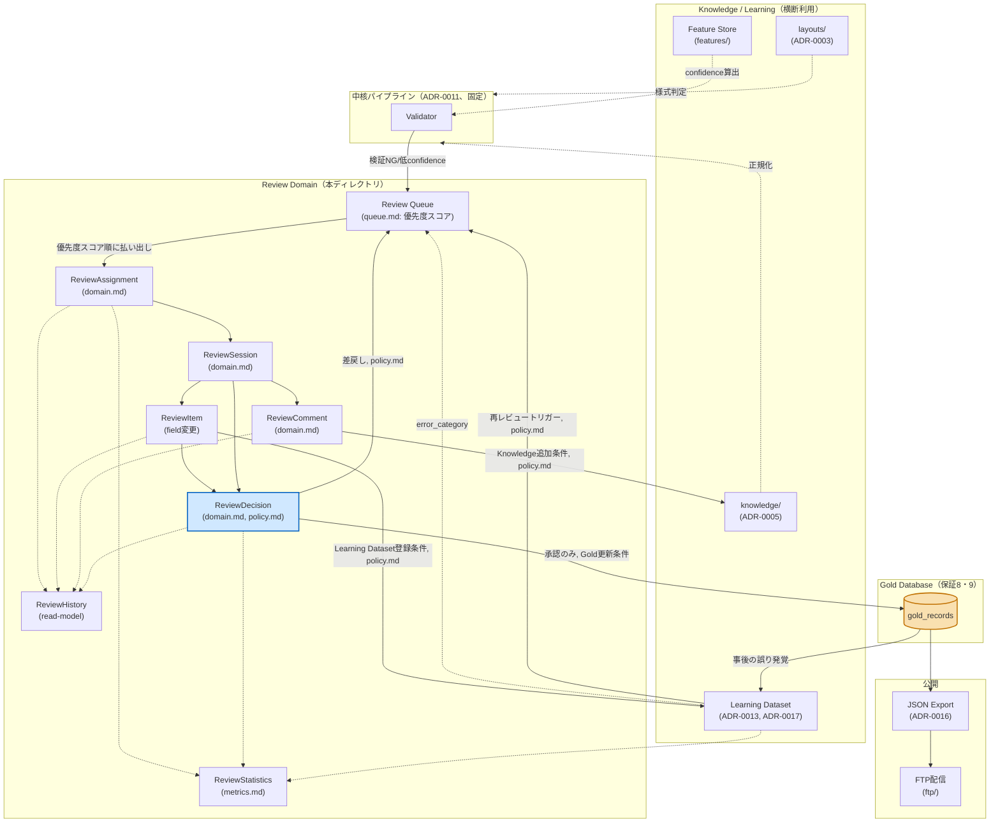

# Review（Human Reviewをシステムの中核として設計する）

> Human ReviewはGUIの付属機能ではなく、独立した**Review Domain**として設計する（Task 9）。本ディレクトリはそのドメインモデル・ポリシー・キュー優先順位・メトリクスを定義する。実装は含まない。

## 構成

| ドキュメント | 内容 |
|---|---|
| [`domain.md`](domain.md) | Review Lifecycle（状態遷移図）、ドメインモデル（`ReviewSession`, `ReviewAssignment`, `ReviewDecision`, `ReviewComment`, `ReviewHistory`, `ReviewStatistics`） |
| [`policy.md`](policy.md) | 承認権限、差戻し、再レビュー、Confidence Override、Knowledge/Learning Dataset登録条件、Gold更新条件 |
| [`queue.md`](queue.md) | レビューキューの優先順位付け（スコアリング式） |
| [`metrics.md`](metrics.md) | Review Time / Correction Rate / Approval Rate / Knowledge Update Rate / Layout Update Rate / Learning Growth |
| [`../api/review.md`](../api/review.md) | Review API（`ReviewService`, `ReviewRepository`, `ReviewEvent`, `ReviewDecision`, `ReviewNotification`の型シグネチャ） |
| [`../architecture/architecture-contract.md`](../architecture/architecture-contract.md) | 保証8・9（Reviewとgold_recordsの排他的な関係） |

## Review Domain 全体像（Mermaid）

Review Domainが、中核パイプライン・Knowledge Base・Learning Dataset・Gold Database・公開の各領域とどう繋がるかを1枚で示す。



**読み方の要点**:

- `gold_records`（オレンジ）に到達する矢印は`DECISION -->|承認のみ...| GOLDDB`の1本のみ。これが[保証8・9](../architecture/architecture-contract.md#9-reviewだけがgold_recordsgold-databaseを書き換えられる)の視覚的な表現である。
- `KNOWLEDGE`サブグラフ（`knowledge/`, `layouts/`, Learning Dataset, Feature Store）は中核パイプラインとReview Domainの**両方から横断的に利用される**（点線矢印）。これはユーザー提示の「Knowledge / Learning Dataset / Feature Storeは横断利用する」という前提をそのまま図に反映したものである。
- 破線矢印（`-.->`）は「参照・利用」、実線矢印（`-->`）は「状態遷移・データフロー」を表す。

## Review Lifecycle（要約）

詳細な状態遷移図は[`domain.md`](domain.md#review-lifecycle状態遷移図)を参照。要約すると:

```
Candidate → Assigned → InReview → Modified → Approved → GoldDatabase → JSONExport → FTP
                ↑                     │
                └──────Returned───────┘（差戻し、policy.md）

GoldDatabase → ReReview → Assigned（事後的な誤り発覚、policy.md）
```

## 設計原則のまとめ

1. **ReviewはGUIではなくドメインである**: `ReviewSession` / `ReviewAssignment` / `ReviewDecision` / `ReviewComment` / `ReviewHistory` / `ReviewStatistics`はいずれもUIの実装形態（CLI/Web）に依存しない値オブジェクト・エンティティとして定義する（[`domain.md`](domain.md)）。UIは[ADR-0021](../adr/0021-review-ui-strategy.md)が定めるとおり当面CLIとするが、これはドメインモデルの選択とは独立である。
2. **Gold Databaseへの書き込みはReviewに一本化する**: [`architecture-contract.md`](../architecture/architecture-contract.md)の保証8・9により、`gold_records`への書き込み経路は`ReviewService.promote_to_gold()`のみに限定される。
3. **優先順位は連続スコアで表現する**: [`queue.md`](queue.md)は固定順位リストではなく、系統的問題（Layout Unknown, Parser Error）を最優先しつつ、confidenceの連続値と経過時間補正を組み合わせたスコアリングを採用する。
4. **差戻しと再レビューを一級市民として扱う**: [`policy.md`](policy.md)は「承認して終わり」ではなく、差戻し（`Candidate`への回帰）と、Gold DB確定後の再レビュー（Learning Dataset起点）を明示的にライフサイクルへ組み込む。
5. **学習効果を計測する**: [`metrics.md`](metrics.md)のKnowledge/Layout Update RateとLearning Growthは、Reviewが単発の作業ではなく、システム全体を継続的に改善する仕組みとして機能しているかを検証する。
