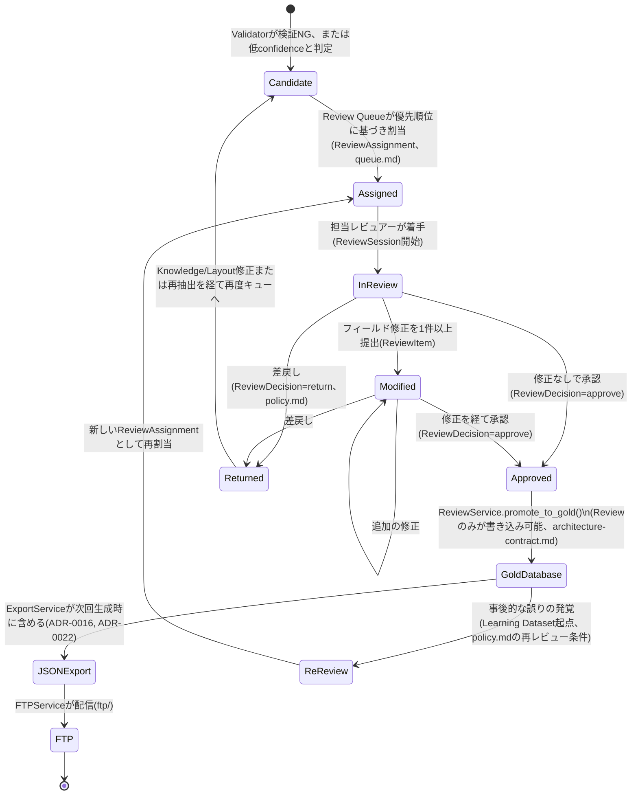

# Review Domain（Human Reviewをシステムの中核として設計する）

> **位置づけ**: Human Reviewは付随的なGUI機能ではなく、**Review Domain**（独立した関心事を持つドメインモデル群）として設計する。本ドキュメントに実装はない。UIの実装形態（当面はCLI、[ADR-0021](../adr/0021-review-ui-strategy.md)）とドメインモデルは独立しており、将来Web UIに置き換わってもドメインモデル（本ドキュメント）は変わらない。
>
> ポリシーは[`policy.md`](policy.md)、キュー優先順位は[`queue.md`](queue.md)、メトリクスは[`metrics.md`](metrics.md)、公開APIは[`docs/api/review.md`](../api/review.md)、全体像は[`README.md`](README.md)を参照。

## 目次

1. [Review Lifecycle（状態遷移図）](#review-lifecycle状態遷移図)
2. [Review Domain Model](#review-domain-model)
   - [ReviewSession](#reviewsession)
   - [ReviewAssignment](#reviewassignment)
   - [ReviewDecision](#reviewdecision)
   - [ReviewComment](#reviewcomment)
   - [ReviewHistory](#reviewhistory)
   - [ReviewStatistics](#reviewstatistics)
3. [既存スキーマとの関係](#既存スキーマとの関係)

---

## Review Lifecycle（状態遷移図）

候補レコードが生成されてから、Gold Database・公開JSON・FTP配信に至るまでの一連のライフサイクル。ユーザー提示の主線（Candidate → Assigned → In Review → Modified → Approved → Gold Database → JSON Export → FTP）に加え、[`policy.md`](policy.md)が定める差戻し（Returned）と再レビュー（Re-review）の分岐を明示する。



**状態の意味**:

| 状態 | 意味 | 対応する永続化 |
|---|---|---|
| `Candidate` | Validatorの出力（検証NG、または低confidence）であり、レビュー待ちの候補 | `candidate_records`（`docs/database/schema.md`） |
| `Assigned` | Review Queueによりレビュアーへ割り当て済み | `ReviewAssignment`（本ドキュメント新設） |
| `InReview` | レビュアーが着手し、`ReviewSession`が開いている | `review_sessions` |
| `Modified` | 1件以上の`ReviewItem`（フィールド修正）が提出された | `review_changes` |
| `Approved` | `ReviewDecision`により承認された | `ReviewDecision`（本ドキュメント新設） |
| `Returned` | 差戻しにより`Candidate`へ戻る | `ReviewDecision`（`decision=return`） |
| `GoldDatabase` | `gold_records`へ昇格済み | `gold_records`（[ADR-0015](../adr/0015-sqlite-schema-finalization.md)） |
| `JSONExport` | 公開JSONエクスポートに含まれた | `exports`（[ADR-0016](../adr/0016-public-json-format.md)） |
| `FTP` | FTP経由で配信済み | `ftp/`パッケージの配信ログ（DB化は範囲外、[`docs/api/package-design.md`](../api/package-design.md)の`ftp/`節） |
| `ReReview` | Gold DB確定後に誤りが発覚し、再レビューが必要と判定された状態 | `learning_dataset`（[ADR-0017](../adr/0017-learning-dataset-field-expansion.md)）を起点とする |

---

## Review Domain Model

### `ReviewSession`

レビュアーが実際に作業する1回のまとまり。既存の`review_sessions`テーブル（[`docs/database/schema.md`](../database/schema.md#6-review_sessions)）に対応する。

| 属性 | 型 | 説明 |
|---|---|---|
| `id` | `ReviewSessionId` | 主キー |
| `reviewer` | `str` | 担当者識別子 |
| `reason` | `str` | セッションの目的（例: `"validation_failure_queue"`） |
| `assignments` | `tuple[ReviewAssignmentId, ...]` | このセッションで扱う`ReviewAssignment`群 |
| `status` | `Literal["in_progress", "completed", "abandoned"]` | |
| `started_at` | `datetime` | |
| `completed_at` | `datetime \| None` | |

- **不変条件**: `status == "completed"` のとき `completed_at` は必須。1レビュアーにつき同時に`in_progress`のセッションは1つまで（1人が複数の候補を並行して開くことはあっても、セッション自体は1つに集約する。[`queue.md`](queue.md)のキュー消化モデルと対応）。

### `ReviewAssignment`

**新設概念**。Review Queue（[`queue.md`](queue.md)）が候補をレビュアーへ割り当てた記録。既存スキーマにはまだ存在しない（[既存スキーマとの関係](#既存スキーマとの関係)参照）。

| 属性 | 型 | 説明 |
|---|---|---|
| `id` | `ReviewAssignmentId` | 主キー |
| `candidate_id` | `CandidateId` | 対象候補 |
| `assigned_to` | `str` | 割当先レビュアー |
| `priority_score` | `float` | 割当時点の優先度スコア（[`queue.md`](queue.md#優先度スコアの算出)） |
| `priority_reason` | `str` | スコアの根拠（例: `"layout_unknown"`, `"low_confidence:0.42"`） |
| `assigned_at` | `datetime` | |
| `session_id` | `ReviewSessionId \| None` | 着手後に紐づく`ReviewSession`（着手前は`None`） |
| `status` | `Literal["pending", "in_progress", "completed", "returned", "expired"]` | |
| `due_at` | `datetime \| None` | SLA期限（任意） |

- **不変条件**: 同一`candidate_id`について、`status`が`pending`または`in_progress`の`ReviewAssignment`は同時に1件のみ（二重割当の禁止）。`status == "in_progress"`のとき`session_id`は必須。
- **Validation Rule**: `priority_score`は[`queue.md`](queue.md)の算出式に基づく非負の実数。

### `ReviewDecision`

**新設概念**。レビュアーの最終判断（承認/差戻し）。個々のフィールド修正（`ReviewItem`、`docs/api/models.md`）とは異なり、1つの候補に対する**結論**を表す。

| 属性 | 型 | 説明 |
|---|---|---|
| `id` | `ReviewDecisionId` | 主キー |
| `session_id` | `ReviewSessionId` | |
| `candidate_id` | `CandidateId` | |
| `decision` | `Literal["approve", "return"]` | |
| `confidence_override` | `Confidence \| None` | [`policy.md`](policy.md#confidence-override)参照。上書きした場合のみ設定 |
| `reason` | `str` | 判断理由（`decision == "return"`のとき必須） |
| `decided_by` | `str` | |
| `decided_at` | `datetime` | |

- **不変条件**: `decision == "approve"`のとき、対応する`CandidateRecord.validation_status`が`"failed"`のままでは承認できない（[`policy.md`](policy.md#誰が承認できるか)の前提条件）——ただし`confidence_override`を伴う承認は例外として`policy.md`に別途条件を定める。`decision == "return"`のとき`reason`は空文字列不可。
- **`ReviewDecision`が`Approved`状態を作る唯一の手段である**（[`docs/architecture/architecture-contract.md`](../architecture/architecture-contract.md)の保証、[Task 7](../architecture/architecture-contract.md#9-reviewだけがgold-databaseを書き換えられる)）。

### `ReviewComment`

**新設概念**。特定のフィールド修正に紐づかない、レビュアー間の自由記述コメント（申し送り事項、判断に迷った点の記録等）。

| 属性 | 型 | 説明 |
|---|---|---|
| `id` | `ReviewCommentId` | 主キー |
| `target_type` | `Literal["candidate", "session"]` | |
| `target_id` | `CandidateId \| ReviewSessionId` | |
| `author` | `str` | |
| `body` | `str` | |
| `created_at` | `datetime` | |

- **不変条件**: `body`は空文字列不可。
- **公開範囲の制約**: `ReviewComment`は内部の運用記録であり、公開JSON（[ADR-0016](../adr/0016-public-json-format.md)）にはいかなる形でも含めない（[ADR-0008](../adr/0008-data-ethics-policy.md)のデータ倫理方針、レビュアーの私的な所感が外部に漏れることを防ぐ）。

### `ReviewHistory`

**派生型（read-model）**。特定の候補について、`ReviewAssignment` → `ReviewItem`（フィールド修正） → `ReviewComment` → `ReviewDecision`を時系列に束ねた監査用ビュー。**独立して永続化しない**（[ADR-0014](../adr/0014-development-discipline.md)の過剰設計回避——個々のイベントは既に各Repositoryに保存されており、`ReviewHistory`はそれらを`candidate_id`で串刺しにクエリした結果である）。

| 属性 | 型 | 説明 |
|---|---|---|
| `candidate_id` | `CandidateId` | |
| `entries` | `tuple[ReviewHistoryEntry, ...]` | 時系列順（古い順） |

```python
@dataclass(frozen=True, slots=True)
class ReviewHistoryEntry:
    occurred_at: datetime
    event_type: Literal["assigned", "field_changed", "commented", "decided"]
    actor: str
    detail: str
```

- **生成方法**: `ReviewService.get_history(candidate_id)`（[`docs/api/review.md`](../api/review.md)）が、`ReviewRepository` / `CandidateRepository`から関連イベントを取得し、時系列にマージして返す。

### `ReviewStatistics`

**派生型（read-model）**。[`metrics.md`](metrics.md)が定義する6指標を、期間・レビュアー単位で集計した結果。**既定では永続化しない**（都度計算）が、長期トレンド分析のために定期スナップショットを取る運用は妨げない（[`metrics.md`](metrics.md#スナップショットの運用)参照）。

| 属性 | 型 | 説明 |
|---|---|---|
| `period_start` | `date` | |
| `period_end` | `date` | |
| `reviewer` | `str \| None` | `None`の場合は全レビュアー集計 |
| `review_time_avg_minutes` | `float` | [`metrics.md`](metrics.md#review-time) |
| `correction_rate` | `float` | [`metrics.md`](metrics.md#correction-rate) |
| `approval_rate` | `float` | [`metrics.md`](metrics.md#approval-rate) |
| `knowledge_update_rate` | `float` | [`metrics.md`](metrics.md#knowledge-update-rate) |
| `layout_update_rate` | `float` | [`metrics.md`](metrics.md#layout-update-rate) |
| `learning_growth` | `float` | [`metrics.md`](metrics.md#learning-growth) |

---

## 既存スキーマとの関係

| 本ドキュメントのモデル | 既存スキーマ（[`docs/database/schema.md`](../database/schema.md)） | 状態 |
|---|---|---|
| `ReviewSession` | `review_sessions` | 既存、変更なし |
| （フィールド修正、`ReviewItem`） | `review_changes` | 既存、変更なし（[`docs/api/models.md`](../api/models.md#reviewitem)） |
| `ReviewAssignment` | なし | **新設**。将来の実装時、非破壊的な新規テーブル`review_assignments`として追加する想定（[ADR-0015](../adr/0015-sqlite-schema-finalization.md)の変更管理に従い、テーブル新設のため別途ADR起票を要する） |
| `ReviewDecision` | なし | **新設**。同様に`review_decisions`テーブルの新規追加を想定 |
| `ReviewComment` | なし | **新設**。同様に`review_comments`テーブルの新規追加を想定 |
| `ReviewHistory` | なし（派生） | 新規テーブル不要（read-model） |
| `ReviewStatistics` | なし（派生） | 新規テーブル不要（read-model、任意でスナップショット可） |

本ドキュメントはドメインモデルの設計に留め、`docs/database/schema.md`への実際のDDL追加は行わない（Task 9の要求範囲外、実装禁止の方針にも合致する）。`review_assignments` / `review_decisions` / `review_comments`の追加は、実装着手時に新規ADRとして起票する。
