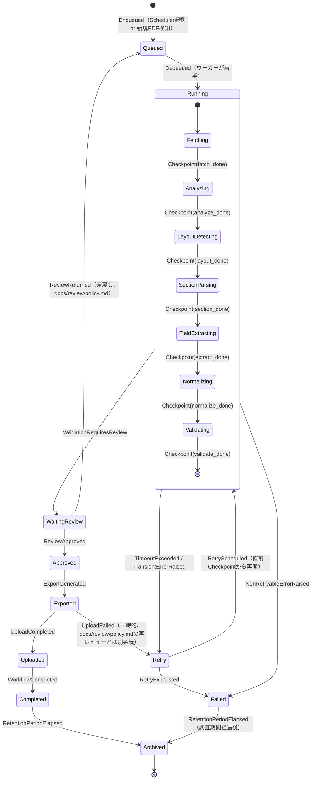

# Workflow State Machine

> Fetchから公開・配信・アーカイブまでの一連の処理を、1つの**Workflow**（1件のPDF、または1回の実行単位）のライフサイクルとして状態機械で設計する。[ADR-0019](../adr/0019-workflow-orchestration.md)（実行オーケストレーション戦略）の運用モデルを具体化したもの。**本ドキュメントに実装（コード）はない。**

## 位置づけ: Workflow / Job / Review Lifecycle / Pipeline Stageの関係

本プロジェクトには、粒度の異なる4つの状態管理の概念が存在する。混同を避けるため、まず関係を整理する。

| 概念 | 粒度 | 定義場所 | 本ドキュメントとの関係 |
|---|---|---|---|
| **Workflow**（本ドキュメント） | 1PDFの取得から公開・配信・アーカイブまでの全体 | 本ドキュメント（新設） | 最上位。以下3つを内包する |
| `Job` | Workflow内の個々の実行試行（`job_type`ごとに1行、[`docs/database/schema.md`](../database/schema.md#12-jobs)） | `docs/database/schema.md`, [`docs/api/models.md`](../api/models.md#job) | 1つのWorkflowは複数の`Job`行（`fetch`, `core_pipeline`, `export`等）から構成される。`Job.status`（`running`/`succeeded`/`failed`）は個々の実行試行の結果であり、本ドキュメントの10状態はそれらを束ねたWorkflow全体の状態 |
| Review Lifecycle | 1候補レコードのレビュー過程 | [`docs/review/domain.md`](../review/domain.md#review-lifecycle状態遷移図) | 本ドキュメントの`WaitingReview`〜`Approved`状態の内部で、候補単位のReview Lifecycleが並行して進行する |
| `PipelineStage` | 中核パイプライン1段階の実行（`run()`） | [`docs/api/pipeline.md`](../api/pipeline.md) | 本ドキュメントの`Running`状態の内部で、6段階が順に`run()`される |

新たにDBテーブルやモデルを追加するものではなく、既存の`jobs` / `review_sessions` / `gold_records` / `exports`等を横断的に束ねる**運用上の状態管理レイヤー**として設計する。

---

## 状態一覧

| # | 状態 | 意味 | 対応する既存概念 |
|---|---|---|---|
| 1 | `Queued` | Workflowが登録され、実行開始を待っている | [ADR-0019](../adr/0019-workflow-orchestration.md)のスケジュール実行、`PDFRepository`の未処理PDF |
| 2 | `Running` | 中核パイプライン（Document Analyzer〜Validator）が実行中 | `Job(job_type='core_pipeline', status='running')` |
| 3 | `Waiting Review` | パイプラインは完了したが、1件以上の候補が人手レビュー待ち | Review Lifecycleの`Candidate`〜`InReview`（[`docs/review/domain.md`](../review/domain.md)） |
| 4 | `Approved` | 対象候補すべてについて`ReviewDecision=approve`が確定した | Review Lifecycleの`Approved`〜`GoldDatabase` |
| 5 | `Exported` | `gold_records`が公開JSON/CSV/Parquetのエクスポートに含まれた | `exports`テーブル（[ADR-0016](../adr/0016-public-json-format.md), [ADR-0022](../adr/0022-export-policy.md)） |
| 6 | `Uploaded` | エクスポート成果物がFTP経由で配信された | `ftp/`パッケージ（[`docs/api/package-design.md`](../api/package-design.md)） |
| 7 | `Completed` | Workflowが正常に完了した（終端状態） | — |
| 8 | `Retry` | 一時的な失敗により再試行中（非終端、`Running`へ戻る） | [Retry Policy](#retry-policy) |
| 9 | `Failed` | 再試行しても回復しない、または再試行不可能な失敗（終端状態） | — |
| 10 | `Archived` | 保持期間を経過し、長期保管状態に移行した（終端状態） | [ADR-0018](../adr/0018-pdf-registry-and-retention.md)の保管方針 |

---

## 状態遷移図（Mermaid）

**設計上の注記**:

- `Running`内部の6サブ状態は[ADR-0011](../adr/0011-fixed-core-pipeline.md)の中核パイプライン6段階に1対1対応する。各サブ状態からの遷移が[Checkpoint](#checkpoint)を生成する。
- `Approved`から`GoldDatabase`への書き込みは`ReviewService.promote_to_gold()`のみが行う（[`docs/architecture/architecture-contract.md`](../architecture/architecture-contract.md)の保証8・9）。本状態機械の`Approved`状態はこの書き込みが完了した時点を指す。
- `WaitingReview --> Queued`（差戻し）は、[`docs/review/domain.md`](../review/domain.md#review-lifecycle状態遷移図)の`Returned --> Candidate`に対応する。Workflow全体としては「最初からやり直す」のではなく、[Checkpoint](#checkpoint)が残っていれば該当箇所から再開する（詳細は[Rollback](#rollback)参照）。
- `Exported --> Retry`は、エクスポート生成は成功したがFTPアップロードが失敗した場合の技術的な再試行であり、[`docs/review/policy.md`](../review/policy.md)の差戻し・再レビューとは異なる系統（データ内容の問題ではなく配信の問題）。

---

## イベント一覧

状態遷移を引き起こすイベント。[`docs/api/pipeline.md`](../api/pipeline.md)の`PipelineEvent`、[`docs/api/review.md`](../api/review.md)の`ReviewEvent`と同じ設計思想（観測可能性、[`docs/architecture.md`](../architecture.md#非機能要件長期運用の観点)の「可観測性」要件）に基づく、Workflowレベルのイベント。

| イベント | 発生元 | 遷移 |
|---|---|---|
| `Enqueued` | `Scheduler`（[ADR-0019](../adr/0019-workflow-orchestration.md)）または新規PDF検知（[ADR-0018](../adr/0018-pdf-registry-and-retention.md)） | `[*] → Queued` |
| `Dequeued` | `JobRunner`（[`docs/api/interfaces.md`](../api/interfaces.md#jobrunner)）がワーカーを割り当て | `Queued → Running` |
| `Checkpoint(stage)` | 中核パイプラインの各段階（[ADR-0011](../adr/0011-fixed-core-pipeline.md)）が`run()`を完了 | `Running`内部のサブ状態遷移（[Checkpoint](#checkpoint)参照） |
| `ValidationRequiresReview` | Validatorの出力が検証NG、または低confidence | `Running → WaitingReview` |
| `TimeoutExceeded` | [Timeout](#timeout)に定めた時間予算を超過 | `Running → Retry`（再試行可能な場合） |
| `TransientErrorRaised` | `PipelineException`のうち一時的なもの（[Retry Policy](#retry-policy)参照） | `Running → Retry` |
| `NonRetryableErrorRaised` | `PipelineException`のうち恒久的なもの | `Running → Failed` |
| `RetryScheduled` | [Retry Policy](#retry-policy)のバックオフ経過後、再試行を起動 | `Retry → Running` |
| `RetryExhausted` | 最大再試行回数に到達 | `Retry → Failed` |
| `ReviewApproved` | `ReviewDecision.decision == "approve"`が全対象候補について確定（[`docs/review/domain.md`](../review/domain.md#reviewdecision)） | `WaitingReview → Approved` |
| `ReviewReturned` | `ReviewDecision.decision == "return"`（[`docs/review/policy.md`](../review/policy.md#差戻し)） | `WaitingReview → Queued` |
| `ExportGenerated` | `ExportService.generate()`が成功（[`docs/api/interfaces.md`](../api/interfaces.md#exportservice)） | `Approved → Exported` |
| `UploadCompleted` | `FTPService.upload()`が成功 | `Exported → Uploaded` |
| `UploadFailed` | `FTPService.upload()`が一時的に失敗 | `Exported → Retry` |
| `WorkflowCompleted` | 配信まで完了 | `Uploaded → Completed` |
| `RetentionPeriodElapsed` | [ADR-0018](../adr/0018-pdf-registry-and-retention.md)の保持期間ポリシーに基づき、`Completed`/`Failed`から一定期間経過 | `Completed → Archived`, `Failed → Archived` |

---

## Timeout

各状態に滞在してよい時間の上限。超過時は`TimeoutExceeded`イベントを発生させる。

| 状態 | タイムアウト予算 | 超過時の扱い |
|---|---|---|
| `Queued` | 定めない（キューの滞留はSLA違反として[`docs/review/metrics.md`](../review/metrics.md)相当の運用メトリクスで別途監視する） | — |
| `Running` | 段階ごとに個別の予算を設ける（例: Document Analyzerはページ数に比例、Normalizer/Validatorは固定上限）。合計の上限も設ける（[ADR-0026](../adr/0026-security-policy.md)の「異常なPDFによるリソース枯渇の防止」と整合） | `TransientErrorRaised`相当として扱い、[Retry Policy](#retry-policy)を適用 |
| `Waiting Review` | 明示的なタイムアウトによる自動遷移は行わない（人手判断を待つ性質上、強制的に失敗させることは不適切）。ただし[`docs/review/queue.md`](../review/queue.md#優先度スコアの算出)の経過時間補正、および`ReviewAssignment.due_at`超過時の`ReviewNotification`（[`docs/api/review.md`](../api/review.md#reviewnotification)）により、放置を検知・エスカレーションする | 状態遷移は起こさず、通知のみ |
| `Exported` / `Uploaded` | 短時間（分オーダー）の上限を設け、超過時は`UploadFailed`相当として扱う | `Retry`へ遷移 |

**方針**: 「機械的に進行すべき状態」（`Running`, `Exported`, `Uploaded`）にはタイムアウトを設け自動的にRetry/Failedへ倒す一方、「人の判断を待つ状態」（`Waiting Review`）は強制的なタイムアウト遷移を避け、通知による促しに留める。これは[`docs/review/policy.md`](../review/policy.md#誰が承認できるか)がレビュー品質を優先する方針と整合させたものである。

---

## Retry Policy

### 再試行対象の分類

| 分類 | 例 | 扱い |
|---|---|---|
| 一時的（Retryable） | ネットワークタイムアウト、外部ストレージの一時的な不可用、`TimeoutExceeded` | `Retry`状態へ遷移し、バックオフ後に再試行 |
| 恒久的（Non-retryable） | PDFの破損・読み取り不能、Validatorの構造的な検証NG、`knowledge/`/`layouts/`のロード失敗 | 直接`Failed`へ遷移（再試行しても同じ結果になることが自明なため） |

この分類は、[ADR-0012](../adr/0012-error-handling-priority-order.md)の`error_category`分類（`unknown_alias`, `unknown_layout`, `knowledge_gap`, `layout_gap`, `true_exception`）のうち、`true_exception`は原則Non-retryable、それ以外はLearning Dataset記録の上でWaiting Reviewへ回す（そもそも技術的失敗ではなく人手判断が必要なケース）という整理と対応する。

### バックオフ戦略

指数バックオフを採用する（基数1分、係数3倍、最大3回、CONTRIBUTING.mdのgit push再試行方針と同様の考え方をWorkflowレベルに適用）。

| 試行回数 | 待機時間 | 累積経過時間 |
|---|---|---|
| 1回目の再試行 | 1分 | 1分 |
| 2回目の再試行 | 3分 | 4分 |
| 3回目の再試行 | 9分 | 13分 |
| 3回失敗後 | — | `RetryExhausted` → `Failed` |

### Retry時の再開位置

`Retry → Running`遷移時、[Checkpoint](#checkpoint)が存在すればそこから再開し、`Fetching`からやり直さない（無駄な再処理を避ける、[ADR-0001](../adr/0001-python-packaging.md)の効率性ではなく[ADR-0026](../adr/0026-security-policy.md)のリソース保護の観点から重要）。ただし、失敗の原因がChekcpoint自体の破損・不整合による場合は、安全側に倒して`Fetching`からの再実行とする。

---

## Rollback

`Approved`（`gold_records`への書き込み）を境に、Rollbackの性質が根本的に変わる。

### `Approved`より前（`Queued` / `Running` / `Waiting Review` / `Retry`）

**真のロールバックが可能**: これらの状態では`candidate_records`にのみ影響があり、外部に公開されたデータは存在しない（[`docs/database/schema.md`](../database/schema.md)の`candidate_records`はINSERT-onlyだが、`gold_records`へは未到達）。異常終了時は、当該Workflowに紐づく`candidate_records` / `personnel_sections`を「無効」として扱い（物理削除はしない、[ADR-0006](../adr/0006-pipeline-provenance.md)の来歴保持原則）、新しいWorkflow試行（またはCheckpointからの再開）に委ねる。

### `Approved`以降（`Exported` / `Uploaded` / `Completed`）

**真のロールバックは行わない**: `gold_records`はSCD Type 2で管理され（[ADR-0015](../adr/0015-sqlite-schema-finalization.md)）、`exports`は永久保持（[ADR-0022](../adr/0022-export-policy.md)）される。既に公開・配信された情報を「なかったこと」にする操作は、来歴管理の原則（[ADR-0006](../adr/0006-pipeline-provenance.md)）と相容れない。

- **誤りが判明した場合は、削除ではなく訂正（Compensating Action）で対応する**: [`docs/review/policy.md`](../review/policy.md#再レビュー)の再レビュートリガーにより新しい`ReviewAssignment`を発行し、新バージョンの`gold_record`を追加して`supersede`する（[`docs/api/repositories.md`](../api/repositories.md#goldrepository)）。訂正されたことは新しいWorkflow実行（`Queued`から開始する別のWorkflowインスタンス）として扱う。
- 既に配信済み（`Uploaded`/`Completed`）のエクスポート成果物自体を遡って差し替えることはしない。次回のエクスポート生成（[ADR-0022](../adr/0022-export-policy.md)のイベント駆動または月次再生成）で訂正後の内容が反映される。

---

## Checkpoint

### 目的

`Running`状態内の6段階（Document Analyzer〜Validator）は、PDFのページ数や候補件数によっては相応の処理時間を要する。`Retry`のたびに`Fetching`からやり直すと、[ADR-0026](../adr/0026-security-policy.md)が懸念するリソース消費が積み重なる。各段階の完了時点を記録し、再試行時はそこから再開できるようにする。

### Checkpointが記録するもの

| 項目 | 内容 |
|---|---|
| `stage` | 完了した段階名（[ADR-0011](../adr/0011-fixed-core-pipeline.md)の6段階名のいずれか、または`fetch`） |
| `completed_at` | 完了時刻 |
| `output_ref` | その段階の出力への参照（例: `Document`の保存先、`PersonnelSection`一覧のID群）。[`docs/api/models.md`](../api/models.md)の各モデルのIDを用いる |
| `parser_version_id` | どのコードバージョンで完了したか（[ADR-0023](../adr/0023-parser-versioning-policy.md)） |

### 運用ルール

- Checkpointは各段階の`run()`が正常に完了した直後に記録する（[`docs/api/pipeline.md`](../api/pipeline.md)の`PipelineEvent(event_type="completed")`と対になる）。
- `Retry → Running`遷移時は、直前のCheckpointの`output_ref`を`PipelineContext`（[`docs/api/pipeline.md`](../api/pipeline.md#pipelinecontext)）経由で次段階に渡し、完了済み段階の再実行を省略する。
- Checkpointは`parser_version_id`が変わった場合（再試行までの間にコードがデプロイされた場合）は無効化し、`Fetching`から再実行する（異なるコードバージョンの出力を混在させないため、[ADR-0006](../adr/0006-pipeline-provenance.md)の来歴の一貫性）。
- Checkpoint自体の永続化先（新規テーブルが必要か、既存の`jobs`/`personnel_sections`等で代替できるか）は実装時に確定する。本ドキュメントでは概念と運用ルールのみを定める。

---

## 関連ADR・ドキュメント

- [ADR-0011](../adr/0011-fixed-core-pipeline.md) — 中核処理パイプラインの固定化（`Running`内部のサブ状態の根拠）
- [ADR-0018](../adr/0018-pdf-registry-and-retention.md) — PDF Registry・長期保管方針（`Archived`の保持期間）
- [ADR-0019](../adr/0019-workflow-orchestration.md) — 実行オーケストレーション戦略（本ドキュメントの前提）
- [ADR-0022](../adr/0022-export-policy.md) — エクスポート運用方針（`Exported`/`Uploaded`）
- [ADR-0026](../adr/0026-security-policy.md) — セキュリティポリシー（Timeout・リソース保護の根拠）
- [`docs/review/domain.md`](../review/domain.md) — Review Lifecycle（`Waiting Review`〜`Approved`の詳細）
- [`docs/api/pipeline.md`](../api/pipeline.md) — Pipeline Interface（`Running`内部の各段階契約）
- [`docs/architecture/architecture-contract.md`](../architecture/architecture-contract.md) — Reviewとgold_recordsの排他的関係（保証8・9）
